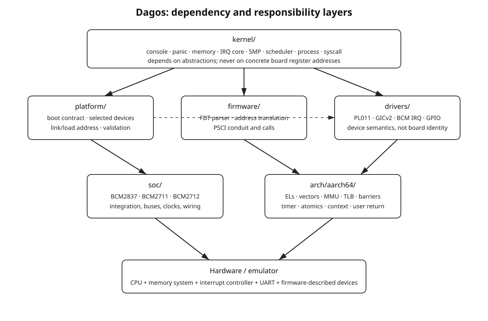

# 1. Architecture Boundaries and Invariants

## 1.1 The separation to preserve

A portable bare-metal kernel becomes manageable only when five different kinds of knowledge remain separate.

### Architecture

`arch/aarch64` owns facts defined by the AArch64 architecture rather than by a board:

- exception levels and PSTATE
- `CurrentEL`, `DAIF`, `SPSel`
- `VBAR_EL1`, `ELR_EL1`, `SPSR_EL1`, `ESR_EL1`, `FAR_EL1`
- `MPIDR_EL1`
- AArch64 exception-vector geometry
- `ERET`
- `SVC`
- translation-table descriptors
- `MAIR_EL1`, `TCR_EL1`, `TTBR0_EL1`, `TTBR1_EL1`, `SCTLR_EL1`
- TLB invalidation instructions
- cache-maintenance instructions
- `DMB`, `DSB`, and `ISB`
- generic timer system registers
- atomic primitives
- context-switch assembly
- AAPCS64 call-preserved register rules

Architecture code must not contain Raspberry Pi peripheral addresses, QEMU machine names, BCM SoC names, or board-specific UART routing. See [ARM-EXC], [ARM-MM], and [AAPCS64] in [References](12-references.md).

### CPU implementation

Cortex-A53, Cortex-A72, and Cortex-A76 are CPU implementations. CPU-model-specific work belongs in an implementation/capability layer only when a real implementation detail requires it. Do not use a CPU model as a proxy for the entire platform.

### SoC

The SoC layer describes integrated hardware relationships such as:

- BCM2837
- BCM2711
- BCM2712
- local interrupt-controller integration
- peripheral bus windows
- GPIO blocks
- clock/reset providers
- integrated timers and mailboxes

The SoC layer may provide reusable helpers shared by QEMU's model of a Raspberry Pi and the corresponding real board. It must not assume a particular firmware boot path if the same SoC can be reached through a different boot contract.

### Platform

A platform is a bootable machine target:

- `qemu_virt`
- `qemu_raspi3b`
- `qemu_raspi4b`
- `rpi3b`
- `rpi4b`
- `rpi5`

The platform layer owns:

- the boot contract
- the image format
- the physical load address expected by the loader
- the platform linker fragment
- initial boot-argument interpretation
- an emergency early-console fallback
- expected Device Tree compatibility strings
- CPU-start mechanism glue when it is not fully discoverable
- QEMU command-line defaults or Raspberry Pi boot-partition configuration

### Driver

A driver knows a device programmer's model. `drivers/serial/pl011.zig` knows PL011 registers and behavior. It does not know whether the PL011 instance is `0x09000000`, `0xfe201000`, or a translated Pi 5 debug-UART address. Platform/FDT code supplies the instance resources.

### Kernel

The kernel layer consumes mechanisms and devices:

- console
- panic handling
- physical memory manager
- virtual memory manager
- heap
- interrupt dispatch
- scheduler
- process model
- syscalls
- user-access helpers

The kernel should not depend on BCM2711 register layout merely because it is being tested on Pi 4.



## 1.2 Dependency direction

Allowed direction:

```text
kernel
  |
  +--> platform ----> soc
  |       |
  |       +---------> drivers
  |
  +--> firmware/FDT
  |
  +--> arch/aarch64

drivers -----------> arch/aarch64 low-level MMIO/barrier primitives when needed
soc ---------------> drivers
platform -----------> arch boot ABI declarations
```

Forbidden examples:

```text
arch/aarch64/mmu.zig imports platform/rpi5.zig

drivers/serial/pl011.zig imports platform/qemu_virt.zig

kernel/mm/physical.zig hardcodes 0x40000000 because QEMU virt RAM starts there
```

## 1.3 Fixed initial architecture policy

Freeze these until there is a concrete reason to change them:

```text
instruction set:               AArch64
endianness:                    little-endian
kernel execution level:        EL1
kernel stack selection:        EL1h / SP_EL1
userspace execution level:     EL0t / SP_EL0
EL2 use:                       transient boot normalization only
EL3 ownership:                 unsupported initially
translation granule:           4 KiB
initial VA width target:       48 bits when supported
kernel/user split:             TTBR1_EL1 / TTBR0_EL1
initial floating-point policy: no implicit FP/SIMD use until context policy exists
```

EL0 support is architectural from the first vector-table implementation. The lower-EL AArch64 vectors are real dispatcher paths, not `panic("unused")` placeholders. AArch32 lower-EL vectors remain unsupported until an AArch32 port exists.

## 1.4 Stack invariants

AAPCS64 requires SP to remain 16-byte aligned at public interfaces and whenever memory is accessed via SP [AAPCS64]. Treat this as a hard kernel invariant:

```text
SP & 0xf == 0
```

This applies to:

- primary boot stack
- secondary boot stacks
- permanent kernel-task stacks
- per-process kernel stacks
- exception-frame allocation
- context-switch frames
- user `SP_EL0`

Do not use a `.bss` region as the active boot stack while clearing `.bss`; the BSS clear would overwrite the active stack. Boot stacks therefore live in a separate `NOLOAD` linker section excluded from the BSS clear range.

## 1.5 Physical and virtual addresses are distinct types

Their underlying representation may be `usize`, but their semantics are different. Use newtypes or equivalent wrappers:

```text
PhysicalAddress
VirtualAddress
PhysicalFrame
VirtualPage
```

A physical address is not automatically dereferenceable after the MMU is enabled. The normal conversion becomes:

```text
PhysicalAddress
     |
     v
physToDirectMap()
     |
     v
VirtualAddress
     |
     v
pointer
```

Do not pass plain integers across PMM/VMM/driver interfaces if the address kind is significant.

## 1.6 Boot stages

Use explicit stages so code can state what facilities are legal:

```text
Stage 0  raw architectural entry
Stage 1  known EL1h + valid stack + DAIF masked
Stage 2  BSS valid + vectors installed + Zig callable
Stage 3  early polling console
Stage 4  Device Tree parsed + immutable discovered platform description
Stage 5  early page allocation + bootstrap page tables
Stage 6  MMU enabled + kernel virtual layout established
Stage 7  real PMM/VMM/heap
Stage 8  interrupt controller + architectural timer
Stage 9  SMP online
Stage 10 scheduler/tasks
Stage 11 isolated EL0 processes + syscalls
```

Code requiring allocation must not be reachable in Stage 3. Code acquiring an SMP spinlock must not pretend it provides useful cross-CPU protection before secondary CPUs can run.

## 1.7 Global initialization invariant

Global initialization runs exactly once. The boot protocol determines which CPU first enters the kernel. Other CPUs remain outside normal kernel execution until the primary explicitly starts them through PSCI, spin-table, or platform-specific mechanics [ARM64-BOOT].

Therefore:

```text
primary CPU only:
    clear BSS
    parse DTB
    initialize PMM
    build global kernel page tables
    initialize global interrupt-controller state
    initialize scheduler globals

all CPUs:
    establish private stack
    establish VBAR_EL1
    establish CPU-local pointer/state
    install/enable compatible MMU context
    initialize CPU-side interrupt interface
    initialize per-CPU timer/scheduler state
```

## 1.8 Exception invariants

- `VBAR_EL1` is valid before interrupts are unmasked.
- The vector table is 2048-byte aligned.
- All 16 architectural slots exist.
- Each vector slot is at its architecturally fixed offset.
- Entry assembly saves every register before reusing it as scratch.
- The exception-frame size is a multiple of 16.
- Assembly offsets and Zig offsets are generated/validated from one layout definition.
- `SP_EL1` is a valid kernel stack before `ERET` to EL0.
- `SP_EL0` is never used as the kernel exception stack.
- Lower-EL AArch64 synchronous exceptions are distinguishable from current-EL faults.
- Kernel faults and user faults are different policy outcomes even when both are data aborts.

## 1.9 Memory invariants

- All ranges are half-open: `[start, end)`.
- All `start + size` operations use checked arithmetic.
- FDT reserved regions are never returned by the physical allocator [DT-SPEC].
- The kernel in-memory extent includes `NOLOAD` BSS and boot-stack sections, not only bytes present in `kernel.bin`.
- MMIO is mapped with Device memory attributes, never ordinary cacheable Normal memory.
- `.text` becomes RX, `.rodata` R+NX, and writable kernel memory RW+NX after permissions are available.
- The page-table manager owns mapping mechanics; the physical allocator owns frames; the virtual allocator owns free virtual ranges; the heap owns sub-page/general allocations.

## 1.10 Error policy by stage

Before the console exists, failure means one of:

- a permanent `WFE`/`WFI` loop at a distinct labeled symbol for GDB
- a deliberate `BRK` if debugger handling is known to be safe
- QEMU debug-exit support later, if explicitly implemented

After the early console exists, every fatal boot failure prints:

```text
stage
platform
CurrentEL
MPIDR_EL1
PC / ELR where meaningful
SP
reason
critical register values
```

After exception handling exists, fatal paths should deliberately enter the common panic path rather than improvising their own register dump.
