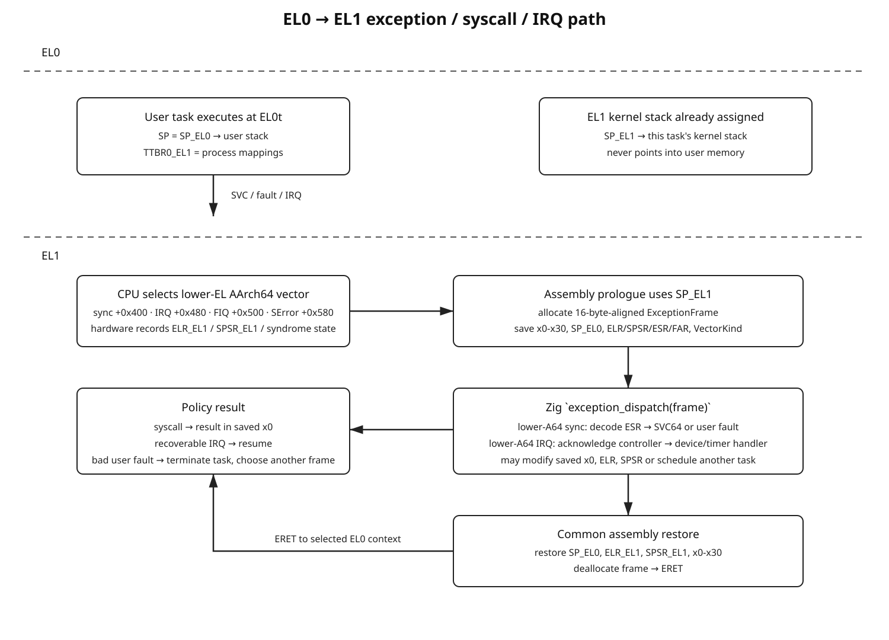

# 5. Exceptions, EL0 → EL1, Syscalls, and Fault Return



## 5.1 EL1 owns the vector table used for EL0 exceptions

There is no `VBAR_EL0`. Privileged exception levels have vector-base registers; EL0 exceptions taken to EL1 enter the EL1 vector table [ARM-EXC].

Your initial EL1 vector table must therefore fully support two important execution origins from the beginning:

```text
current EL, SP_EL1   -> kernel synchronous faults and kernel IRQs
lower EL, AArch64    -> userspace synchronous exceptions and userspace IRQs
```

The remaining architectural slots still exist and enter explicit unsupported/fatal paths.

## 5.2 Complete EL1 vector table

The EL1 vector base has 16 architecturally fixed entries [ARM-EXC]:

| Offset | Origin | Type | Initial policy |
|---:|---|---|---|
| `0x000` | current EL, using SP0 | synchronous | fatal: kernel should use EL1h |
| `0x080` | current EL, using SP0 | IRQ | fatal |
| `0x100` | current EL, using SP0 | FIQ | fatal |
| `0x180` | current EL, using SP0 | SError | fatal |
| `0x200` | current EL, using SPx (`SP_EL1`) | synchronous | real kernel fault dispatcher |
| `0x280` | current EL, using SPx | IRQ | real IRQ dispatcher |
| `0x300` | current EL, using SPx | FIQ | initially fatal/diagnostic |
| `0x380` | current EL, using SPx | SError | fatal/diagnostic |
| `0x400` | lower EL, AArch64 | synchronous | real EL0 syscall/fault dispatcher |
| `0x480` | lower EL, AArch64 | IRQ | real IRQ dispatcher with user-origin metadata |
| `0x500` | lower EL, AArch64 | FIQ | initially fatal/diagnostic |
| `0x580` | lower EL, AArch64 | SError | fatal/diagnostic |
| `0x600` | lower EL, AArch32 | synchronous | unsupported until AArch32 userspace exists |
| `0x680` | lower EL, AArch32 | IRQ | unsupported |
| `0x700` | lower EL, AArch32 | FIQ | unsupported |
| `0x780` | lower EL, AArch32 | SError | unsupported |

Each slot occupies 128 bytes. The whole table is 2048 bytes and must be aligned accordingly.

## 5.3 Vector source layout

Keep the fixed vector geometry visible in `vectors.S`. A typical style is:

```asm
.section .text.vectors, "ax"
.balign 0x800
.global aarch64_vectors

aarch64_vectors:
    b vector_sync_current_sp0
    .balign 0x80
    b vector_irq_current_sp0
    .balign 0x80
    b vector_fiq_current_sp0
    .balign 0x80
    b vector_serror_current_sp0
    .balign 0x80

    b vector_sync_current_spx
    .balign 0x80
    b vector_irq_current_spx
    .balign 0x80
    b vector_fiq_current_spx
    .balign 0x80
    b vector_serror_current_spx
    .balign 0x80

    b vector_sync_lower_a64
    .balign 0x80
    b vector_irq_lower_a64
    .balign 0x80
    b vector_fiq_lower_a64
    .balign 0x80
    b vector_serror_lower_a64
    .balign 0x80

    b vector_sync_lower_a32
    .balign 0x80
    b vector_irq_lower_a32
    .balign 0x80
    b vector_fiq_lower_a32
    .balign 0x80
    b vector_serror_lower_a32
    .balign 0x80
```

The final source should assert or otherwise ensure that no slot-local stub grows past 128 bytes. Keeping each slot as a branch into common code makes overflow unlikely and keeps the table auditable.

## 5.4 Vector metadata

Each stub supplies a compact `VectorKind` constant to the shared prologue. The kind encodes at least:

```text
origin:
    current_sp0
    current_spx
    lower_aarch64
    lower_aarch32

class:
    synchronous
    irq
    fiq
    serror
```

Do not infer origin later only from `SPSR_EL1`; the vector slot is direct architectural information and should be preserved in the frame.

## 5.5 Exception frame

Use one full frame for synchronous and IRQ entry initially. A simple fixed layout is:

```text
+0x000  x0
+0x008  x1
...
+0x0f0  x30
+0x0f8  SP_EL0
+0x100  ELR_EL1
+0x108  SPSR_EL1
+0x110  ESR_EL1
+0x118  FAR_EL1
+0x120  VectorKind
+0x128  reserved / alignment
--------------------------------
0x130 = 304 bytes total
```

304 is divisible by 16, preserving the stack invariant.

`SP_EL0` is explicitly captured because it is part of user-thread state. For a current-EL exception, the pre-exception kernel SP can be reconstructed from the post-allocation frame pointer plus `EXC_FRAME_SIZE` if required.

## 5.6 Save-before-clobber rule

On vector entry, every GPR still contains interrupted state. If `x0` is used to read `ESR_EL1` before saving the old `x0`, the frame is already corrupted.

The shared prologue must first reserve the frame and save all `x0-x30`, then use those registers as scratch:

```text
sub SP by full frame size
save x0-x30
read SP_EL0
read ELR_EL1
read SPSR_EL1
read ESR_EL1
read FAR_EL1
store VectorKind
```

Do not call Zig before all required interrupted state has been saved.

## 5.7 What hardware saves automatically

When an exception is taken to EL1, the architecture records return state in EL1 system registers, including:

- `ELR_EL1`: return PC appropriate to the exception class
- `SPSR_EL1`: prior PSTATE
- `ESR_EL1`: syndrome for synchronous exceptions and applicable faults
- `FAR_EL1`: fault address for exception classes where it is architecturally valid

General-purpose registers are **not** automatically copied into a kernel frame. The vector prologue does that.

## 5.8 Zig dispatcher interface

The assembly-facing function should have a stable C/AAPCS64 ABI, conceptually:

```text
exceptionDispatch(frame: *ExceptionFrame) -> void
```

The dispatcher examines `frame.vector_kind` first, then class-specific architectural state.

A reasonable split:

```text
exceptionDispatch
    |
    +--> synchronousCurrentEl(frame)
    |
    +--> synchronousLowerA64(frame)
    |
    +--> irqDispatch(frame)
    |
    +--> fatalUnsupportedVector(frame)
```

Assembly should not decode `ESR_EL1.EC` beyond what is needed to reach a safe high-level dispatcher.

## 5.9 Synchronous exception decoding

At minimum decode:

```text
ESR_EL1.EC   exception class
ESR_EL1.IL   trapped-instruction length metadata
ESR_EL1.ISS  class-specific syndrome
```

For aborts, decode the fault-status portion sufficiently to distinguish:

- address-size fault
- translation fault
- access-flag fault
- permission fault
- synchronous external abort
- alignment-related causes where applicable

Also print/record:

```text
ELR_EL1
FAR_EL1 (only when meaningful for the class)
SPSR_EL1
VectorKind
MPIDR_EL1
```

## 5.10 Current-EL synchronous exception policy

The `0x200` vector represents an exception taken while the kernel was executing at EL1 using `SP_EL1`.

Initially:

```text
BRK used deliberately for tests -> recognizable diagnostic path
recoverable kernel page fault    -> only later if explicitly designed
all unexpected data/instruction aborts -> panic
undefined instruction            -> panic
alignment fault                  -> panic
```

Do not silently convert arbitrary kernel faults into task failures. A kernel fault is a kernel correctness failure unless it occurs in a deliberately recoverable mechanism such as a future `copyFromUser` fault-fixup region.

## 5.11 Lower-EL AArch64 synchronous exception policy

The `0x400` vector is first-class from the initial exception subsystem.

Eventually it handles:

```text
SVC64                    -> syscall dispatcher
instruction abort EL0    -> user fault
Data Abort EL0           -> user fault / page-fault mechanism later
BRK from EL0             -> debugger/process fault policy
undefined instruction    -> user fault
FP/SIMD trap             -> policy-dependent
other trapped operations -> explicit decode/fault
```

Before a process scheduler exists, an EL0 smoke test may return to a fixed EL1 test harness. Once real processes exist, unexpected user exceptions terminate/fault the current process rather than panicking the whole kernel.

## 5.12 The EL0 → EL1 stack transition

Before executing EL0, the kernel must ensure two different stack pointers are valid:

```text
SP_EL0 = user stack pointer
SP_EL1 = current task's kernel stack pointer/top
```

When AArch64 EL0 executes `svc`, faults, or receives an IRQ that is routed to EL1:

```text
EL0 code
    |
    | SVC / fault / IRQ
    v
CPU takes exception to EL1
    |
    +-- saves old PSTATE -> SPSR_EL1
    +-- saves return PC -> ELR_EL1
    +-- selects lower-EL AArch64 vector slot
    +-- executes handler at EL1 using kernel EL1 stack convention
    v
vector prologue allocates ExceptionFrame on SP_EL1
```

`SP_EL0` remains the user stack and is read into the frame by the handler. User-controlled memory must never be used as the kernel exception stack.

## 5.13 Entering EL0

A prepared initial user context needs at least:

```text
TTBR0_EL1 / process address space installed
user text mapped executable and user-accessible
user stack mapped RW, NX, user-accessible
kernel TTBR1 mappings active and privileged-only
SP_EL0 = aligned user stack top
SP_EL1 = valid current task kernel stack
ELR_EL1 = user entry PC
SPSR_EL1 = AArch64 EL0t state with intended interrupt mask state
initial x0-x30 state
```

Then execute `ERET` from EL1.

Do not make a normal function call to a user PC. `ERET` is the architectural privilege transition.

## 5.14 Why real EL0 execution should wait for MMU isolation

It is possible to use a temporary EL0 trampoline while translation is disabled, but that does not give meaningful user/kernel memory protection. It is acceptable only as an explicit architecture smoke test under QEMU.

The real userspace milestone should wait until:

- TTBR1 kernel mappings exist
- TTBR0 process mappings exist
- EL0 permissions are configured
- user pointers can be distinguished from kernel pointers
- faults are reliable

The exception **infrastructure** supports lower EL from the beginning; secure userspace semantics begin later.

## 5.15 Minimal EL0 smoke test

Once the MMU user mapping is ready, the first test program should contain only architecture-observable operations:

```text
1. enter EL0
2. execute SVC #0
3. EL1 handler recognizes SVC64
4. handler changes saved x0 to a known result
5. ERET to EL0
6. EL0 validates x0 and executes BRK or another SVC to report completion
```

Then add tests for:

```text
read unmapped address          -> lower-EL data abort
execute unmapped address       -> lower-EL instruction abort
write read-only user page      -> lower-EL permission fault
access privileged kernel VA    -> lower-EL fault
```

## 5.16 Syscall ABI

Pick an ABI once and document it. A simple AArch64 Linux-like register convention is practical even without Linux compatibility:

```text
x8      syscall number
x0-x5   arguments
x0      result / negative-or-tagged error by your chosen convention
```

User code executes:

```asm
svc #0
```

The lower-AArch64 synchronous dispatcher verifies that the syndrome corresponds to an AArch64 SVC before reading the syscall number.

Do not assume every lower-EL synchronous exception is a syscall.

## 5.17 Returning from a syscall

The syscall handler operates on the saved `ExceptionFrame`:

```text
frame.x[0] = return value
```

Then the common epilogue restores:

```text
ELR_EL1
SPSR_EL1
x0-x30
SP_EL0 if the kernel intentionally changed it
```

and executes `ERET`.

Because the architectural return PC for an SVC is defined by the exception semantics, do not blindly add 4 to `ELR_EL1` in a generic synchronous handler. Exception-class-specific return behavior belongs in the class handler.

## 5.18 User fault policy

Once a scheduler exists:

```text
lower-EL fault
    |
    v
decode syndrome
    |
    +--> recoverable page fault later -> resolve mapping -> return
    |
    +--> unrecoverable user fault -> mark task/process faulted/dead
                                      schedule another task
```

Do not panic the kernel merely because a user process dereferenced an invalid address.

## 5.19 Kernel fault policy

For current-EL faults:

```text
unexpected kernel fault -> panic
```

Later `copyFromUser`/`copyToUser` may need recoverable exception fixups. Implement that as a deliberate mechanism:

- known faulting PC range or exception-table entry
- known recovery PC
- exact error return

Never treat all EL1 data aborts as recoverable because some happen while touching user memory.

## 5.20 IRQs from EL0 and EL1

An IRQ taken while EL0 executes uses the lower-AArch64 IRQ slot (`+0x480`). An IRQ taken while the kernel is already at EL1h uses current-EL SPx (`+0x280`).

Both can use the same `ExceptionFrame` and high-level IRQ dispatcher. Preserve the origin because scheduling/preemption decisions can differ:

```text
IRQ interrupted EL0 -> returning to userspace is a natural reschedule point
IRQ interrupted EL1 -> must respect kernel preemption/critical-section state
```

## 5.21 Nested exceptions

Initial policy: do not permit nested maskable IRQs inside an IRQ handler.

The vector prologue saves the full frame with interrupts masked according to the exception state, and high-level IRQ code does not re-enable IRQs until the system has explicit nesting rules.

Later, if nested IRQs are desired, define:

- maximum nesting
- IRQ stack policy
- lock/preemption interaction
- per-CPU `irq_depth`
- which interrupt priorities can preempt

## 5.22 IRQ stacks versus task kernel stacks

Initial design:

```text
EL0 task
  |
  | exception
  v
same task's kernel stack via SP_EL1
```

This is sufficient for early userspace and simple scheduling.

Later, a per-CPU IRQ stack can reduce worst-case task-stack requirements. AArch64 does not magically switch to an arbitrary OS IRQ stack; software must switch after architectural entry if that policy is desired.

## 5.23 Exception-frame exit and scheduling

Avoid switching tasks from arbitrary points inside deeply nested exception code. A clean eventual design is:

```text
handler sets need_reschedule
      |
      v
common exception-exit path
      |
      +--> if safe and reschedule required: scheduler path
      |
      +--> otherwise restore same frame
      v
ERET
```

This keeps return-to-EL0, return-to-EL1, preemption state, and interrupt depth under one exit policy.
