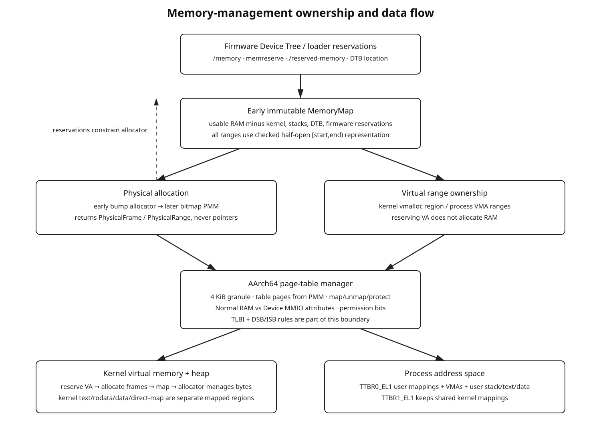

# 7. MMU, Physical Memory, Virtual Memory, and Allocators



## 7.1 Four separate resource managers

Do not collapse these into one “allocator”.

### Early physical allocator

Bootstraps page tables and allocator metadata before the full PMM exists. Usually monotonic and never frees.

### Physical memory manager (PMM)

Owns physical RAM frames.

### Virtual address manager (VMM range allocator)

Owns unused regions of the kernel/process virtual address space. Reserving a VA range does not allocate RAM.

### Heap allocator

Owns variable-sized allocations inside mapped kernel virtual memory and requests more mapped pages from lower layers as needed.

Conceptually:

```text
heap request
    |
    v
kernel virtual range allocator
    |
    +---- reserves VA range
    |
    v
physical frame allocator
    |
    +---- allocates frames
    |
    v
page-table manager
    |
    +---- maps frames at reserved VA
    v
heap gets more mapped memory
```

## 7.2 Memory-map construction before allocation

Build usable physical memory from Device Tree:

```text
all /memory ranges
    minus FDT reservation-block ranges
    minus /reserved-memory ranges
    minus [__kernel_phys_start, __kernel_phys_end)
    minus DTB itself if not already reserved
    minus bootstrap page tables
    minus early allocator allocations
    minus firmware/runtime reservations required by platform
```

All ranges use `[start, end)` and checked arithmetic.

Do not use `__kernel_end .. hardcoded_ram_end` as the final allocator input.

## 7.3 Early physical page allocator

The first page tables require physical pages before the full PMM exists. Use a simple boot allocator:

```text
EarlyPageAllocator {
    current range index
    next aligned address
    reservation ledger
}
```

Properties:

- returns 4-KiB-aligned physical frames
- skips all reserved ranges
- no free operation
- records allocations so the final PMM marks them used
- no heap dependency

It may walk a precomputed small array of usable ranges produced by the zero-allocation DT/memory-map phase.

## 7.4 Translation granule and table geometry

Initial policy: 4-KiB granule.

For a 48-bit virtual address space, the common four-level decomposition is [ARM-MM]:

```text
VA[47:39]  L0 index
VA[38:30]  L1 index
VA[29:21]  L2 index
VA[20:12]  L3 index
VA[11:0]   page offset
```

A 4-KiB table with 8-byte descriptors has 512 entries.

Useful mapping sizes:

```text
L1 block  1 GiB
L2 block  2 MiB
L3 page   4 KiB
```

Do not hardcode four levels in generic APIs if `T0SZ/T1SZ` could later select a different starting level; but the first implementation can deliberately support the chosen 48-bit layout only and reject others.

## 7.5 Page-table module split

Recommended responsibilities:

```text
pagetable.zig
    descriptor encoding/decoding
    table walking
    map/unmap primitive
    conflict detection

mmu.zig
    MAIR/TCR/TTBR/SCTLR policy
    enable/disable transition
    feature probing

tlb.zig
    invalidate operations
    required barrier sequences

layout.zig
    kernel virtual address policy
```

Do not embed raw `TCR_EL1` constants inside a generic `mapPage()` function.

## 7.6 Physical address width

Read the architectural feature register (`ID_AA64MMFR0_EL1.PARange`) and configure the translation regime's physical-address-size field consistently.

Do not assume `u64` representation means the hardware implements 64 physical address bits.

The PMM can still use a 64-bit/`usize` representation with checked validation against the implemented range.

## 7.7 MAIR policy

At minimum define named MAIR indexes for:

```text
Normal WB cacheable memory
Device memory suitable for MMIO
```

Do not use the same attribute for RAM and PL011/GIC registers.

Document each MAIR byte in terms of architectural semantics, not as an unexplained hex constant.

## 7.8 TCR policy

Explicitly document each configured field:

```text
T0SZ / T1SZ    lower/upper VA size
TG0 / TG1      4-KiB granules
SH0 / SH1      shareability
IRGN0 / ORGN0  cacheability for table walks
IRGN1 / ORGN1
IPS            physical address size
EPD0/EPD1      whether a translation half is disabled during stages
A1 / ASID policy later
TBI0/TBI1      initially disabled unless deliberately used
```

The register should be assembled from named field values and validated against supported CPU features.

## 7.9 Initial MMU bootstrap maps

Before setting `SCTLR_EL1.M`, the CPU is executing at identity/physical addresses. Initial tables need all memory required to survive the transition:

```text
identity map:
    current kernel code
    current boot stack
    current vector table
    current page tables where needed
    early UART MMIO if code continues using its physical VA

future/high map:
    kernel image
    direct physical map
    MMIO mappings
```

The safest first MMU milestone is identity-only with correct attributes. Then add the high-half mapping as a separate milestone.

## 7.10 MMU enable sequence

The exact barrier/TLB sequence must follow the Arm architecture requirements for changing translation state [ARM-MM]. Conceptually:

```text
build tables completely
clean table memory as required by cache state/coherency contract
configure MAIR_EL1
configure TCR_EL1
configure TTBR0_EL1 / TTBR1_EL1
perform required TLB invalidation and barriers
configure SCTLR_EL1
ISB
continue in identity mapping
```

Do not guess barrier ordering from intuition. Keep the architecture sequence in one named function and cite the Arm ARM/guide beside it.

## 7.11 First MMU acceptance test

Immediately after enabling translation:

```text
print through UART
execute BRK and receive correct exception
read/write known RAM
verify current SP/PC are still mapped
```

If UART dies but RAM execution continues, suspect MMIO address/attribute mapping before suspecting the PL011 driver.

## 7.12 Kernel virtual layout

A proposed 48-bit policy:

```text
0x0000_0000_0000_0000
        |
        | TTBR0 user space
        |
0x0000_7fff_ffff_ffff

        canonical gap

0xffff_8000_0000_0000
        |
        | direct physical map
        |
        +-------------------------
        | vmalloc / dynamic kernel VA
        +-------------------------
        | kernel image region
        |
0xffff_ffff_ffff_ffff
```

Exact boundaries are kernel policy. Store them as named constants in one module and compile-time assert non-overlap.

## 7.13 TTBR policy

Long-term:

```text
TTBR1_EL1 = shared kernel mappings
TTBR0_EL1 = current process user mappings
```

During kernel-only stages, TTBR0 can be disabled or point to a minimal bootstrap lower-half table according to the chosen TCR policy.

When userspace is introduced, each process owns a TTBR0 root and eventually an ASID.

## 7.14 Direct physical map

Map ordinary usable/reserved RAM into a fixed upper VA region:

```text
VA = DIRECT_MAP_BASE + PA
```

The direct map permits the kernel to inspect page-table pages and PMM-owned RAM without temporary mappings.

Do not direct-map MMIO as ordinary RAM. Device regions get explicit Device mappings.

## 7.15 Kernel image permissions

After high-half mappings work, split sections:

```text
.text                 read + execute, not writable
.rodata               read, execute-never, not writable
.data / .bss          read/write, execute-never
kernel stacks         read/write, execute-never
guard pages           unmapped
page tables           read/write, execute-never
heap                   read/write, execute-never
MMIO                   Device read/write, execute-never
```

Maintain W^X: no page should be simultaneously writable and executable unless a very deliberate future mechanism requires it.

## 7.16 High-half transition

After both identity and high mappings exist:

1. enable MMU while executing identity-mapped code
2. branch to the high virtual alias of a dedicated continuation label
3. move SP to the high virtual alias of the same stack or switch to a newly allocated high kernel stack
4. update `VBAR_EL1` to the high virtual vector address
5. keep the physical secondary trampoline identity mapped
6. remove unnecessary identity mappings only after no CPU/firmware path still needs them
7. invalidate affected TLB entries with correct break-before-make/order rules

Do not remove identity mappings before all secondary CPUs have a safe startup strategy.

## 7.17 Physical allocator: bitmap first

A bitmap PMM is a good first real allocator.

One bit per 4-KiB frame costs approximately:

```text
1 GiB RAM -> 262,144 frames -> 32 KiB bitmap
8 GiB RAM -> 2,097,152 frames -> 256 KiB bitmap
```

Required operations:

```text
allocateFrame()
freeFrame()
allocateContiguous(count, alignment)   # can be simple/slow initially
markUsed(range)
markFree(range)
isUsed(frame)
```

Initialize all bits used, then free only verified usable RAM ranges, then re-mark all reservations. This “default reserved” policy is safer than default-free initialization.

## 7.18 PMM concurrency

Before SMP, no lock is needed for correctness. Before secondaries go online, wrap the PMM in its final locking interface so call sites do not change later.

When SMP begins:

- protect allocator metadata with a spinlock or finer-grained mechanism
- do not disable only local IRQs and call that SMP-safe
- if PMM is callable from IRQ context, define lock/IRQ ordering explicitly

Initially, simply prohibit PMM allocation in hard IRQ context.

## 7.19 Virtual range allocator

This allocator manages free virtual intervals, not physical memory.

API concept:

```text
reservePages(count, alignment) -> VirtualRange
releaseRange(range)
```

For the first implementation, a sorted free-range list is easier to inspect than a sophisticated tree. Once heap allocation exists, allocator metadata can become dynamic; bootstrap it with a fixed node pool first if necessary.

## 7.20 Page-table mapping API

Use explicit types and permissions:

```text
mapPage(va: VirtualPage, pa: PhysicalFrame, attrs: MappingAttributes)
unmapPage(va)
protectRange(range, attrs)
translate(va) -> ?PhysicalAddress
```

`MappingAttributes` should name semantic properties:

```text
read
write
execute
user_accessible
memory_type: normal | device
shareability
```

Descriptor bit encoding remains inside the AArch64 page-table module.

## 7.21 Mapping races and TLB correctness

Once multiple CPUs use the same page tables, updating mappings requires more than a lock around descriptor writes.

The mapping subsystem must implement the architecture's required:

- descriptor update ordering
- break-before-make when changing mappings/attributes in cases where required
- TLB invalidation scope
- barriers before/after TLBI
- cross-CPU shootdown

Initial SMP policy can avoid many dynamic mapping races by bringing all CPUs online only after stable kernel mappings exist. Dynamic unmap/protect across CPUs comes later but must be designed as a page-table responsibility, not a PMM responsibility.

## 7.22 Kernel heap

Only introduce a general allocator after PMM + VMM + mapping works.

A sensible progression:

```text
boot bump allocator
    -> mapped-page allocator
    -> simple free-list/slab-like kernel heap
```

The heap requests additional pages through a kernel-memory layer rather than calling the PMM and inventing virtual addresses itself.

## 7.23 Process address spaces

Each user process eventually owns:

```text
AddressSpace {
    ttbr0_root: PhysicalFrame,
    asid: ...,
    vm_areas: ...,
}
```

The process's logical VM areas are separate from raw page tables:

```text
VmArea {
    [start, end),
    permissions,
    backing type,
}
```

Examples:

```text
user text     R+X
user rodata   R
user data     R+W
user stack    R+W + guard page
anonymous     R+W
```

## 7.24 EL0 access protection

User mappings must be marked user-accessible only where intended. Kernel TTBR1 mappings must remain privileged.

Later hardening can use architecture features such as PAN where available, but the first correctness boundary is page-table permission separation plus explicit user-copy helpers.

## 7.25 User-copy API

Never allow syscall code to casually turn an integer user address into a kernel pointer.

Introduce:

```text
copyFromUser(dst_kernel, src_user, len)
copyToUser(dst_user, src_kernel, len)
```

They validate:

- user canonical range
- integer overflow
- mapped pages
- requested permissions
- process lifetime/address-space stability
- fault behavior

Future fault-fixup support belongs here rather than in arbitrary drivers/filesystems.
