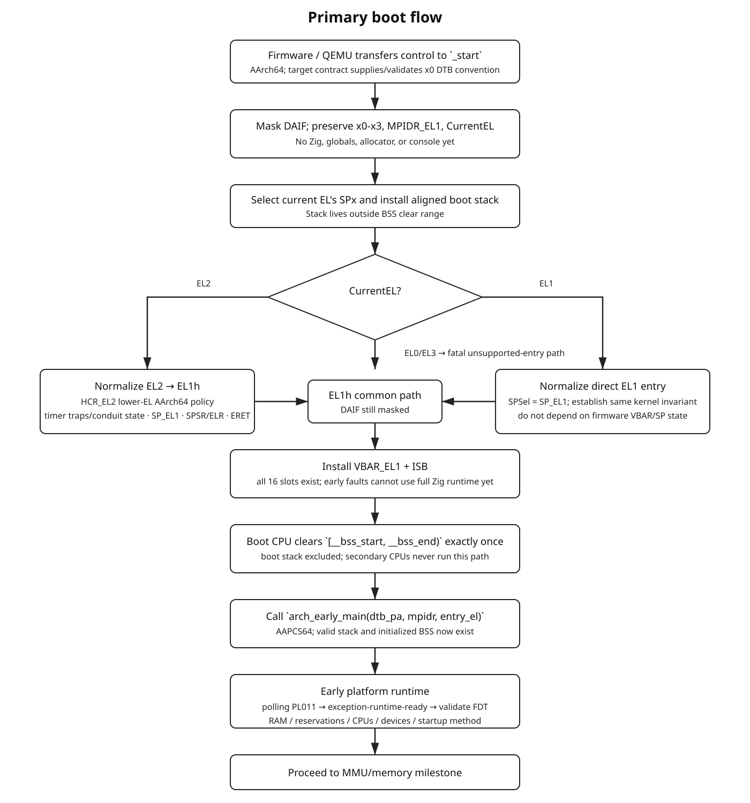
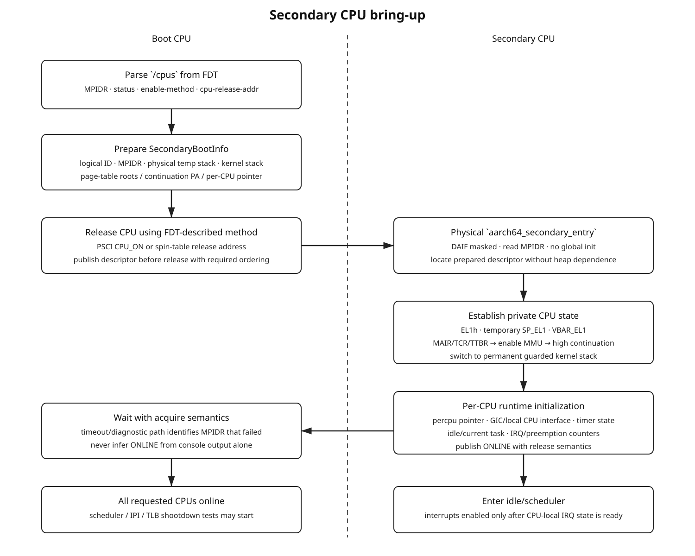

<!-- Generated combined view. Canonical editable chapters are the individual Markdown files. -->
# Dagos AArch64 Kernel Architecture and Development Design

This document set is the development design for a freestanding Zig kernel targeting AArch64 on:

- QEMU `virt`
- QEMU `raspi3b`
- QEMU `raspi4b`
- Raspberry Pi 3
- Raspberry Pi 4
- Raspberry Pi 5

The initial architecture port is **AArch64 only**. AArch32 is intentionally outside the initial scope. EL0 is **inside** the initial architecture: the EL1 vector table, exception frame, kernel-stack rules, and exception dispatcher are designed from the start for exceptions from AArch64 EL0 to EL1. Actual isolated user processes are enabled only after the MMU and per-process address-space work exists.

## Reading order

1. [Foundations and glossary](00-foundations-glossary.md)
2. [Architecture boundaries and invariants](01-architecture-boundaries.md)
3. [Project and assembly structure](02-project-structure.md)
4. [Build, images, and linker scripts](03-build-linker-images.md)
5. [Boot contract and exception-level normalization](04-boot-and-exception-levels.md)
6. [Exceptions, EL0 → EL1, syscalls, and fault return](05-exceptions-and-el0.md)
7. [Platforms, drivers, early console, and Device Tree](06-platforms-drivers-fdt.md)
8. [MMU, physical memory, virtual memory, and allocators](07-mmu-and-memory.md)
9. [Interrupts, timers, SMP, and CPU-local state](08-interrupts-timers-smp.md)
10. [Tasks, scheduling, and userspace](09-tasks-scheduler-userspace.md)
11. [Development milestones and acceptance criteria](10-development-roadmap.md)
12. [Debugging, testing, and bring-up procedure](11-debugging-testing.md)
13. [Assembly blueprints](13-assembly-blueprints.md)
14. [Per-target boot and bring-up contracts](14-target-contracts.md)
15. [References](12-references.md)

## Diagrams

- [Layering](diagrams/layers.svg)
- [Primary boot flow](diagrams/boot-flow.svg)
- [EL0 → EL1 exception flow](diagrams/el0-exception-flow.svg)
- [Memory-management layering](diagrams/memory-flow.svg)
- [Secondary CPU bring-up](diagrams/smp-flow.svg)

## Foundational dependency chain

```text
platform boot contract
        │
        v
AArch64 entry + known stack + EL1h
        │
        v
BSS + VBAR_EL1 + lower-EL-aware vector table
        │
        v
polling early console
        │
        v
reliable synchronous exception handling
        │
        v
Device Tree parser + actual RAM/device discovery
        │
        v
early physical-page allocator
        │
        v
translation tables + MMU + kernel mappings
        │
        v
physical frame allocator + kernel VMM + heap
        │
        v
interrupt controller + architectural timer
        │
        v
secondary CPU bring-up + SMP synchronization
        │
        v
kernel tasks + context switching + scheduler
        │
        v
per-process TTBR0 address spaces
        │
        v
AArch64 EL0 + SVC + userspace faults
```

## Scope decision

EL3 ownership is not part of the initial kernel. The supported kernel-entry contract is non-secure AArch64 EL1 or EL2, with EL2 normalized to EL1h. Taking ownership at EL3 would turn the project into both a kernel and secure firmware/monitor implementation and would add secure-state, exception routing, and firmware-service responsibilities unrelated to the initial OS goals.

The architectural exception subsystem nevertheless supports the complete EL1 vector-table shape from the beginning: current-EL SP0, current-EL SPx, lower-EL AArch64, and lower-EL AArch32 slots all exist. Unsupported origins fail explicitly rather than falling through into adjacent vector slots.


---

# 0. Foundations and Glossary

This chapter defines the terms used throughout the design. It is intentionally explicit so later chapters can distinguish architecture requirements from conventions and implementation choices.

Source labels such as `[ARM-EXC]` are defined in [12. References](12-references.md).

## 0.1 Armv8-A, AArch64, and Cortex CPU names

These names describe different things:

```text
Armv8-A / later A-profile architecture
    specification of instructions, registers, exceptions, MMU, etc.

AArch64
    the 64-bit execution state/instruction set of A-profile Arm

AArch32
    the 32-bit execution state/instruction set

Cortex-A53 / A72 / A76
    concrete CPU implementations of compatible architecture revisions
```

Dagos' initial port is AArch64. A future AArch32 port is a separate architecture implementation rather than a `32_bit` switch sprinkled through AArch64 code.

## 0.2 Exception levels

AArch64 software can execute at exception levels:

```text
EL3  secure monitor / highest privileged firmware role
EL2  hypervisor role
EL1  operating-system kernel role
EL0  unprivileged application role
```

Not every implementation must provide every optional higher level. Dagos' initial kernel runs at EL1 and applications run at EL0. It accepts a firmware entry at EL2 and performs a controlled `ERET` to EL1h. It does not initially own EL3 `[ARM-EXC]`.

An EL number is not an interrupt priority. It is a privilege/execution context.

## 0.3 `CurrentEL`, PSTATE, and saved PSTATE

`CurrentEL` tells privileged software which exception level it is executing at.

PSTATE contains current processor state including:

- current EL/mode;
- interrupt masks;
- condition flags;
- other execution-state controls.

When an exception is taken to EL1, hardware saves the old PSTATE into:

```text
SPSR_EL1
```

and saves the exception return PC into:

```text
ELR_EL1
```

`ERET` consumes these saved values to return from the exception `[ARM-EXC]`.

## 0.4 `DAIF`

The four commonly discussed asynchronous mask bits are:

```text
D  debug exceptions
A  SError
I  IRQ
F  FIQ
```

Early boot masks all four. Installing `VBAR_EL1` does **not** automatically make interrupts safe; the relevant interrupt controller, handler state, stack, and CPU-local state must also be initialized before unmasking IRQ/FIQ.

## 0.5 IRQ, FIQ, SError, and synchronous exceptions

AArch64 vectors classify exceptions into four kinds:

```text
synchronous
    directly associated with the current instruction stream:
    SVC, BRK, data abort, instruction abort, undefined instruction, etc.

IRQ
    normal asynchronous interrupt request

FIQ
    fast interrupt request class; routing/use is platform policy

SError
    asynchronous system error, commonly related to external/system memory errors
```

A hardware timer interrupt is an IRQ source. The CPU vector tells Dagos **that an IRQ was taken**; the interrupt controller identifies the interrupt source.

## 0.6 `VBAR_EL1`

`VBAR_EL1` is the base address of EL1's vector table.

EL1's table contains vectors for:

- exceptions from current EL using SP0;
- exceptions from current EL using SPx (`SP_EL1` at EL1);
- exceptions from a lower AArch64 EL;
- exceptions from a lower AArch32 EL.

Thus EL0→EL1 exception support does **not** require `VBAR_EL0`; there is no EL0 vector-base register. EL0 exceptions are handled by the lower-EL entries in the EL1 table `[ARM-EXC]`.

## 0.7 `SP_EL0`, `SP_EL1`, EL1t, and EL1h

AArch64 gives privileged levels stack-selection behavior.

Dagos uses:

```text
EL1h
    kernel execution uses SP_EL1

EL0t
    userspace uses SP_EL0
```

For a user task:

```text
SP_EL0 -> user stack
SP_EL1 -> that task's kernel stack
```

When EL0 takes an exception to EL1, hardware enters the EL1 vector context and Dagos builds its exception frame on the kernel stack. User memory must never be trusted as the kernel's exception stack.

## 0.8 `ESR_EL1` and `FAR_EL1`

`ESR_EL1` is the Exception Syndrome Register for exceptions reported to EL1. Important fields include:

```text
EC   Exception Class: broad reason, e.g. SVC64 or data abort
IL   instruction length information where defined
ISS  class-specific syndrome information
```

`FAR_EL1` is the fault address register for exception classes where a faulting virtual address is reported.

A useful exception dump prints both the raw register and decoded fields. Do not treat `FAR_EL1` as meaningful for every exception class `[ARM-EXC]`.

## 0.9 Physical and virtual addresses

A **physical address (PA)** identifies a location in the physical address space presented to the CPU/memory system.

A **virtual address (VA)** is the address used by software when stage-1 translation is enabled.

Before the MMU is enabled, early Dagos uses an identity-style environment where the linked/executed addresses correspond to physical locations. After the MMU is enabled, PA and VA are different semantic types even if a particular mapping happens to use equal numeric values.

Do not equate:

```text
usize == pointer == physical address
```

`usize` is only a machine-sized integer representation.

## 0.10 MMU and translation tables

The Memory Management Unit translates virtual addresses to physical addresses according to translation tables.

At EL1, key registers include:

```text
TTBR0_EL1   translation-table root conventionally used for lower/user VA
TTBR1_EL1   translation-table root conventionally used for upper/kernel VA
TCR_EL1     translation control: VA size, granules, cacheability, PA size, etc.
MAIR_EL1    named memory-attribute encodings
SCTLR_EL1   includes MMU/cache/control enable fields
```

Dagos initially uses 4-KiB translation granules `[ARM-MM]`.

## 0.11 Page, physical frame, and page-table page

With a 4-KiB granule:

```text
virtual page
    a 4-KiB-sized region of virtual address space

physical frame
    a 4-KiB-sized allocatable unit of physical RAM

page-table page
    a 4-KiB physical frame whose contents are translation descriptors
```

A virtual page is not RAM. It becomes backed when the page-table manager maps it to a physical frame or another physical region.

## 0.12 TLB

A Translation Lookaside Buffer caches translations and related permissions/attributes.

Changing a page-table entry does not imply every CPU immediately forgets an old cached translation. Page-table operations therefore require appropriate:

- descriptor update ordering;
- TLBI operations;
- `DSB`/`ISB` sequences;
- eventually inter-processor TLB shootdowns for mappings cached by another CPU.

The exact sequence depends on the kind of mapping change and is architectural, not a generic compiler-memory-ordering problem `[ARM-MM]`.

## 0.13 Normal memory versus Device memory

RAM and MMIO registers must not use the same memory attributes.

```text
Normal memory
    ordinary RAM; cacheable/shareable attributes can be selected

Device memory
    peripheral-register regions with stronger access/ordering semantics
```

Mapping UART or GIC registers as normal cacheable RAM is a correctness bug.

## 0.14 MMIO and `volatile`

Memory-Mapped I/O means a device exposes control/status registers at addresses in the CPU physical address space.

A PL011 write is conceptually:

```text
CPU store -> mapped UART register -> hardware action
```

Compiler `volatile` semantics are required so accesses are actually emitted as intended. `volatile` is **not** a substitute for Arm memory barriers when architectural ordering is required.

## 0.15 DMB, DSB, and ISB

Very roughly:

```text
DMB  orders relevant memory accesses
DSB  waits for required prior memory/system effects to complete to the selected domain
ISB  flushes/refetches the instruction stream so subsequent instructions observe changed execution context
```

Do not interchange them mechanically. System-register writes such as changing translation/control state have specified synchronization requirements in the Arm ARM.

## 0.16 Cache coherency

SMP CPUs can have private caches while participating in a coherent memory domain. Coherency does not eliminate the need for atomics, locks, acquire/release ordering, TLB shootdowns, or explicit cache maintenance required by firmware/CPU-start protocols.

"The caches are coherent" is not a valid race-condition solution.

## 0.17 Device Tree / FDT / DTB

A **Device Tree** describes hardware as a hierarchy of nodes and properties.

An **FDT/DTB** is the flattened binary representation handed to the kernel.

Important properties/nodes include:

```text
/compatible
/chosen/stdout-path
/memory*/reg
/reserved-memory
/cpus
compatible
reg
ranges
interrupts
interrupt-parent
enable-method
cpu-release-addr
```

FDT integer cells are big-endian. A child's `reg` address is interpreted in its parent bus' address space and may require one or more `ranges` translations before it becomes a CPU physical address `[DT-FLAT] [DT-SPEC]`.

## 0.18 SoC versus board/platform

A SoC such as BCM2711 integrates CPU clusters and peripherals. A board such as Raspberry Pi 4 places that SoC in a concrete machine with firmware configuration and external wiring.

QEMU's `raspi4b` is an emulator platform approximating relevant parts of that machine. It is not proof that every real Pi 4 hardware behavior is emulated.

## 0.19 UART and PL011

UART is a serial communication interface. PL011 is a specific Arm UART controller design.

The generic PL011 driver owns the register-level behavior. The platform/firmware description owns:

- where the PL011 is mapped;
- which instance is intended as the console;
- pin mux/routing;
- clock source/frequency;
- interrupt line.

This is why "UART is platform dependent" is only partly true: the **device instance/integration** is platform dependent while the PL011 device driver is reusable.

## 0.20 Interrupt controller and GIC terms

An interrupt controller collects interrupt sources, applies enable/priority/routing policy, and presents interrupts to CPUs.

For GIC terminology:

```text
SGI  Software Generated Interrupt; commonly used as an IPI
PPI  Private Peripheral Interrupt; per-CPU source such as architectural timer
SPI  Shared Peripheral Interrupt; ordinary shared peripheral source
INTID interrupt identifier
```

GICv2 and GICv3 differ significantly in CPU-interface architecture. Dagos initially forces QEMU `virt` to GICv2 so the first generic GIC path can also serve Pi 4/Pi 5 integration work.

## 0.21 PSCI

PSCI is a firmware interface for power/state coordination, including bringing CPUs online. It can use an `SMC` or `HVC` conduit as described by firmware/Device Tree.

Dagos should not hardcode the conduit. The `/psci` Device Tree description determines how the call is made `[ARM64-BOOT]`.

## 0.22 Spin-table CPU startup

With the spin-table convention, firmware holds a secondary CPU outside normal kernel execution until the primary writes an entry address to a firmware-described release location and performs the required ordering/event operations.

Device Tree can describe this using:

```text
enable-method = "spin-table"
cpu-release-addr = ...
```

`cpu-release-addr` is platform data, not an AArch64 architectural constant `[ARM64-BOOT]`.

## 0.23 `WFE`, `SEV`, and `WFI`

```text
WFE  Wait For Event
SEV  Send Event
WFI  Wait For Interrupt
```

These are architectural instructions, but a complete synchronization protocol requires memory ordering and a shared-state design around them. A `WFE` loop alone does not make a data handoff race-free.

## 0.24 ELF versus flat binary

`kernel.elf` contains:

- sections;
- symbols;
- ELF metadata;
- optional DWARF/debug data.

A flat `kernel.bin` contains selected loadable bytes in image order and has no ELF symbol table.

Boot firmware/QEMU may consume the flat image while GDB uses the ELF. Keep both.

## 0.25 VMA, LMA, and linker `NOLOAD`

In linker terminology:

```text
VMA  virtual/run-time address associated with a section
LMA  load address from which its bytes are loaded, where distinct
```

Initially Dagos keeps these effectively identical to simplify MMU-off bring-up.

`NOLOAD` sections reserve runtime address space but do not require bytes in the flat image. Typical examples:

```text
.bss
boot stacks
bootstrap scratch/page-table reservations
```

Therefore the end of bytes in `kernel.bin` and the end of physical memory reserved by the running kernel are not necessarily the same address.

## 0.26 ABI

An Application Binary Interface defines machine-level interoperability rules. AAPCS64 specifies the AArch64 procedure-call convention used at Zig/assembly boundaries `[AAPCS64]`.

Important initial consequences:

- arguments/results use defined registers;
- x19-x29 have call-preservation roles;
- x30 is the link register;
- SP must obey 16-byte alignment requirements;
- a context switch and an exception frame solve different preservation problems.

## 0.27 Boot stack, kernel stack, and user stack

These are different lifetimes:

```text
boot stack
    temporary primary/secondary bring-up stack before scheduler/task stacks exist

kernel stack
    per scheduled task/thread stack used while that task executes in EL1 or takes EL0 exceptions

user stack
    EL0 virtual-memory stack, referenced through SP_EL0
```

Do not let every CPU share one boot stack. Do not use a user stack as an EL1 exception stack.

## 0.28 Physical allocator, virtual allocator, page mapper, and heap

These are separate:

```text
physical frame allocator
    chooses available RAM frames

virtual range allocator
    chooses unused virtual addresses

page-table manager
    establishes/removes VA -> PA mappings and attributes

heap allocator
    allocates byte/object-sized regions from already usable kernel virtual memory
```

A request for 128 heap bytes may eventually cause all three lower layers to act, but that does not make them one allocator.

## 0.29 Per-CPU state

Per-CPU state belongs to one logical CPU:

```text
logical ID
MPIDR
current task
IRQ nesting/preemption state
scheduler-local state
kernel/idle stack references
interrupt-interface state
```

The kernel maps architectural MPIDR affinity values to dense logical IDs. `MPIDR_EL1 & 0xff` may be a convenient early observation on simple targets but is not the permanent CPU-identity abstraction.

## 0.30 Architecture requirement versus project policy

Every design statement should fall into one of these classes:

```text
architectural requirement
    mandated by Arm architecture/AAPCS

boot-protocol requirement
    promised by the configured firmware/QEMU loader

platform fact
    device integration/address/topology for one target

Dagos policy
    a deliberate project choice, e.g. 4-KiB pages or EL1h

implementation detail
    current code organization/algorithm, replaceable without changing contracts
```

Keeping these categories visible prevents a working QEMU constant from slowly becoming a false "Arm rule".


---

# 1. Architecture Boundaries and Invariants

## 1.1 The separation to preserve

A portable bare-metal kernel becomes manageable only when five different kinds of knowledge remain separate.

### Architecture

`arch/aarch64` owns facts defined by the AArch64 architecture rather than by a board:

- exception levels and PSTATE
- `CurrentEL`, `DAIF`, `SPSel`
- `VBAR_EL1`, `ELR_EL1`, `SPSR_EL1`, `ESR_EL1`, `FAR_EL1`
- `MPIDR_EL1`
- AArch64 exception-vector geometry
- `ERET`
- `SVC`
- translation-table descriptors
- `MAIR_EL1`, `TCR_EL1`, `TTBR0_EL1`, `TTBR1_EL1`, `SCTLR_EL1`
- TLB invalidation instructions
- cache-maintenance instructions
- `DMB`, `DSB`, and `ISB`
- generic timer system registers
- atomic primitives
- context-switch assembly
- AAPCS64 call-preserved register rules

Architecture code must not contain Raspberry Pi peripheral addresses, QEMU machine names, BCM SoC names, or board-specific UART routing. See [ARM-EXC], [ARM-MM], and [AAPCS64] in [References](12-references.md).

### CPU implementation

Cortex-A53, Cortex-A72, and Cortex-A76 are CPU implementations. CPU-model-specific work belongs in an implementation/capability layer only when a real implementation detail requires it. Do not use a CPU model as a proxy for the entire platform.

### SoC

The SoC layer describes integrated hardware relationships such as:

- BCM2837
- BCM2711
- BCM2712
- local interrupt-controller integration
- peripheral bus windows
- GPIO blocks
- clock/reset providers
- integrated timers and mailboxes

The SoC layer may provide reusable helpers shared by QEMU's model of a Raspberry Pi and the corresponding real board. It must not assume a particular firmware boot path if the same SoC can be reached through a different boot contract.

### Platform

A platform is a bootable machine target:

- `qemu_virt`
- `qemu_raspi3b`
- `qemu_raspi4b`
- `rpi3b`
- `rpi4b`
- `rpi5`

The platform layer owns:

- the boot contract
- the image format
- the physical load address expected by the loader
- the platform linker fragment
- initial boot-argument interpretation
- an emergency early-console fallback
- expected Device Tree compatibility strings
- CPU-start mechanism glue when it is not fully discoverable
- QEMU command-line defaults or Raspberry Pi boot-partition configuration

### Driver

A driver knows a device programmer's model. `drivers/serial/pl011.zig` knows PL011 registers and behavior. It does not know whether the PL011 instance is `0x09000000`, `0xfe201000`, or a translated Pi 5 debug-UART address. Platform/FDT code supplies the instance resources.

### Kernel

The kernel layer consumes mechanisms and devices:

- console
- panic handling
- physical memory manager
- virtual memory manager
- heap
- interrupt dispatch
- scheduler
- process model
- syscalls
- user-access helpers

The kernel should not depend on BCM2711 register layout merely because it is being tested on Pi 4.


## 1.2 Dependency direction

Allowed direction:

```text
kernel
  |
  +--> platform ----> soc
  |       |
  |       +---------> drivers
  |
  +--> firmware/FDT
  |
  +--> arch/aarch64

drivers -----------> arch/aarch64 low-level MMIO/barrier primitives when needed
soc ---------------> drivers
platform -----------> arch boot ABI declarations
```

Forbidden examples:

```text
arch/aarch64/mmu.zig imports platform/rpi5.zig

drivers/serial/pl011.zig imports platform/qemu_virt.zig

kernel/mm/physical.zig hardcodes 0x40000000 because QEMU virt RAM starts there
```

## 1.3 Fixed initial architecture policy

Freeze these until there is a concrete reason to change them:

```text
instruction set:               AArch64
endianness:                    little-endian
kernel execution level:        EL1
kernel stack selection:        EL1h / SP_EL1
userspace execution level:     EL0t / SP_EL0
EL2 use:                       transient boot normalization only
EL3 ownership:                 unsupported initially
translation granule:           4 KiB
initial VA width target:       48 bits when supported
kernel/user split:             TTBR1_EL1 / TTBR0_EL1
initial floating-point policy: no implicit FP/SIMD use until context policy exists
```

EL0 support is architectural from the first vector-table implementation. The lower-EL AArch64 vectors are real dispatcher paths, not `panic("unused")` placeholders. AArch32 lower-EL vectors remain unsupported until an AArch32 port exists.

## 1.4 Stack invariants

AAPCS64 requires SP to remain 16-byte aligned at public interfaces and whenever memory is accessed via SP [AAPCS64]. Treat this as a hard kernel invariant:

```text
SP & 0xf == 0
```

This applies to:

- primary boot stack
- secondary boot stacks
- permanent kernel-task stacks
- per-process kernel stacks
- exception-frame allocation
- context-switch frames
- user `SP_EL0`

Do not use a `.bss` region as the active boot stack while clearing `.bss`; the BSS clear would overwrite the active stack. Boot stacks therefore live in a separate `NOLOAD` linker section excluded from the BSS clear range.

## 1.5 Physical and virtual addresses are distinct types

Their underlying representation may be `usize`, but their semantics are different. Use newtypes or equivalent wrappers:

```text
PhysicalAddress
VirtualAddress
PhysicalFrame
VirtualPage
```

A physical address is not automatically dereferenceable after the MMU is enabled. The normal conversion becomes:

```text
PhysicalAddress
     |
     v
physToDirectMap()
     |
     v
VirtualAddress
     |
     v
pointer
```

Do not pass plain integers across PMM/VMM/driver interfaces if the address kind is significant.

## 1.6 Boot stages

Use explicit stages so code can state what facilities are legal:

```text
Stage 0  raw architectural entry
Stage 1  known EL1h + valid stack + DAIF masked
Stage 2  BSS valid + vectors installed + Zig callable
Stage 3  early polling console
Stage 4  Device Tree parsed + immutable discovered platform description
Stage 5  early page allocation + bootstrap page tables
Stage 6  MMU enabled + kernel virtual layout established
Stage 7  real PMM/VMM/heap
Stage 8  interrupt controller + architectural timer
Stage 9  SMP online
Stage 10 scheduler/tasks
Stage 11 isolated EL0 processes + syscalls
```

Code requiring allocation must not be reachable in Stage 3. Code acquiring an SMP spinlock must not pretend it provides useful cross-CPU protection before secondary CPUs can run.

## 1.7 Global initialization invariant

Global initialization runs exactly once. The boot protocol determines which CPU first enters the kernel. Other CPUs remain outside normal kernel execution until the primary explicitly starts them through PSCI, spin-table, or platform-specific mechanics [ARM64-BOOT].

Therefore:

```text
primary CPU only:
    clear BSS
    parse DTB
    initialize PMM
    build global kernel page tables
    initialize global interrupt-controller state
    initialize scheduler globals

all CPUs:
    establish private stack
    establish VBAR_EL1
    establish CPU-local pointer/state
    install/enable compatible MMU context
    initialize CPU-side interrupt interface
    initialize per-CPU timer/scheduler state
```

## 1.8 Exception invariants

- `VBAR_EL1` is valid before interrupts are unmasked.
- The vector table is 2048-byte aligned.
- All 16 architectural slots exist.
- Each vector slot is at its architecturally fixed offset.
- Entry assembly saves every register before reusing it as scratch.
- The exception-frame size is a multiple of 16.
- Assembly offsets and Zig offsets are generated/validated from one layout definition.
- `SP_EL1` is a valid kernel stack before `ERET` to EL0.
- `SP_EL0` is never used as the kernel exception stack.
- Lower-EL AArch64 synchronous exceptions are distinguishable from current-EL faults.
- Kernel faults and user faults are different policy outcomes even when both are data aborts.

## 1.9 Memory invariants

- All ranges are half-open: `[start, end)`.
- All `start + size` operations use checked arithmetic.
- FDT reserved regions are never returned by the physical allocator [DT-SPEC].
- The kernel in-memory extent includes `NOLOAD` BSS and boot-stack sections, not only bytes present in `kernel.bin`.
- MMIO is mapped with Device memory attributes, never ordinary cacheable Normal memory.
- `.text` becomes RX, `.rodata` R+NX, and writable kernel memory RW+NX after permissions are available.
- The page-table manager owns mapping mechanics; the physical allocator owns frames; the virtual allocator owns free virtual ranges; the heap owns sub-page/general allocations.

## 1.10 Error policy by stage

Before the console exists, failure means one of:

- a permanent `WFE`/`WFI` loop at a distinct labeled symbol for GDB
- a deliberate `BRK` if debugger handling is known to be safe
- QEMU debug-exit support later, if explicitly implemented

After the early console exists, every fatal boot failure prints:

```text
stage
platform
CurrentEL
MPIDR_EL1
PC / ELR where meaningful
SP
reason
critical register values
```

After exception handling exists, fatal paths should deliberately enter the common panic path rather than improvising their own register dump.


---

# 2. Project and Assembly Structure

## 2.1 Proposed source tree

```text
.
├── build.zig
├── build.zig.zon
├── link/
│   ├── aarch64/
│   │   └── kernel.ld
│   └── platform/
│       ├── qemu_virt.ld
│       ├── qemu_raspi3b.ld
│       ├── qemu_raspi4b.ld
│       ├── rpi3b.ld
│       ├── rpi4b.ld
│       └── rpi5.ld
│
├── src/
│   ├── main.zig
│   │
│   ├── arch/
│   │   ├── arch.zig
│   │   └── aarch64/
│   │       ├── arch.zig
│   │       ├── boot.zig
│   │       ├── cpu.zig
│   │       ├── registers.zig
│   │       ├── barriers.zig
│   │       ├── atomics.zig
│   │       ├── exceptions.zig
│   │       ├── context.zig
│   │       ├── timer.zig
│   │       ├── mmu.zig
│   │       ├── pagetable.zig
│   │       ├── tlb.zig
│   │       ├── cache.zig
│   │       ├── user.zig
│   │       ├── abi/
│   │       │   ├── exception_frame_layout.zig
│   │       │   └── exception_frame.zig
│   │       └── asm/
│   │           ├── include/
│   │           │   ├── common.inc
│   │           │   ├── sysreg.inc
│   │           │   └── exception_frame.inc   # generated
│   │           ├── entry.S
│   │           ├── el.S
│   │           ├── vectors.S
│   │           ├── context.S
│   │           ├── user.S
│   │           └── secondary.S
│   │
│   ├── firmware/
│   │   ├── fdt/
│   │   │   ├── fdt.zig
│   │   │   ├── header.zig
│   │   │   ├── iterator.zig
│   │   │   ├── cells.zig
│   │   │   └── translate.zig
│   │   └── psci.zig
│   │
│   ├── drivers/
│   │   ├── mmio.zig
│   │   ├── serial/
│   │   │   ├── serial.zig
│   │   │   ├── pl011.zig
│   │   │   └── bcm_aux_uart.zig
│   │   ├── irq/
│   │   │   ├── controller.zig
│   │   │   ├── gicv2.zig
│   │   │   ├── bcm2836_local.zig
│   │   │   └── bcm283x_armctrl.zig
│   │   └── gpio/
│   │       └── ...
│   │
│   ├── soc/
│   │   ├── bcm2837/
│   │   │   └── soc.zig
│   │   ├── bcm2711/
│   │   │   └── soc.zig
│   │   └── bcm2712/
│   │       └── soc.zig
│   │
│   ├── platform/
│   │   ├── platform.zig
│   │   ├── common/
│   │   │   ├── raspberry_pi.zig
│   │   │   └── asm/
│   │   │       └── aarch64_dtb_boot.S
│   │   ├── qemu_virt/
│   │   │   └── platform.zig
│   │   ├── qemu_raspi3b/
│   │   │   └── platform.zig
│   │   ├── qemu_raspi4b/
│   │   │   └── platform.zig
│   │   ├── rpi3b/
│   │   │   └── platform.zig
│   │   ├── rpi4b/
│   │   │   └── platform.zig
│   │   └── rpi5/
│   │       └── platform.zig
│   │
│   └── kernel/
│       ├── boot.zig
│       ├── console.zig
│       ├── panic.zig
│       ├── percpu.zig
│       ├── smp.zig
│       ├── irq.zig
│       ├── syscall.zig
│       ├── task.zig
│       ├── scheduler.zig
│       ├── process.zig
│       └── mm/
│           ├── range.zig
│           ├── early.zig
│           ├── physical.zig
│           ├── virtual.zig
│           ├── address_space.zig
│           ├── layout.zig
│           └── heap.zig
│
└── tools/
    └── gen_asm_offsets.zig
```

This is a boundary map, not a requirement to create every empty file immediately.

## 2.2 Why platform `boot.S` files exist

The ELF entry symbol is where the platform boot protocol meets the architecture. Keep the platform entry file deliberately tiny so differences remain explicit without duplicating architecture logic.

Each selected platform links exactly one `_start` implementation. The current six targets can share one wrapper after the boot contract has been verified:

```asm
/* platform/common/asm/aarch64_dtb_boot.S */
#include "common.inc"

.section .text.boot, "ax"
.global _start
.type _start, %function
_start:
    /* x0-x3 remain untouched: the architecture entry preserves them. */
    b aarch64_boot_entry
```

QEMU's AArch64 Linux-style raw `-kernel` path supplies the DTB in `x0`. Raspberry Pi's public 64-bit Arm stub likewise loads the primary DTB pointer into `x0`, zeros `x1-x3`, parks the secondary cores, and branches to the kernel from EL2. A platform with a different contract can replace this one source with `platform/<name>/asm/boot.S` without duplicating `arch/aarch64/asm/entry.S`.

The common AArch64 entry lives in:

```text
src/arch/aarch64/asm/entry.S
```

Benefits:

1. `_start` remains allowed to differ when a future platform has a genuinely different entry contract.
2. EL normalization, DAIF handling, register preservation, and the transition to Zig are not copied six times.
3. Platform code cannot accidentally grow into an alternate implementation of AArch64 exception setup.
4. QEMU `virt`, QEMU Pi, and real Pi can initially use nearly identical one-branch wrappers while still documenting different load addresses and loader behavior.

If two platforms later prove to have exactly the same boot contract, their build descriptions may select the same wrapper object. Do not remove the conceptual boundary merely to save one branch instruction in source.

## 2.3 Common assembly include directory

Build every AArch64 `.S` file with an include path for:

```text
src/arch/aarch64/asm/include
```

Use includes for constants and macros, not for large executable routines.

### `common.inc`

Appropriate contents:

- function-symbol declaration macros
- alignment macros
- local-label conventions
- `DAIF` mask/unmask helpers
- small `adrp`/`add` address-load macro if it improves readability
- compile-time assembly constants that are genuinely architectural

Do not hide entire boot algorithms inside a macro. Debugging macro-expanded assembly becomes harder than debugging normal labels/functions.

### `sysreg.inc`

Use only if named bit definitions substantially improve readability. Prefer:

```asm
orr x0, x0, #HCR_RW
```

over unexplained hexadecimal register values.

Keep the source of each bit definition documented beside it with the Arm register name and field.

### `exception_frame.inc`

This file should be generated from a single target-independent Zig layout description. It provides assembly constants such as:

```asm
.equ EXC_X0,       0
.equ EXC_X1,       8
...
.equ EXC_X30,      240
.equ EXC_SP_EL0,   248
.equ EXC_ELR,      256
.equ EXC_SPSR,     264
.equ EXC_ESR,      272
.equ EXC_FAR,      280
.equ EXC_VECTOR,   288
.equ EXC_RESERVED, 296
.equ EXC_FRAME_SIZE, 304
```

The exact values are part of the ABI between `vectors.S` and `exceptions.zig`.

## 2.4 Single source of truth for assembly/Zig layouts

Manual duplication of exception offsets is a recurring kernel bug source. Use this flow:

```text
exception_frame_layout.zig
        |
        +----> exception_frame.zig compile-time assertions
        |
        +----> tools/gen_asm_offsets.zig
                    |
                    v
          generated/exception_frame.inc
                    |
                    v
                 vectors.S
```

`exception_frame_layout.zig` should contain only target-independent integer constants/enums, so the host build can import it safely.

`exception_frame.zig` defines the actual `extern struct` and asserts:

```text
@offsetOf(ExceptionFrame, "x") ...
@sizeOf(ExceptionFrame) == layout.frame_size
@alignOf(ExceptionFrame) compatible with 16-byte SP invariant
```

Do the same later for context-switch frames if assembly and Zig both inspect their memory layout.

## 2.5 Assembly file responsibilities

### `entry.S`

Owns the architecture-common primary entry after the platform wrapper:

- preserve boot arguments
- read `CurrentEL`
- mask DAIF
- establish or select the primary boot stack
- branch to EL normalization
- clear/initialize architecture state needed before Zig
- eventually call the Zig early entry with a defined ABI

It must not initialize PL011 or parse a DTB.

### `el.S`

Owns exception-level transitions:

- EL2 → EL1h
- direct EL1h normalization
- explicit unsupported-EL trap labels

This separation makes the system-register setup inspectable without mixing it with BSS clearing and stack code.

### `vectors.S`

Owns:

- 2048-byte aligned EL1 vector table
- 16 128-byte vector slots
- common exception prologue
- exception-frame save
- call to Zig exception dispatcher
- exception-frame restore
- `ERET`

### `context.S`

Owns scheduler context switches, not architectural exception entry. The context frame is smaller because AAPCS64 call-preserved state is sufficient at a scheduler boundary.

### `user.S`

Owns the final architecture-sensitive transition from an already prepared EL1 context into EL0 if keeping that code out of Zig improves clarity:

- load/set `SP_EL0`
- set `ELR_EL1`
- set `SPSR_EL1` for EL0t
- optionally restore initial user GPR state
- `ERET`

Do not put process policy or syscall dispatch in assembly.

### `secondary.S`

Owns the physical secondary-CPU trampoline:

- entry with MMU potentially off
- locate the logical CPU's prepared bootstrap descriptor
- set private stack
- normalize EL if required by the platform contract
- install translation tables / MMU state consistent with primary
- branch to common secondary Zig entry

Keep the trampoline in a region that remains physically reachable and identity mapped until all secondaries have booted.

## 2.6 Platform assembly responsibilities

Platform assembly is allowed only for things that cannot reasonably be deferred to Zig because no stack/runtime environment exists yet.

Examples:

- adapting a unique boot register convention
- parking unexpected CPUs if that platform's boot contract genuinely enters all PEs
- selecting a board-specific pre-stack temporary location
- jumping through a firmware-provided release trampoline

Not platform assembly:

- PL011 register programming
- GPIO configuration once Zig can run
- DT parsing
- ordinary interrupt-controller initialization

## 2.7 Compile-time platform selection

`build.zig` should parse one platform enum and derive everything else:

```text
-Dplatform=qemu_virt
-Dplatform=qemu_raspi3b
-Dplatform=qemu_raspi4b
-Dplatform=rpi3b
-Dplatform=rpi4b
-Dplatform=rpi5
```

The selected platform determines as one unit:

```text
AArch64 target CPU/features
platform Zig module
platform boot.S
platform linker script
raw-image rules
run command or boot-directory rules
early console fallback
runtime DT compatibility validation
```

Do not expose independent options that allow incompatible combinations such as `rpi4b` platform code with the `qemu_virt` linker script.

## 2.8 Architecture selection for future AArch32

Do not create `if (is_32_bit)` branches inside AArch64 assembly. A future port gets a parallel tree:

```text
src/arch/arm/
    asm/
    exceptions.zig
    mmu.zig
    ...

link/arm/kernel.ld
```

A future target can then be the composition:

```text
architecture = arm
platform     = rpi3b
```

while the initial system remains:

```text
architecture = aarch64
platform     = rpi3b
```


---

# 3. Build, Images, and Linker Scripts

## 3.1 Two output formats

Every successful kernel build should retain at least:

```text
zig-out/bin/kernel.elf
zig-out/bin/kernel.bin
zig-out/debug/kernel.map
zig-out/debug/kernel.disasm
```

`kernel.elf` is the authoritative debugging artifact. Keep DWARF and symbols available for GDB even if the loader consumes `kernel.bin`.

`kernel.bin` is a flat image generated from loadable sections. `NOLOAD` regions such as BSS and boot stacks occupy runtime physical memory but do not consume bytes in the flat image.

That distinction is why linker symbols must include both an **image end** and an **in-memory kernel reservation end**.

## 3.2 Common linker script plus platform fragment

Recommended structure:

```text
link/aarch64/kernel.ld
link/platform/<platform>.ld
```

Each platform fragment defines the boot-loader-dependent symbols and includes the common architectural layout.

### QEMU `virt`

For QEMU's raw AArch64 `-kernel` path, RAM begins at `0x40000000`, and QEMU's AArch64 raw kernel load offset is `0x80000`; this gives `0x40080000`. QEMU documents RAM base and DTB rules; the current loader source defines the `0x80000` AArch64 raw offset [QEMU-VIRT], [QEMU-ARM-BOOT].

```ld
/* link/platform/qemu_virt.ld */
KERNEL_PHYS_LOAD = 0x40080000;
KERNEL_LINK_LIMIT = 0x04000000; /* build-time guard, not discovered RAM size */

INCLUDE link/aarch64/kernel.ld
```

### QEMU `raspi3b` / `raspi4b`

QEMU's Raspberry Pi machine source uses `0x80000` as the Pi 3-family firmware/kernel location, and the common AArch64 raw loader uses a `0x80000` offset [QEMU-RASPI-SRC], [QEMU-ARM-BOOT]. For the flat raw-image development path, use:

```ld
/* link/platform/qemu_raspi3b.ld */
KERNEL_PHYS_LOAD = 0x00080000;
KERNEL_LINK_LIMIT = 0x04000000;
INCLUDE link/aarch64/kernel.ld
```

```ld
/* link/platform/qemu_raspi4b.ld */
KERNEL_PHYS_LOAD = 0x00080000;
KERNEL_LINK_LIMIT = 0x04000000;
INCLUDE link/aarch64/kernel.ld
```

Treat these as explicit QEMU boot contracts and verify the PC in GDB on every QEMU version upgrade. Do not infer real Raspberry Pi firmware addresses from these values.

### Real Raspberry Pi 3 / 4 / 5

Current Raspberry Pi documentation lists the legacy `kernel_address` default as `0x200000` for 64-bit kernels and explicitly notes that the legacy option remains useful for bare-metal development [RPI-LEGACY-BOOT]. Make the address explicit in both the linker and boot configuration:

```ld
/* link/platform/rpi3b.ld */
KERNEL_PHYS_LOAD = 0x00200000;
KERNEL_LINK_LIMIT = 0x04000000;
INCLUDE link/aarch64/kernel.ld
```

```ld
/* link/platform/rpi4b.ld */
KERNEL_PHYS_LOAD = 0x00200000;
KERNEL_LINK_LIMIT = 0x04000000;
INCLUDE link/aarch64/kernel.ld
```

```ld
/* link/platform/rpi5.ld */
KERNEL_PHYS_LOAD = 0x00200000;
KERNEL_LINK_LIMIT = 0x04000000;
INCLUDE link/aarch64/kernel.ld
```

Matching boot configuration:

```ini
arm_64bit=1
kernel=dagos.img
kernel_address=0x200000
```

Pi 5 ignores `arm_64bit` because current flagship models only support 64-bit kernels, but keeping architecture intent in generated configuration for Pi 3/4 is useful. On Pi 5 also use `os_check=0` for a deliberately non-Linux bare-metal image as documented by Raspberry Pi [RPI-CONFIG].

`KERNEL_LINK_LIMIT` above is only an assertion budget for accidental giant images. It is **not** the real RAM size. RAM size is discovered from the Device Tree.

## 3.3 Common AArch64 linker layout

A practical initial script:

```ld
/* link/aarch64/kernel.ld */
OUTPUT_ARCH(aarch64)
ENTRY(_start)

ASSERT(DEFINED(KERNEL_PHYS_LOAD), "platform must define KERNEL_PHYS_LOAD")

SECTIONS
{
    . = KERNEL_PHYS_LOAD;

    __kernel_phys_start = .;
    __kernel_image_start = .;

    .text.boot : ALIGN(16) {
        KEEP(*(.text.boot))
        KEEP(*(.text.boot.*))
    }

    .text.vectors : ALIGN(0x800) {
        __vectors_start = .;
        KEEP(*(.text.vectors))
        KEEP(*(.text.vectors.*))
        __vectors_end = .;
    }

    .text : ALIGN(16) {
        __text_start = .;
        *(.text .text.*)
        __text_end = .;
    }

    .rodata : ALIGN(16) {
        __rodata_start = .;
        *(.rodata .rodata.*)
        __rodata_end = .;
    }

    .data : ALIGN(16) {
        __data_start = .;
        *(.data .data.*)
        __data_end = .;
    }

    /* End of bytes that must exist in the flat image. */
    __kernel_image_end = .;

    .bss (NOLOAD) : ALIGN(16) {
        __bss_start = .;
        *(.bss .bss.*)
        *(COMMON)
        . = ALIGN(16);
        __bss_end = .;
    }

    /* Do not include this in the BSS clear range. */
    .boot_stack (NOLOAD) : ALIGN(16) {
        __boot_stack_bottom = .;
        KEEP(*(.boot_stack))
        KEEP(*(.boot_stack.*))
        . = ALIGN(16);
        __boot_stack_top = .;
    }

    /* Optional later: physical secondary trampoline or reserved bootstrap tables. */
    .bootstrap (NOLOAD) : ALIGN(4096) {
        __bootstrap_start = .;
        KEEP(*(.bootstrap))
        KEEP(*(.bootstrap.*))
        __bootstrap_end = .;
    }

    . = ALIGN(4096);
    __kernel_phys_end = .;

    /DISCARD/ : {
        *(.comment)
        *(.note .note.*)
    }
}

ASSERT((__vectors_start & 0x7ff) == 0,
       "VBAR_EL1 table must be 2048-byte aligned")
ASSERT((__boot_stack_top & 0xf) == 0,
       "boot stack top must be 16-byte aligned")
ASSERT(__bss_end <= __boot_stack_bottom,
       "BSS must not overlap active boot stack")
ASSERT((__kernel_phys_end - __kernel_phys_start) <= KERNEL_LINK_LIMIT,
       "kernel reservation exceeds platform link budget")
```

The exact `INCLUDE` search path is a build-system concern. If LLD path handling becomes inconvenient, have `build.zig` generate a final linker script by concatenating/templating the platform constants and common script. Preserve the same conceptual split.

## 3.4 Why `__kernel_image_end` and `__kernel_phys_end` differ

Suppose:

```text
.text + .rodata + .data end at 0x00228000
.bss ends at                0x00234000
boot stack ends at          0x00238000
page alignment gives        0x00239000
```

The flat `kernel.bin` may stop near `0x00228000`, but physical memory from `0x00200000` through `0x00239000` is occupied by the kernel at runtime.

The physical allocator must reserve:

```text
[__kernel_phys_start, __kernel_phys_end)
```

not merely the bytes present in the flat image.

## 3.5 Do not clear the boot stack

An unsafe layout is:

```text
.bss:
    globals
    boot stack
```

followed by:

```text
set SP into boot stack
clear all .bss
```

The clear loop can overwrite return addresses, spilled registers, or local variables on the active stack. Keep the boot stack outside `[__bss_start, __bss_end)`.

## 3.6 Vector-table section constraints

`VBAR_EL1` points to a 2048-byte vector table containing 16 fixed 128-byte slots [ARM-EXC]. Require:

```text
__vectors_start % 2048 == 0
__vectors_end - __vectors_start == 2048
```

Add the second assertion once `vectors.S` is final:

```ld
ASSERT((__vectors_end - __vectors_start) == 0x800,
       "EL1 vector table must occupy exactly 2048 bytes")
```

## 3.7 Future high-half linking

Do not complicate the first hello-world image with separate virtual/load addresses. Begin identity-linked and identity-mapped.

After bootstrap MMU support works, add an explicit virtual kernel base. Two reasonable designs exist:

### Design A: linked high, loaded low using `AT(...)`

```ld
. = KERNEL_VIRT_BASE;
.text : AT(KERNEL_PHYS_LOAD) { ... }
```

This makes normal symbols high virtual addresses after the transition. Linker load-memory-address arithmetic must remain carefully synchronized.

### Design B: initially link physical, then later migrate the linker policy

This is simpler during early development and is the recommended progression here.

When changing to high-half linking, preserve physical linker symbols for:

- secondary CPU entry
- firmware CPU-start APIs
- initial page-table descriptors
- physical kernel reservation

Do not try to recover those with arbitrary subtraction scattered through the kernel; centralize conversions in the memory-layout layer.

## 3.8 Linker script is architecture + platform, not one or the other

Architecture-dependent linker information:

- AArch64 output architecture
- section alignment
- vector-table alignment
- AArch64 boot code location/order
- later virtual-address arrangement

Platform-dependent linker information:

- physical load address
- any loader-imposed maximum or special region
- boot trampoline placement when a particular firmware requires one

Therefore the base-plus-fragment structure is the correct model. Do not create a generic `32-bit.ld` and `64-bit.ld` under `platform/`; a future AArch32 port needs its own architecture linker layout because its ABI, vectors, MMU, and boot code are different.

## 3.9 Raspberry Pi generated boot directory

For real boards, generate a reproducible boot directory rather than maintaining an SD card manually:

```text
zig-out/boot/rpi4b/
    dagos.img
    config.txt
    bcm2711-rpi-4-b.dtb       # supplied from chosen firmware bundle
    overlays/...              # only if needed
    firmware files required by that board/boot path
```

For Pi 3/4, an initial console-oriented `config.txt` may contain:

```ini
arm_64bit=1
kernel=dagos.img
kernel_address=0x200000
enable_uart=1
dtoverlay=disable-bt
```

For bare metal, Linux's `hciuart` service does not exist, so only the firmware/Device-Tree effect of the overlay matters.

For Pi 5:

```ini
kernel=dagos.img
kernel_address=0x200000
os_check=0
```

The primary Pi 5 debug UART is UART10 on the dedicated debug connector [RPI-UART]. Avoid making RP1 PCIe initialization a prerequisite for first output.


---

# 4. Boot Contract and Exception-Level Normalization



## 4.1 There is no universal “Arm boot state”

Arm defines reset and architectural states, but your kernel normally enters through firmware or QEMU loader code. The boot protocol, not the Arm ISA alone, determines:

- which CPU enters first
- initial EL
- MMU state
- cache/coherency state
- register arguments
- where the DTB is
- where the kernel image is loaded
- how secondary CPUs are released

Document these as platform contracts.

## 4.2 Initial platform contracts

### QEMU `virt`

For a non-ELF AArch64 image passed via `-kernel`, QEMU documents:

```text
x0 = DTB physical address
RAM starts at 0x40000000
other device addresses: discover from DTB
```

QEMU's `virt` default CPU is 32-bit Cortex-A15, so an AArch64 run must select a 64-bit CPU [QEMU-VIRT]. Use a fixed initial development command such as:

```sh
qemu-system-aarch64 \
    -machine virt,gic-version=2 \
    -cpu cortex-a72 \
    -smp 4 \
    -m 1G \
    -kernel zig-out/bin/kernel.bin \
    -nographic
```

Do not rely forever on a PL011 hardcoded address even though the current `virt` layout commonly places the first PL011 at `0x09000000`; QEMU explicitly guarantees only a small set of addresses and tells bare-metal guests to use its generated DTB [QEMU-VIRT].

### QEMU Raspberry Pi models

QEMU documents `raspi3b` as four Cortex-A53 cores and `raspi4b` as four Cortex-A72 cores and includes PL011/AUX UART models [QEMU-RASPI]. Treat them as separate platforms from physical boards because the emulator implements only a subset of real peripherals and its boot shim is QEMU code.

### Real Raspberry Pi

Raspberry Pi firmware runs a model-appropriate Arm stub before the kernel; `config.txt` controls kernel selection, 64-bit mode on supported older boards, and related boot behavior [RPI-CONFIG]. Current documentation describes the stub as low-level setup code executed before the kernel.

The public Raspberry Pi `armstub8.S` is especially useful for understanding the handoff: it performs EL3-side setup, `ERET`s to EL2, parks non-primary cores in a `WFE` loop, loads the primary DTB pointer into `x0`, zeros `x1-x3`, and branches to the kernel entry. That validates an initial real-Pi contract of **kernel entry at EL2 with the DTB in x0 and secondaries parked by the stub**, rather than every core racing through `_start` [RPI-ARMSTUB8].

Keep Device Tree enabled. The firmware selects and loads a board DTB, and the kernel relies on it for memory/device topology [RPI-DT].

## 4.3 Initial supported entry EL

The kernel accepts:

```text
EL1 AArch64 -> normalize to EL1h conventions -> continue
EL2 AArch64 -> configure lower EL -> ERET to EL1h -> continue
```

The kernel rejects:

```text
EL0 entry
EL3 entry
AArch32 entry
```

Rejecting EL3 is a scope decision, not an architectural limitation.

## 4.4 Primary entry register preservation

The platform wrapper must not destroy boot arguments. The common entry immediately preserves:

```text
x0    firmware/QEMU boot argument, normally DTB PA under the chosen contract
x1-x3 reserved boot args, preserved until contract validation
MPIDR_EL1
CurrentEL
```

Do not store these into ordinary zero-initialized globals before BSS has been cleared. Keep them in registers or in a linker-defined non-BSS bootstrap record that is never implicitly assumed zero.

A simple primary path can reserve callee-saved registers before calling anything:

```text
x19 = boot x0 / DTB physical address
x20 = MPIDR_EL1
x21 = raw CurrentEL
```

Once the stack and BSS are valid, copy them into a typed `BootInfo`.

## 4.5 DAIF

Mask asynchronous exceptions as one of the first instructions:

```text
D: debug exception mask
A: SError mask
I: IRQ mask
F: FIQ mask
```

Keep IRQ/FIQ masked until at least:

- stack valid
- BSS valid
- `VBAR_EL1` valid
- vector frame verified
- interrupt controller initialized enough to acknowledge sources
- handlers installed

Do not use “the firmware probably left interrupts disabled” as a contract.

## 4.6 Primary boot stack

Before calling Zig:

1. Obtain linker symbol `__boot_stack_top` with a PC-relative sequence.
2. Align it down to 16 bytes if the linker does not already assert alignment.
3. Put it in the correct EL stack register.

If currently EL2, there are two choices:

- temporarily use an EL2 bootstrap SP while preparing EL1, then set `SP_EL1`
- set `SP_EL1` before `ERET`, with the common Zig entry occurring only at EL1

Prefer the second conceptual model: all ordinary kernel code begins at EL1h and uses `SP_EL1`.

## 4.7 EL2 → EL1h normalization

At EL2, configure only enough state to provide a predictable non-hypervisor EL1 environment, then leave EL2.

The exact bit definitions must be taken from the Arm Architecture Reference Manual for the minimum architecture version you support; do not copy unexplained constants from tutorials. The setup normally includes at least the following concepts:

### `HCR_EL2`

Ensure lower ELs execute AArch64:

```text
HCR_EL2.RW = 1
```

Avoid accidentally enabling traps or virtual-machine behavior you do not handle.

### Generic timer access

Configure EL2 timer-control state so EL1 can access the intended architectural counters/timers without trapping to an EL2 handler that does not exist. Arm's EL-transition example explicitly configures timer access before dropping to EL1 [ARM-EL-TRANSITION].

### FP/SIMD traps

Because the initial policy is “kernel does not rely on FP/SIMD until context handling exists,” configure trap state deliberately. Either forbid compiler-generated FP/SIMD in the kernel build or configure access and later implement state preservation. Never leave the policy accidental.

### `SCTLR_EL1`

Put EL1 in a known pre-MMU state rather than inheriting unknown control bits. Do not enable MMU/caches here unless the MMU milestone owns that transition.

### `SP_EL1`

Set the primary kernel stack that EL1h will use.

### `ELR_EL2`

Set to the `el1_entry` label.

### `SPSR_EL2`

Set return state to:

```text
AArch64 EL1h
DAIF masked
```

Then execute:

```asm
eret
```

Arm documents this style of exception-level transition using `HCR_EL2`, `SPSR_EL2`, `ELR_EL2`, and `ERET` [ARM-EL-TRANSITION].

## 4.8 Direct EL1 entry

If already at EL1:

1. Ensure `SPSel` selects `SP_EL1` (`EL1h` stack convention).
2. Set `SP_EL1` to the boot stack if the incoming value is not part of the explicit boot contract.
3. Put EL1 system registers used by early boot into known states.
4. Continue at the same common `el1_entry` label used by the EL2 path.

All subsequent common code should no longer care whether firmware entered at EL1 or EL2 except for diagnostic `BootInfo.entry_el`.

## 4.9 Why not EL3

Dropping from EL3 is mechanically possible, but a correct design must decide:

- secure vs non-secure state
- `SCR_EL3` routing/configuration
- secure GIC state
- FIQ/IRQ/SError routing
- EL2 availability and state
- firmware SMC services
- PSCI ownership or forwarding

That is secure-firmware/monitor work. Keep the kernel contract:

```text
Dagos enters in non-secure AArch64 EL1 or EL2.
```

If direct EL3 reset becomes a goal, implement a distinct boot firmware/monitor layer rather than spreading EL3 assumptions through the kernel.

## 4.10 BSS clearing order

Only after a valid stack exists and only on the boot CPU:

```text
[__bss_start, __bss_end) = 0
```

A robust clear loop:

- requires start/end alignment compatible with the store width
- uses half-open bounds
- never touches `.boot_stack`
- uses no Zig globals before the clear completes

Afterward construct:

```text
BootInfo {
    dtb_phys,
    entry_mpidr,
    entry_el,
    boot_cpu_logical_id (once known),
}
```

## 4.11 Install `VBAR_EL1`

Set `VBAR_EL1` to `__vectors_start`, followed by an `ISB` before relying on the new vector base. `VBAR_EL1` is undefined after reset and must be initialized before exceptions are enabled [ARM-EXC].

Do this before the first deliberate exception test.

## 4.12 First Zig ABI

Define exactly one early function ABI, for example conceptually:

```text
archEarlyMain(dtb_phys, entry_mpidr, entry_el)
```

Assembly passes normal AAPCS64 arguments in `x0-x2` after the architecture is ready for a public function call.

The function may:

- initialize an early console
- validate boot information
- print diagnostics
- run exception smoke tests

It may not allocate from the general heap or enable interrupts.

## 4.13 Secondary CPUs do not repeat primary entry

Do not use `_start` as the normal secondary CPU entry once SMP is implemented. The primary uses firmware/PSCI/spin-table to start a secondary at `secondary_entry_phys`, which runs `secondary.S` and then a dedicated Zig secondary entry.

This prevents a secondary from accidentally:

- clearing BSS
- reparsing global boot state
- reinitializing PMM
- rewriting global page tables
- resetting the console

Secondary CPU design is detailed in [Interrupts, timers, and SMP](08-interrupts-timers-smp.md).


---

# 5. Exceptions, EL0 → EL1, Syscalls, and Fault Return


## 5.1 EL1 owns the vector table used for EL0 exceptions

There is no `VBAR_EL0`. Privileged exception levels have vector-base registers; EL0 exceptions taken to EL1 enter the EL1 vector table [ARM-EXC].

Your initial EL1 vector table must therefore fully support two important execution origins from the beginning:

```text
current EL, SP_EL1   -> kernel synchronous faults and kernel IRQs
lower EL, AArch64    -> userspace synchronous exceptions and userspace IRQs
```

The remaining architectural slots still exist and enter explicit unsupported/fatal paths.

## 5.2 Complete EL1 vector table

The EL1 vector base has 16 architecturally fixed entries [ARM-EXC]:

| Offset | Origin | Type | Initial policy |
|---:|---|---|---|
| `0x000` | current EL, using SP0 | synchronous | fatal: kernel should use EL1h |
| `0x080` | current EL, using SP0 | IRQ | fatal |
| `0x100` | current EL, using SP0 | FIQ | fatal |
| `0x180` | current EL, using SP0 | SError | fatal |
| `0x200` | current EL, using SPx (`SP_EL1`) | synchronous | real kernel fault dispatcher |
| `0x280` | current EL, using SPx | IRQ | real IRQ dispatcher |
| `0x300` | current EL, using SPx | FIQ | initially fatal/diagnostic |
| `0x380` | current EL, using SPx | SError | fatal/diagnostic |
| `0x400` | lower EL, AArch64 | synchronous | real EL0 syscall/fault dispatcher |
| `0x480` | lower EL, AArch64 | IRQ | real IRQ dispatcher with user-origin metadata |
| `0x500` | lower EL, AArch64 | FIQ | initially fatal/diagnostic |
| `0x580` | lower EL, AArch64 | SError | fatal/diagnostic |
| `0x600` | lower EL, AArch32 | synchronous | unsupported until AArch32 userspace exists |
| `0x680` | lower EL, AArch32 | IRQ | unsupported |
| `0x700` | lower EL, AArch32 | FIQ | unsupported |
| `0x780` | lower EL, AArch32 | SError | unsupported |

Each slot occupies 128 bytes. The whole table is 2048 bytes and must be aligned accordingly.

## 5.3 Vector source layout

Keep the fixed vector geometry visible in `vectors.S`. A typical style is:

```asm
.section .text.vectors, "ax"
.balign 0x800
.global aarch64_vectors

aarch64_vectors:
    b vector_sync_current_sp0
    .balign 0x80
    b vector_irq_current_sp0
    .balign 0x80
    b vector_fiq_current_sp0
    .balign 0x80
    b vector_serror_current_sp0
    .balign 0x80

    b vector_sync_current_spx
    .balign 0x80
    b vector_irq_current_spx
    .balign 0x80
    b vector_fiq_current_spx
    .balign 0x80
    b vector_serror_current_spx
    .balign 0x80

    b vector_sync_lower_a64
    .balign 0x80
    b vector_irq_lower_a64
    .balign 0x80
    b vector_fiq_lower_a64
    .balign 0x80
    b vector_serror_lower_a64
    .balign 0x80

    b vector_sync_lower_a32
    .balign 0x80
    b vector_irq_lower_a32
    .balign 0x80
    b vector_fiq_lower_a32
    .balign 0x80
    b vector_serror_lower_a32
    .balign 0x80
```

The final source should assert or otherwise ensure that no slot-local stub grows past 128 bytes. Keeping each slot as a branch into common code makes overflow unlikely and keeps the table auditable.

## 5.4 Vector metadata

Each stub supplies a compact `VectorKind` constant to the shared prologue. The kind encodes at least:

```text
origin:
    current_sp0
    current_spx
    lower_aarch64
    lower_aarch32

class:
    synchronous
    irq
    fiq
    serror
```

Do not infer origin later only from `SPSR_EL1`; the vector slot is direct architectural information and should be preserved in the frame.

## 5.5 Exception frame

Use one full frame for synchronous and IRQ entry initially. A simple fixed layout is:

```text
+0x000  x0
+0x008  x1
...
+0x0f0  x30
+0x0f8  SP_EL0
+0x100  ELR_EL1
+0x108  SPSR_EL1
+0x110  ESR_EL1
+0x118  FAR_EL1
+0x120  VectorKind
+0x128  reserved / alignment
--------------------------------
0x130 = 304 bytes total
```

304 is divisible by 16, preserving the stack invariant.

`SP_EL0` is explicitly captured because it is part of user-thread state. For a current-EL exception, the pre-exception kernel SP can be reconstructed from the post-allocation frame pointer plus `EXC_FRAME_SIZE` if required.

## 5.6 Save-before-clobber rule

On vector entry, every GPR still contains interrupted state. If `x0` is used to read `ESR_EL1` before saving the old `x0`, the frame is already corrupted.

The shared prologue must first reserve the frame and save all `x0-x30`, then use those registers as scratch:

```text
sub SP by full frame size
save x0-x30
read SP_EL0
read ELR_EL1
read SPSR_EL1
read ESR_EL1
read FAR_EL1
store VectorKind
```

Do not call Zig before all required interrupted state has been saved.

## 5.7 What hardware saves automatically

When an exception is taken to EL1, the architecture records return state in EL1 system registers, including:

- `ELR_EL1`: return PC appropriate to the exception class
- `SPSR_EL1`: prior PSTATE
- `ESR_EL1`: syndrome for synchronous exceptions and applicable faults
- `FAR_EL1`: fault address for exception classes where it is architecturally valid

General-purpose registers are **not** automatically copied into a kernel frame. The vector prologue does that.

## 5.8 Zig dispatcher interface

The assembly-facing function should have a stable C/AAPCS64 ABI, conceptually:

```text
exceptionDispatch(frame: *ExceptionFrame) -> void
```

The dispatcher examines `frame.vector_kind` first, then class-specific architectural state.

A reasonable split:

```text
exceptionDispatch
    |
    +--> synchronousCurrentEl(frame)
    |
    +--> synchronousLowerA64(frame)
    |
    +--> irqDispatch(frame)
    |
    +--> fatalUnsupportedVector(frame)
```

Assembly should not decode `ESR_EL1.EC` beyond what is needed to reach a safe high-level dispatcher.

## 5.9 Synchronous exception decoding

At minimum decode:

```text
ESR_EL1.EC   exception class
ESR_EL1.IL   trapped-instruction length metadata
ESR_EL1.ISS  class-specific syndrome
```

For aborts, decode the fault-status portion sufficiently to distinguish:

- address-size fault
- translation fault
- access-flag fault
- permission fault
- synchronous external abort
- alignment-related causes where applicable

Also print/record:

```text
ELR_EL1
FAR_EL1 (only when meaningful for the class)
SPSR_EL1
VectorKind
MPIDR_EL1
```

## 5.10 Current-EL synchronous exception policy

The `0x200` vector represents an exception taken while the kernel was executing at EL1 using `SP_EL1`.

Initially:

```text
BRK used deliberately for tests -> recognizable diagnostic path
recoverable kernel page fault    -> only later if explicitly designed
all unexpected data/instruction aborts -> panic
undefined instruction            -> panic
alignment fault                  -> panic
```

Do not silently convert arbitrary kernel faults into task failures. A kernel fault is a kernel correctness failure unless it occurs in a deliberately recoverable mechanism such as a future `copyFromUser` fault-fixup region.

## 5.11 Lower-EL AArch64 synchronous exception policy

The `0x400` vector is first-class from the initial exception subsystem.

Eventually it handles:

```text
SVC64                    -> syscall dispatcher
instruction abort EL0    -> user fault
Data Abort EL0           -> user fault / page-fault mechanism later
BRK from EL0             -> debugger/process fault policy
undefined instruction    -> user fault
FP/SIMD trap             -> policy-dependent
other trapped operations -> explicit decode/fault
```

Before a process scheduler exists, an EL0 smoke test may return to a fixed EL1 test harness. Once real processes exist, unexpected user exceptions terminate/fault the current process rather than panicking the whole kernel.

## 5.12 The EL0 → EL1 stack transition

Before executing EL0, the kernel must ensure two different stack pointers are valid:

```text
SP_EL0 = user stack pointer
SP_EL1 = current task's kernel stack pointer/top
```

When AArch64 EL0 executes `svc`, faults, or receives an IRQ that is routed to EL1:

```text
EL0 code
    |
    | SVC / fault / IRQ
    v
CPU takes exception to EL1
    |
    +-- saves old PSTATE -> SPSR_EL1
    +-- saves return PC -> ELR_EL1
    +-- selects lower-EL AArch64 vector slot
    +-- executes handler at EL1 using kernel EL1 stack convention
    v
vector prologue allocates ExceptionFrame on SP_EL1
```

`SP_EL0` remains the user stack and is read into the frame by the handler. User-controlled memory must never be used as the kernel exception stack.

## 5.13 Entering EL0

A prepared initial user context needs at least:

```text
TTBR0_EL1 / process address space installed
user text mapped executable and user-accessible
user stack mapped RW, NX, user-accessible
kernel TTBR1 mappings active and privileged-only
SP_EL0 = aligned user stack top
SP_EL1 = valid current task kernel stack
ELR_EL1 = user entry PC
SPSR_EL1 = AArch64 EL0t state with intended interrupt mask state
initial x0-x30 state
```

Then execute `ERET` from EL1.

Do not make a normal function call to a user PC. `ERET` is the architectural privilege transition.

## 5.14 Why real EL0 execution should wait for MMU isolation

It is possible to use a temporary EL0 trampoline while translation is disabled, but that does not give meaningful user/kernel memory protection. It is acceptable only as an explicit architecture smoke test under QEMU.

The real userspace milestone should wait until:

- TTBR1 kernel mappings exist
- TTBR0 process mappings exist
- EL0 permissions are configured
- user pointers can be distinguished from kernel pointers
- faults are reliable

The exception **infrastructure** supports lower EL from the beginning; secure userspace semantics begin later.

## 5.15 Minimal EL0 smoke test

Once the MMU user mapping is ready, the first test program should contain only architecture-observable operations:

```text
1. enter EL0
2. execute SVC #0
3. EL1 handler recognizes SVC64
4. handler changes saved x0 to a known result
5. ERET to EL0
6. EL0 validates x0 and executes BRK or another SVC to report completion
```

Then add tests for:

```text
read unmapped address          -> lower-EL data abort
execute unmapped address       -> lower-EL instruction abort
write read-only user page      -> lower-EL permission fault
access privileged kernel VA    -> lower-EL fault
```

## 5.16 Syscall ABI

Pick an ABI once and document it. A simple AArch64 Linux-like register convention is practical even without Linux compatibility:

```text
x8      syscall number
x0-x5   arguments
x0      result / negative-or-tagged error by your chosen convention
```

User code executes:

```asm
svc #0
```

The lower-AArch64 synchronous dispatcher verifies that the syndrome corresponds to an AArch64 SVC before reading the syscall number.

Do not assume every lower-EL synchronous exception is a syscall.

## 5.17 Returning from a syscall

The syscall handler operates on the saved `ExceptionFrame`:

```text
frame.x[0] = return value
```

Then the common epilogue restores:

```text
ELR_EL1
SPSR_EL1
x0-x30
SP_EL0 if the kernel intentionally changed it
```

and executes `ERET`.

Because the architectural return PC for an SVC is defined by the exception semantics, do not blindly add 4 to `ELR_EL1` in a generic synchronous handler. Exception-class-specific return behavior belongs in the class handler.

## 5.18 User fault policy

Once a scheduler exists:

```text
lower-EL fault
    |
    v
decode syndrome
    |
    +--> recoverable page fault later -> resolve mapping -> return
    |
    +--> unrecoverable user fault -> mark task/process faulted/dead
                                      schedule another task
```

Do not panic the kernel merely because a user process dereferenced an invalid address.

## 5.19 Kernel fault policy

For current-EL faults:

```text
unexpected kernel fault -> panic
```

Later `copyFromUser`/`copyToUser` may need recoverable exception fixups. Implement that as a deliberate mechanism:

- known faulting PC range or exception-table entry
- known recovery PC
- exact error return

Never treat all EL1 data aborts as recoverable because some happen while touching user memory.

## 5.20 IRQs from EL0 and EL1

An IRQ taken while EL0 executes uses the lower-AArch64 IRQ slot (`+0x480`). An IRQ taken while the kernel is already at EL1h uses current-EL SPx (`+0x280`).

Both can use the same `ExceptionFrame` and high-level IRQ dispatcher. Preserve the origin because scheduling/preemption decisions can differ:

```text
IRQ interrupted EL0 -> returning to userspace is a natural reschedule point
IRQ interrupted EL1 -> must respect kernel preemption/critical-section state
```

## 5.21 Nested exceptions

Initial policy: do not permit nested maskable IRQs inside an IRQ handler.

The vector prologue saves the full frame with interrupts masked according to the exception state, and high-level IRQ code does not re-enable IRQs until the system has explicit nesting rules.

Later, if nested IRQs are desired, define:

- maximum nesting
- IRQ stack policy
- lock/preemption interaction
- per-CPU `irq_depth`
- which interrupt priorities can preempt

## 5.22 IRQ stacks versus task kernel stacks

Initial design:

```text
EL0 task
  |
  | exception
  v
same task's kernel stack via SP_EL1
```

This is sufficient for early userspace and simple scheduling.

Later, a per-CPU IRQ stack can reduce worst-case task-stack requirements. AArch64 does not magically switch to an arbitrary OS IRQ stack; software must switch after architectural entry if that policy is desired.

## 5.23 Exception-frame exit and scheduling

Avoid switching tasks from arbitrary points inside deeply nested exception code. A clean eventual design is:

```text
handler sets need_reschedule
      |
      v
common exception-exit path
      |
      +--> if safe and reschedule required: scheduler path
      |
      +--> otherwise restore same frame
      v
ERET
```

This keeps return-to-EL0, return-to-EL1, preemption state, and interrupt depth under one exit policy.


---

# 6. Platforms, Drivers, Early Console, and Device Tree

## 6.1 Target matrix

| Target | CPU | Early serial plan | Interrupt plan | Discovery/boot |
|---|---|---|---|---|
| QEMU `virt` | explicit 64-bit CPU, initially Cortex-A72 | PL011 polling | force GICv2 first | QEMU DTB in `x0` for raw `-kernel` |
| QEMU `raspi3b` | 4× Cortex-A53 | PL011 polling | BCM283x/local controller path | QEMU Pi model |
| QEMU `raspi4b` | 4× Cortex-A72 | PL011 polling | GICv2 / BCM2711 model | QEMU Pi model |
| Pi 3 | 4× Cortex-A53 | PL011 routed to header | BCM local + legacy peripheral IRQ controller | Pi firmware + DT |
| Pi 4 | 4× Cortex-A72 | PL011 routed to header | GIC-400 / GICv2 | Pi firmware + DT / spin-table data |
| Pi 5 | 4× Cortex-A76 | UART10 PL011 debug connector | GIC-400 / GICv2 | Pi firmware + DT |

QEMU documents the CPU models and serial devices for its Pi boards [QEMU-RASPI]. Current Raspberry Pi DTS files describe GIC-400 on BCM2711 and BCM2712 [RPI-BCM2711-DTS], [RPI-BCM2712-DTS].

## 6.2 Early console versus normal console

Keep three concepts separate.

### Early console

Properties:

- polling only
- no heap
- no IRQs
- no scheduler
- no mutex
- base address may come from a platform fallback because DT parsing has not happened yet
- used for bring-up and panic diagnostics

### Serial driver

Device-specific implementation such as PL011.

### Kernel console

Higher-level facility that:

- formats output
- owns locking after SMP
- can select a backend
- may later use interrupts/ring buffers
- provides a panic-safe bypass path

The early and normal console may use the same PL011 instance, but they are different lifecycle states.

## 6.3 PL011 driver boundary

The PL011 driver owns the PrimeCell UART programming model:

- data register
- flags/status
- integer/fractional baud divisors
- line control
- control register
- interrupt masks/status/clear
- FIFO behavior
- polling TX/RX

It receives an instance configuration such as:

```text
Pl011Resources {
    base: MmioRegion,
    input_clock_hz: ?u64,
    irq: ?InterruptSpec,
}
```

Do not put GPIO pin muxing or Bluetooth routing in `pl011.zig`.

## 6.4 MMIO abstraction

Implement narrow MMIO primitives with volatile semantics:

```text
read8 / write8
read16 / write16
read32 / write32
read64 / write64
```

A driver should not duplicate pointer-cast boilerplate in every register accessor.

Volatile access and CPU memory barriers are not the same thing:

- volatile constrains compiler treatment of the access
- `DMB` orders memory observations
- `DSB` waits for relevant memory operations to complete
- `ISB` synchronizes subsequent instruction execution with changed architectural state

Use barriers only where the architecture/device contract requires them; do not sprinkle `DSB SY` after every MMIO write as a substitute for understanding ordering.

## 6.5 Pi 3/4 UART routing

Current Raspberry Pi documentation states that Pi 3 and Pi 4 have both PL011 UART0 and the mini UART, and by default the primary console role on those boards is commonly the mini UART while UART0 is associated with Bluetooth [RPI-UART].

For bare-metal uniformity, make UART0 PL011 the external console through firmware/DT configuration. A practical generated configuration includes:

```ini
enable_uart=1
dtoverlay=disable-bt
```

The Linux instruction to disable `hciuart` is irrelevant to a bare-metal kernel because Linux userspace is not running. The overlay's hardware/DT routing effect is what matters.

## 6.6 Pi 5 early UART

Pi 5 has no mini UART in the same model sense; current Raspberry Pi documentation identifies UART10 as the primary/debug UART on the dedicated debug connector [RPI-UART]. The current BCM2712 DTS describes:

```text
uart10: serial@7d001000
compatible = "arm,pl011", "arm,primecell"
```

and the board DTS enables it [RPI-BCM2712-DTS], [RPI-BCM2712-RPI-DTS].

Use UART10 for the first Pi 5 console. Do not require RP1 PCIe enumeration to print hello world.

## 6.7 Early hardcoded addresses are bootstrap data, not driver data

For first output, each platform may provide a known early PL011 address. Treat it as:

```text
platform.early_console_fallback
```

After FDT parsing, discover the console node and verify that it matches the expected device. If not, either switch console backend deliberately or fail with a clear mismatch.

This lets early boot work before FDT while keeping hardcoded addresses out of reusable drivers.

## 6.8 Initial early-console fallback addresses

For bring-up only, the current Raspberry Pi documentation publishes Linux early-console PL011 CPU-visible addresses that are useful as bare-metal debug cross-checks [RPI-UART]:

```text
Pi 3 PL011 UART0:       0x3f201000
Pi 4 PL011 UART0:       0xfe201000
Pi 5 debug UART10:      0x107d001000
```

For QEMU `virt`, current machine layouts conventionally expose the first PL011 at `0x09000000`, but QEMU explicitly tells guests not to depend on non-guaranteed device addresses. Treat it only as a selected-QEMU-version early fallback and replace/validate it from the generated DTB as soon as the parser works [QEMU-VIRT].

For QEMU Raspberry Pi models, prefer the board model's DTB/SoC description and verify the chosen early address against the emulator version rather than assuming the physical-board address is necessarily the emulator contract.

## 6.8 Why FDT is foundational

QEMU explicitly says that on `virt` only a small part of the physical map is stable enough to hardcode and all other device information should be read from the generated DTB [QEMU-VIRT]. Raspberry Pi firmware also loads board-specific DTBs [RPI-DT].

The kernel needs FDT for:

- RAM ranges
- reserved RAM
- CPU list
- CPU enable methods
- interrupt controller
- UART resources
- bus address translation
- `stdout-path`
- clock references later
- compatible strings

## 6.9 Initial FDT parser constraints

The first parser must be:

```text
read-only
zero-allocation
bounds-checked
endian-correct
iterator/stream oriented
```

Do not build a heap-resident object tree before a heap exists.

## 6.10 DTB header validation

The flattened Device Tree format contains:

- header
- memory reservation block
- structure block
- strings block

with defined alignment and big-endian integer encoding [DT-FLAT].

Validate before walking:

```text
pointer alignment appropriate to access strategy
magic == 0xd00dfeed
totalsize >= header size
totalsize within a configured sane boot maximum
all offsets < totalsize
offset + size checked for overflow and <= totalsize
version compatibility
reservation block 8-byte alignment
structure token alignment
strings offsets in range
node nesting cannot underflow
property length cannot run past structure block
FDT_END exists
```

Treat malformed firmware data as `InvalidDeviceTree`, not as a random load from an unchecked pointer.

## 6.11 Big-endian cells

DTB integer cells are big-endian. The CPU is configured little-endian. Every cell reader must convert explicitly.

Do not cast a property slice directly to `[]const u32` and consume native values without byte swapping.

## 6.12 `#address-cells` and `#size-cells`

`reg` is not universally a pair of 64-bit numbers. Its encoding depends on the parent bus's cell counts [DT-SPEC].

Implement helpers:

```text
readCells(bytes, cell_count) -> checked integer
parseReg(node) -> iterator of bus-relative ranges
```

Handle common one- and two-cell addresses but reject unsupported widths explicitly rather than truncating.

## 6.13 `reg` does not always contain CPU physical addresses

The Devicetree specification defines `reg` in the address space of the **parent bus** [DT-SPEC]. A nested bus can translate addresses through `ranges`.

This is directly relevant to Raspberry Pi peripherals.

Implement:

```text
translateToCpuPhysical(node, bus_address)
```

which walks parent buses and applies `ranges` at each level until reaching root CPU address space.

Never globally define:

```text
UART_BASE = property.reg.address
```

without address translation.

## 6.14 `ranges`

A `ranges` property maps:

```text
child-bus-address -> parent-bus-address for length
```

The parser needs the child bus's address-cell count, the parent's address-cell count, and the child's size-cell count to decode each tuple [DT-SPEC].

For every translation:

1. find the tuple containing the child address
2. calculate offset using checked subtraction/addition
3. reject addresses not covered unless the bus semantics explicitly define identity translation
4. continue at parent

An empty `ranges` property represents an identity mapping for that bus under DT semantics; absence of `ranges` is not always equivalent and should be handled according to the bus binding/specification rather than guessed.

## 6.15 Essential nodes/properties

Implement in this order:

### Root

```text
compatible
model
#address-cells
#size-cells
```

### `/chosen`

```text
stdout-path
bootargs (optional initially)
```

`stdout-path` can contain an alias and optional `:options` suffix [DT-SPEC]. Resolve aliases through `/aliases`.

### memory

```text
device_type = "memory"
reg
```

A DT can contain multiple memory ranges [DT-SPEC]. Do not assume one contiguous `[0, RAM_END)` region.

### reservation block and `/reserved-memory`

Collect both:

- FDT memory reservation entries
- `/reserved-memory` child ranges

The kernel must exclude reserved memory from ordinary allocation [DT-FLAT], [DT-SPEC].

### `/cpus`

Collect:

```text
reg / hardware CPU identifier
status
compatible
enable-method
cpu-release-addr where present
```

Do not assume four CPUs just because the physical Pi models currently have four. QEMU `virt` is configurable with `-smp`.

### interrupt controller

Identify compatible strings and register ranges.

### console UART

Resolve `/chosen/stdout-path`, identify `compatible`, translate `reg`, and capture interrupts/clocks if needed.

## 6.16 DTB lifetime

The parser will initially return slices into firmware-provided DTB memory. Therefore reserve the entire DTB physical range until no references remain.

Initial policy:

```text
reserve original DTB permanently for boot lifetime
```

Later policy may copy it to kernel-owned memory and release the original region.

The DT specification explicitly requires the client not to overwrite the blob before it is finished with it, regardless of whether the firmware included it in the reservation list [DT-FLAT].

## 6.17 Runtime platform validation

Compile-time platform selection determines the expected boot contract. FDT validates the actual machine.

Example:

```text
-Dplatform=rpi5
expected root compatible includes brcm,bcm2712 / Pi 5 board compatible
```

If the actual DT is BCM2837, halt with a platform mismatch. Do not continue using selected-platform hardcoded early resources on the wrong board.

## 6.18 Discovered immutable hardware description

After FDT parsing, convert only the data needed by early kernel subsystems into compact typed descriptions:

```text
DiscoveredPlatform {
    memory_ranges,
    reserved_ranges,
    cpus,
    console,
    interrupt_controller,
    psci?,
}
```

This object is not a clone of the whole Device Tree. Keep the parser available for later driver discovery, but give foundational subsystems typed inputs.

## 6.19 Driver binding

Eventually bind using compatible strings:

```text
"arm,pl011"  -> PL011 driver
"arm,gic-400" -> GICv2 driver
```

Do not begin with a general dynamic driver manager. Compile-time-known driver tables or explicit boot-time matching are enough.

## 6.20 QEMU DTB inspection workflow

Maintain a development target to dump QEMU's DTB and decompile it with `dtc`. The build/run tooling should make it easy to compare:

```text
kernel's parsed RAM ranges
kernel's parsed CPUs
kernel's translated PL011 base
kernel's interrupt controller
```

against the actual generated DTS. This is more reliable than copying memory maps from blogs.


---

# 7. MMU, Physical Memory, Virtual Memory, and Allocators


## 7.1 Four separate resource managers

Do not collapse these into one “allocator”.

### Early physical allocator

Bootstraps page tables and allocator metadata before the full PMM exists. Usually monotonic and never frees.

### Physical memory manager (PMM)

Owns physical RAM frames.

### Virtual address manager (VMM range allocator)

Owns unused regions of the kernel/process virtual address space. Reserving a VA range does not allocate RAM.

### Heap allocator

Owns variable-sized allocations inside mapped kernel virtual memory and requests more mapped pages from lower layers as needed.

Conceptually:

```text
heap request
    |
    v
kernel virtual range allocator
    |
    +---- reserves VA range
    |
    v
physical frame allocator
    |
    +---- allocates frames
    |
    v
page-table manager
    |
    +---- maps frames at reserved VA
    v
heap gets more mapped memory
```

## 7.2 Memory-map construction before allocation

Build usable physical memory from Device Tree:

```text
all /memory ranges
    minus FDT reservation-block ranges
    minus /reserved-memory ranges
    minus [__kernel_phys_start, __kernel_phys_end)
    minus DTB itself if not already reserved
    minus bootstrap page tables
    minus early allocator allocations
    minus firmware/runtime reservations required by platform
```

All ranges use `[start, end)` and checked arithmetic.

Do not use `__kernel_end .. hardcoded_ram_end` as the final allocator input.

## 7.3 Early physical page allocator

The first page tables require physical pages before the full PMM exists. Use a simple boot allocator:

```text
EarlyPageAllocator {
    current range index
    next aligned address
    reservation ledger
}
```

Properties:

- returns 4-KiB-aligned physical frames
- skips all reserved ranges
- no free operation
- records allocations so the final PMM marks them used
- no heap dependency

It may walk a precomputed small array of usable ranges produced by the zero-allocation DT/memory-map phase.

## 7.4 Translation granule and table geometry

Initial policy: 4-KiB granule.

For a 48-bit virtual address space, the common four-level decomposition is [ARM-MM]:

```text
VA[47:39]  L0 index
VA[38:30]  L1 index
VA[29:21]  L2 index
VA[20:12]  L3 index
VA[11:0]   page offset
```

A 4-KiB table with 8-byte descriptors has 512 entries.

Useful mapping sizes:

```text
L1 block  1 GiB
L2 block  2 MiB
L3 page   4 KiB
```

Do not hardcode four levels in generic APIs if `T0SZ/T1SZ` could later select a different starting level; but the first implementation can deliberately support the chosen 48-bit layout only and reject others.

## 7.5 Page-table module split

Recommended responsibilities:

```text
pagetable.zig
    descriptor encoding/decoding
    table walking
    map/unmap primitive
    conflict detection

mmu.zig
    MAIR/TCR/TTBR/SCTLR policy
    enable/disable transition
    feature probing

tlb.zig
    invalidate operations
    required barrier sequences

layout.zig
    kernel virtual address policy
```

Do not embed raw `TCR_EL1` constants inside a generic `mapPage()` function.

## 7.6 Physical address width

Read the architectural feature register (`ID_AA64MMFR0_EL1.PARange`) and configure the translation regime's physical-address-size field consistently.

Do not assume `u64` representation means the hardware implements 64 physical address bits.

The PMM can still use a 64-bit/`usize` representation with checked validation against the implemented range.

## 7.7 MAIR policy

At minimum define named MAIR indexes for:

```text
Normal WB cacheable memory
Device memory suitable for MMIO
```

Do not use the same attribute for RAM and PL011/GIC registers.

Document each MAIR byte in terms of architectural semantics, not as an unexplained hex constant.

## 7.8 TCR policy

Explicitly document each configured field:

```text
T0SZ / T1SZ    lower/upper VA size
TG0 / TG1      4-KiB granules
SH0 / SH1      shareability
IRGN0 / ORGN0  cacheability for table walks
IRGN1 / ORGN1
IPS            physical address size
EPD0/EPD1      whether a translation half is disabled during stages
A1 / ASID policy later
TBI0/TBI1      initially disabled unless deliberately used
```

The register should be assembled from named field values and validated against supported CPU features.

## 7.9 Initial MMU bootstrap maps

Before setting `SCTLR_EL1.M`, the CPU is executing at identity/physical addresses. Initial tables need all memory required to survive the transition:

```text
identity map:
    current kernel code
    current boot stack
    current vector table
    current page tables where needed
    early UART MMIO if code continues using its physical VA

future/high map:
    kernel image
    direct physical map
    MMIO mappings
```

The safest first MMU milestone is identity-only with correct attributes. Then add the high-half mapping as a separate milestone.

## 7.10 MMU enable sequence

The exact barrier/TLB sequence must follow the Arm architecture requirements for changing translation state [ARM-MM]. Conceptually:

```text
build tables completely
clean table memory as required by cache state/coherency contract
configure MAIR_EL1
configure TCR_EL1
configure TTBR0_EL1 / TTBR1_EL1
perform required TLB invalidation and barriers
configure SCTLR_EL1
ISB
continue in identity mapping
```

Do not guess barrier ordering from intuition. Keep the architecture sequence in one named function and cite the Arm ARM/guide beside it.

## 7.11 First MMU acceptance test

Immediately after enabling translation:

```text
print through UART
execute BRK and receive correct exception
read/write known RAM
verify current SP/PC are still mapped
```

If UART dies but RAM execution continues, suspect MMIO address/attribute mapping before suspecting the PL011 driver.

## 7.12 Kernel virtual layout

A proposed 48-bit policy:

```text
0x0000_0000_0000_0000
        |
        | TTBR0 user space
        |
0x0000_7fff_ffff_ffff

        canonical gap

0xffff_8000_0000_0000
        |
        | direct physical map
        |
        +-------------------------
        | vmalloc / dynamic kernel VA
        +-------------------------
        | kernel image region
        |
0xffff_ffff_ffff_ffff
```

Exact boundaries are kernel policy. Store them as named constants in one module and compile-time assert non-overlap.

## 7.13 TTBR policy

Long-term:

```text
TTBR1_EL1 = shared kernel mappings
TTBR0_EL1 = current process user mappings
```

During kernel-only stages, TTBR0 can be disabled or point to a minimal bootstrap lower-half table according to the chosen TCR policy.

When userspace is introduced, each process owns a TTBR0 root and eventually an ASID.

## 7.14 Direct physical map

Map ordinary usable/reserved RAM into a fixed upper VA region:

```text
VA = DIRECT_MAP_BASE + PA
```

The direct map permits the kernel to inspect page-table pages and PMM-owned RAM without temporary mappings.

Do not direct-map MMIO as ordinary RAM. Device regions get explicit Device mappings.

## 7.15 Kernel image permissions

After high-half mappings work, split sections:

```text
.text                 read + execute, not writable
.rodata               read, execute-never, not writable
.data / .bss          read/write, execute-never
kernel stacks         read/write, execute-never
guard pages           unmapped
page tables           read/write, execute-never
heap                   read/write, execute-never
MMIO                   Device read/write, execute-never
```

Maintain W^X: no page should be simultaneously writable and executable unless a very deliberate future mechanism requires it.

## 7.16 High-half transition

After both identity and high mappings exist:

1. enable MMU while executing identity-mapped code
2. branch to the high virtual alias of a dedicated continuation label
3. move SP to the high virtual alias of the same stack or switch to a newly allocated high kernel stack
4. update `VBAR_EL1` to the high virtual vector address
5. keep the physical secondary trampoline identity mapped
6. remove unnecessary identity mappings only after no CPU/firmware path still needs them
7. invalidate affected TLB entries with correct break-before-make/order rules

Do not remove identity mappings before all secondary CPUs have a safe startup strategy.

## 7.17 Physical allocator: bitmap first

A bitmap PMM is a good first real allocator.

One bit per 4-KiB frame costs approximately:

```text
1 GiB RAM -> 262,144 frames -> 32 KiB bitmap
8 GiB RAM -> 2,097,152 frames -> 256 KiB bitmap
```

Required operations:

```text
allocateFrame()
freeFrame()
allocateContiguous(count, alignment)   # can be simple/slow initially
markUsed(range)
markFree(range)
isUsed(frame)
```

Initialize all bits used, then free only verified usable RAM ranges, then re-mark all reservations. This “default reserved” policy is safer than default-free initialization.

## 7.18 PMM concurrency

Before SMP, no lock is needed for correctness. Before secondaries go online, wrap the PMM in its final locking interface so call sites do not change later.

When SMP begins:

- protect allocator metadata with a spinlock or finer-grained mechanism
- do not disable only local IRQs and call that SMP-safe
- if PMM is callable from IRQ context, define lock/IRQ ordering explicitly

Initially, simply prohibit PMM allocation in hard IRQ context.

## 7.19 Virtual range allocator

This allocator manages free virtual intervals, not physical memory.

API concept:

```text
reservePages(count, alignment) -> VirtualRange
releaseRange(range)
```

For the first implementation, a sorted free-range list is easier to inspect than a sophisticated tree. Once heap allocation exists, allocator metadata can become dynamic; bootstrap it with a fixed node pool first if necessary.

## 7.20 Page-table mapping API

Use explicit types and permissions:

```text
mapPage(va: VirtualPage, pa: PhysicalFrame, attrs: MappingAttributes)
unmapPage(va)
protectRange(range, attrs)
translate(va) -> ?PhysicalAddress
```

`MappingAttributes` should name semantic properties:

```text
read
write
execute
user_accessible
memory_type: normal | device
shareability
```

Descriptor bit encoding remains inside the AArch64 page-table module.

## 7.21 Mapping races and TLB correctness

Once multiple CPUs use the same page tables, updating mappings requires more than a lock around descriptor writes.

The mapping subsystem must implement the architecture's required:

- descriptor update ordering
- break-before-make when changing mappings/attributes in cases where required
- TLB invalidation scope
- barriers before/after TLBI
- cross-CPU shootdown

Initial SMP policy can avoid many dynamic mapping races by bringing all CPUs online only after stable kernel mappings exist. Dynamic unmap/protect across CPUs comes later but must be designed as a page-table responsibility, not a PMM responsibility.

## 7.22 Kernel heap

Only introduce a general allocator after PMM + VMM + mapping works.

A sensible progression:

```text
boot bump allocator
    -> mapped-page allocator
    -> simple free-list/slab-like kernel heap
```

The heap requests additional pages through a kernel-memory layer rather than calling the PMM and inventing virtual addresses itself.

## 7.23 Process address spaces

Each user process eventually owns:

```text
AddressSpace {
    ttbr0_root: PhysicalFrame,
    asid: ...,
    vm_areas: ...,
}
```

The process's logical VM areas are separate from raw page tables:

```text
VmArea {
    [start, end),
    permissions,
    backing type,
}
```

Examples:

```text
user text     R+X
user rodata   R
user data     R+W
user stack    R+W + guard page
anonymous     R+W
```

## 7.24 EL0 access protection

User mappings must be marked user-accessible only where intended. Kernel TTBR1 mappings must remain privileged.

Later hardening can use architecture features such as PAN where available, but the first correctness boundary is page-table permission separation plus explicit user-copy helpers.

## 7.25 User-copy API

Never allow syscall code to casually turn an integer user address into a kernel pointer.

Introduce:

```text
copyFromUser(dst_kernel, src_user, len)
copyToUser(dst_user, src_kernel, len)
```

They validate:

- user canonical range
- integer overflow
- mapped pages
- requested permissions
- process lifetime/address-space stability
- fault behavior

Future fault-fixup support belongs here rather than in arbitrary drivers/filesystems.


---

# 8. Interrupts, Timers, SMP, and CPU-Local State



## 8.1 CPU exceptions and interrupt controllers are different layers

The AArch64 vector table tells the kernel that an IRQ exception was taken. The interrupt controller tells the kernel which interrupt source is pending and provides acknowledgement/end-of-interrupt semantics.

Flow:

```text
device raises interrupt
       |
       v
interrupt controller
       |
       v
CPU IRQ exception
       |
       v
EL1 vector +0x280 or +0x480
       |
       v
save ExceptionFrame
       |
       v
generic irqDispatch(frame)
       |
       v
controller acknowledge -> interrupt ID
       |
       v
registered device/timer handler
       |
       v
controller end/deactivate
       |
       v
exception exit / possible reschedule
```

Do not put GIC register accesses in `vectors.S`.

## 8.2 Interrupt-controller interface

An initial architecture-neutral interface needs roughly:

```text
initGlobal()
initCpu(logical_cpu)
enable(irq)
disable(irq)
acknowledge() -> InterruptId
end(InterruptId)
setPriority(...) later
setAffinity(...) later
sendIpi(...) when supported
```

Separate global distributor-like initialization from per-CPU interface initialization because secondary CPUs must perform the latter independently.

## 8.3 Target interrupt controllers

### QEMU `virt`

Force GICv2 initially:

```text
-machine virt,gic-version=2
```

QEMU documents GICv2 as supported and notes the eight-CPU GICv2 limit [QEMU-VIRT]. Four development CPUs fit comfortably.

Do not add GICv3 to the first milestone merely because QEMU supports it. Add it later as a separate driver/architecture exercise.

### Pi 4 / BCM2711

Current Raspberry Pi BCM2711 DTS describes an `arm,gic-400` interrupt controller, i.e. GICv2-family hardware [RPI-BCM2711-DTS].

### Pi 5 / BCM2712

Current BCM2712 DTS also describes `arm,gic-400` for the main interrupt controller [RPI-BCM2712-DTS].

### Pi 3 / BCM2837 family

Pi 3 uses the BCM2836-family local interrupt-controller arrangement in addition to the legacy BCM peripheral interrupt controller. This is not a GICv2 clone. Keep it behind the generic interrupt-controller boundary. Current Raspberry Pi DTS/source material documents the local interrupt controller and CPU-local timer/mailbox interrupt registers [RPI-BCM2836-DTS].

## 8.4 IRQ handler table

Before a heap exists, use a fixed handler table:

```text
IrqHandlerEntry {
    callback,
    context,
    flags,
}

handlers[MAX_INTERRUPT_IDS]
```

The interrupt-controller driver can expose its supported ID range so the generic table size is not silently guessed.

Initial policy:

- one handler per IRQ
- no shared IRQs
- no threaded IRQ handlers
- no allocation in hard IRQ context
- no blocking locks in hard IRQ context

## 8.5 Architectural timer

Use the Arm generic timer as the first scheduling/time source instead of a board-specific peripheral timer.

The architecture exposes a counter frequency and timer/counter registers. The EL2 → EL1 boot path must ensure the intended EL1 timer accesses are not unexpectedly trapped to an EL2 handler that Dagos does not implement [ARM-EL-TRANSITION].

Expose architecture-neutral time APIs:

```text
counterTicks() -> u64
counterFrequencyHz() -> u64
monotonicNanoseconds() -> u64
setOneShotDeadline(deadline_ticks)
cancelTimer()
```

Do not hardcode the counter frequency. Read the architectural frequency register and use checked arithmetic for time conversion.

## 8.6 Timer IRQ discovery

The generic timer interrupt is typically a PPI described in Device Tree. Do not hardcode a single interrupt number across all boards.

The FDT/interrupt-controller binding must translate the timer's interrupt specifier into the controller's logical `InterruptId`/PPI representation.

## 8.7 First IRQ test

Before scheduling:

```text
initialize vectors
initialize GIC/BCM controller
register timer handler
program one-shot timer
unmask IRQ locally
print "waiting"
WFI
IRQ fires
handler acknowledges timer/controller
handler prints/increments counter
ERET
```

Then repeat many times.

Do not debug the first timer IRQ and first context switch simultaneously.

## 8.8 CPU topology

After DT parsing, represent CPUs as:

```text
CpuInfo {
    logical_id,
    hardware_id / MPIDR affinity,
    status,
    enable_method,
    release_address?,
}
```

The raw `MPIDR_EL1` is not the same type as a dense kernel logical CPU ID.

For current Pi boards, low affinity values are simple, but the kernel should still build a mapping rather than spread `MPIDR & 0xff` throughout code.

## 8.9 Secondary startup methods

Represent firmware boot methods explicitly:

```text
CpuBootMethod =
    psci
    spin_table
    platform_specific
```

The Arm64 boot protocol documents PSCI and spin-table as standard secondary CPU mechanisms [ARM64-BOOT].

## 8.10 PSCI

For a CPU whose Device Tree enable method is PSCI, parse the PSCI node to determine the conduit (`smc` or `hvc`) rather than hardcoding one.

The primary conceptually performs:

```text
PSCI CPU_ON(
    target_mpidr,
    secondary_entry_phys,
    context_id
)
```

The entry address is physical because the target CPU may start with translation disabled.

The context value can be used when the firmware/PSCI version guarantees it is delivered according to the PSCI ABI; otherwise the secondary can resolve its logical CPU from MPIDR and a prebuilt topology table.

## 8.11 Spin-table

For `enable-method = "spin-table"`, the CPU node provides `cpu-release-addr` [ARM64-BOOT]. The primary:

1. verifies the release address is reserved and correctly aligned
2. writes `secondary_entry_phys` as a 64-bit little-endian value
3. performs the cache maintenance/order operations required by the boot contract
4. executes `SEV`

Current BCM2711 DTS provides concrete release addresses for its four CPUs, but these are Device Tree data, not generic Pi constants [RPI-BCM2711-DTS].

## 8.12 Secondary trampoline lifetime

`secondary_entry_phys` must remain executable at a physical/identity address until all secondaries have started.

Therefore:

- keep the trampoline in a dedicated linker section
- identity-map it after the MMU is enabled
- do not reclaim that page during early PMM initialization
- remove/reclaim only after CPU bring-up is complete and no hotplug path depends on it

## 8.13 Secondary descriptor

Before starting a CPU, primary prepares immutable/bootstrap information accessible with MMU off:

```text
SecondaryBootInfo {
    expected_mpidr,
    logical_id,
    stack_top_phys,
    kernel_ttbr_phys,
    high_stack_top_va,
    percpu_pointer_va,
}
```

Place this in memory reachable by identity mapping or by physical addresses used by the trampoline.

Do not require the secondary to traverse heap data structures before its MMU and permanent stack exist.

## 8.14 Secondary sequence

A secondary performs:

```text
entry at physical trampoline
    |
    v
mask DAIF
    |
    v
read MPIDR_EL1 and locate SecondaryBootInfo
    |
    v
establish temporary/private aligned stack
    |
    v
normalize to EL1h if boot contract permits variation
    |
    v
set VBAR_EL1 to physical/identity vector address
    |
    v
install MAIR/TCR/TTBR consistent with primary
    |
    v
enable MMU/caches using common architecture routine
    |
    v
branch high
    |
    v
switch to permanent high kernel stack
    |
    v
set high VBAR_EL1
    |
    v
initialize PerCpu pointer
    |
    v
interruptController.initCpu()
    |
    v
per-CPU timer/scheduler state
    |
    v
publish ONLINE with release ordering
    |
    v
idle/scheduler loop
```

Reuse the same AArch64 MMU-enable helpers as the primary. Do not maintain a second set of magic system-register constants in `secondary.S`.

## 8.15 Per-CPU state

Initial structure:

```text
PerCpu {
    logical_id,
    mpidr,
    state,
    current_task,
    idle_task,
    irq_depth,
    preempt_disable_count,
    need_reschedule,
    kernel_stack metadata,
    timer state,
}
```

Start with a global fixed array indexed by `LogicalCpuId`.

Later optimize access using an EL1 thread-ID register or another architectural per-CPU pointer convention, but document ownership before doing so.

## 8.16 CPU state machine

Use explicit states:

```text
Discovered
Prepared
Starting
Online
Offline/Failed
```

Only the primary writes `Prepared/Starting`; each secondary publishes `Online` itself.

Use atomic acquire/release semantics for state publication. Do not use an ordinary volatile integer as an SMP synchronization primitive.

## 8.17 Spinlocks

Implement kernel locks with AArch64 acquire/release semantics.

Minimum API:

```text
lock()
tryLock()
unlock()
```

Then add:

```text
lockIrqSave()
unlockIrqRestore()
```

for data shared with local interrupt handlers.

A local IRQ mask does not stop another CPU. A spinlock does not automatically prevent a local interrupt handler from deadlocking on the same lock. These are separate concerns.

## 8.18 Locking rules

Document lock context for every major lock:

```text
PMM lock             task context only initially
console lock         task + panic bypass; avoid hard IRQ printing normally
scheduler runqueue   IRQ-safe once timer can schedule
process VM lock      task context; page-fault interaction later
```

Introduce a lock-order document once more than a few nested locks exist.

## 8.19 Console under SMP

Ordinary console output becomes serialized by a lock after secondaries are online. Panic output cannot simply block forever on that lock because the panicking CPU may already own it or another stopped CPU may own it.

Panic policy:

```text
mask local IRQ
attempt nonblocking/forced polling console path
emit CPU ID and panic data
stop this CPU
```

Eventually send stop IPIs to other CPUs before dumping global state.

## 8.20 IPIs

Do not require IPIs for the first `hello world` or first secondary bring-up.

They become necessary for:

- scheduler reschedule requests
- TLB shootdown
- stopping CPUs on panic
- cross-CPU work

Pi 3's local mailbox mechanism and GIC SGIs are different hardware implementations behind an IPI abstraction.

## 8.21 TLB shootdown

Once a page mapping used by multiple CPUs is removed or changed, local TLBI is insufficient.

The VMM/page-table subsystem requests a shootdown:

```text
lock/update mapping
publish invalidation request
send IPI to CPUs using address space
remote CPUs execute required TLBI + barriers
acknowledge
initiator completes operation
```

Do not implement this before dynamic SMP mappings need it, but keep ownership in VMM + IPI infrastructure rather than in the PMM.

## 8.22 SMP milestone scope

The first successful SMP kernel only needs:

- discover CPUs
- start all configured secondaries
- private stacks
- shared kernel mappings
- per-CPU state
- synchronized console
- idle loops
- timer/IRQ on each CPU or a deliberately documented subset

Do not combine first SMP with work stealing, CPU hotplug, NUMA, or per-CPU allocators.


---

# 9. Tasks, Scheduling, and Userspace

## 9.1 Progression

Use this sequence:

```text
idle context
  -> cooperative kernel tasks
  -> tested context switch
  -> preemptible kernel tasks
  -> process address spaces
  -> EL0 tasks
  -> SVC/syscalls
```

The exception subsystem already supports lower-EL vectors before this phase; this phase gives those vectors real isolated processes to manage.

## 9.2 Context switch is not an exception frame

An exception can interrupt arbitrary code, so its frame saves full architectural state needed to resume that exact point.

A scheduler context switch occurs at a controlled ABI boundary. Under AAPCS64, callee-saved state includes `x19-x29` plus the link register/return structure needed by the switch routine [AAPCS64].

Keep:

```text
ExceptionFrame
```

and:

```text
ContextFrame / saved_sp
```

as separate concepts even if some later scheduler path transfers information between them.

## 9.3 Kernel task structure

Initial conceptual structure:

```text
Task {
    id,
    state,
    saved_sp,
    kernel_stack,
    owner_process?,
    address_space?,
    cpu_affinity?,
    scheduling metadata,
}
```

Initial states:

```text
Unused
Runnable
Running
Blocked
Sleeping
Dead
```

State transitions occur under scheduler synchronization once SMP/preemption exists.

## 9.4 Kernel stacks

Once the MMU exists, allocate stacks dynamically with guard pages:

```text
unmapped guard
RW + NX kernel stack
unmapped guard
```

A 16-KiB initial usable stack is reasonable for development but is kernel policy, not an architecture requirement. Instrument high-water usage before tuning.

Each EL0 task requires a kernel stack because exceptions from EL0 enter EL1 using `SP_EL1`.

## 9.5 `SP_EL1` ownership while a task runs in EL0

Before returning to a user task:

```text
SP_EL1 must reference that task's usable kernel exception stack
SP_EL0 must reference that task's user stack
```

On an EL0 exception, the CPU enters the lower-EL vector and the prologue pushes `ExceptionFrame` on the kernel stack.

When switching to a different user task, its kernel-stack/exception-return context becomes the one associated with `SP_EL1` before `ERET`.

## 9.6 Cooperative scheduler first

Implement:

```text
yield()
```

with a single global round-robin run queue and one lock.

Acceptance test:

```text
task A increments/prints A then yields
task B increments/prints B then yields
repeat for millions of switches
```

Verify callee-saved registers with dedicated torture tests rather than trusting output alone.

## 9.7 Context switch ABI

The assembly switch routine conceptually receives:

```text
switchContext(prev_saved_sp*, next_saved_sp*)
```

and:

1. saves required callee-preserved registers on the current task stack
2. stores current SP through `prev_saved_sp`
3. loads next task SP
4. restores next task's saved registers
5. returns into next task's continuation

Keep the Zig declaration and assembly symbol/calling convention identical.

Do not use SP as if it were a normal general-purpose register in instructions that do not permit it; use a temporary GPR when storing/loading SP values.

## 9.8 Initial kernel task bootstrap

A newly created kernel task has never previously called `switchContext`, so fabricate a stack frame matching the restore sequence.

The synthetic saved `x30` should point to a trampoline such as:

```text
kernelTaskStart
    calls task function
    if it returns -> taskExit
```

Never let a task function return into uninitialized stack memory.

## 9.9 Preemption

After timer IRQs work independently, connect them to scheduling.

Preferred control flow:

```text
timer IRQ
  |
  v
account time / set need_reschedule
  |
  v
common exception exit
  |
  +--> if preemption allowed and runnable task differs: schedule
  |
  v
restore / ERET
```

Do not blindly switch while holding arbitrary IRQ-handler locks.

## 9.10 Preemption disable

Per-CPU state needs a counter rather than a Boolean:

```text
preempt_disable_count
```

Nested critical sections can increment/decrement safely. Underflow is a kernel bug.

A pending reschedule is acted on when the counter returns to zero at a safe boundary.

## 9.11 Idle tasks

Each online CPU owns an idle task that runs when no other task is runnable.

Idle loop eventually uses:

```text
WFI
```

with interrupts configured to wake the CPU. Do not busy-spin permanently once timer/IPI wakeup is reliable.

## 9.12 Process versus task

Keep concepts separate even if one process initially contains one task.

```text
Process:
    address space
    resource namespace/handles later
    process ID

Task/thread:
    execution state
    kernel stack
    scheduler state
    user register state
```

This avoids redesign when multithreading is added.

## 9.13 User process address space

A process owns a TTBR0 root and VM metadata. Kernel TTBR1 mappings are shared.

Initial program layout can be simple:

```text
low user VA
    text      R+X
    rodata    R
    data      R+W
    heap      R+W later
    ...
    guard
    stack     R+W
high user VA
```

All user writable pages are NX unless deliberately executable.

## 9.14 User register state

For a user task, the saved exception frame is a natural complete user register state:

```text
x0-x30
SP_EL0
ELR_EL1
SPSR_EL1
```

Keep scheduler bookkeeping separate from this architectural state.

## 9.15 First EL0 program

Do not begin with ELF loading. Start with a kernel-embedded test blob copied/mapped into a user page.

Program behavior:

```text
set recognizable registers
SVC #0
verify returned x0
attempt another SVC to print a short message
SVC exit
```

Then add deliberate fault programs.

## 9.16 Syscall dispatch

Use a fixed compile-time syscall table initially:

```text
0  debug_write / write
1  exit
2  yield
```

Every syscall validates user pointers through user-copy helpers.

Do not let `write(fd, user_ptr, len)` pass `user_ptr` directly to the UART/console driver.

## 9.17 `copyFromUser`/`copyToUser`

These are kernel memory-safety boundaries.

Initial implementation may prevalidate page-table mappings for the full range, then copy. Later concurrent unmapping/page faults can require stronger address-space locking or fault-fixup mechanisms.

Always check:

```text
start in user VA range
start + len does not overflow
end in user VA range
required permissions
mapping exists for every page
```

## 9.18 User fault handling

For a lower-EL abort:

1. identify current process/task
2. decode `ESR_EL1`
3. capture `FAR_EL1` if valid
4. determine whether the address lies in a valid VM area
5. initially: kill process on any unmapped/protection fault
6. later: resolve demand-zero/file-backed page faults where policy allows

A user process cannot be allowed to panic the entire machine merely by performing an invalid access.

## 9.19 Kernel fault while handling a user syscall

A kernel data abort caused by a bug in syscall code is still a kernel fault. Do not relabel it a user fault because the syscall originated at EL0.

Only explicit user-access fixup machinery may convert a specific EL1 fault into `EFAULT`-like behavior.

## 9.20 FP/SIMD state

Before preemptive user tasks use FP/SIMD, define how `v0-v31`, FPCR, and FPSR are preserved.

Initial safest policy:

- compile kernel to avoid implicit FP/SIMD if toolchain options allow
- prevent/handle EL0 FP use until save/restore exists

Then implement either eager or lazy user FP state management deliberately.

Do not let the compiler begin using vector registers across context switches without a preservation policy.


---

# 10. Development Roadmap and Acceptance Criteria

Each milestone ends in a known-good kernel. Do not begin the next milestone while unexplained faults remain in the previous one.

## M0 — Build contract

Implement:

- AArch64 freestanding Zig target
- platform enum
- platform-selected boot assembly
- platform-selected linker fragment
- common AArch64 linker layout
- ELF + raw binary output
- map + disassembly output
- QEMU normal and GDB run commands

Acceptance:

```text
GDB stops at _start
PC equals selected platform's load address
symbol addresses match map file
SP has not yet been assumed valid before initialization
```

Matrix first: QEMU `virt` only.

## M1 — Raw entry, stack, BSS

Implement:

- platform `_start` wrapper
- shared AArch64 entry
- DAIF masking
- primary boot stack
- preserved boot registers
- BSS clear excluding boot stack
- call into a minimal Zig function

Acceptance in GDB:

```text
SP % 16 == 0
BSS globals are zero
active stack lies outside BSS clear range
x0 boot argument was preserved
Zig function entry reached
```

## M2 — EL normalization

Implement:

- `CurrentEL` decode
- EL2 → EL1h path
- direct EL1h path
- explicit unsupported EL labels
- known `SPSel`/`SP_EL1`

Acceptance:

```text
ordinary kernel code always observes CurrentEL == EL1
entry_el remains recorded separately
DAIF still masked
```

Test QEMU variants that enter under both supported modes if practical.

## M3 — Early polling console

Implement:

- MMIO primitive
- PL011 polling TX
- platform early-console resource
- primitive hex/decimal formatting without heap

Print:

```text
platform
entry EL
current EL
MPIDR_EL1
kernel physical range
boot stack range
DTB PA if provided
hello world
```

Acceptance:

- stable output over thousands of boots
- no interrupt dependency
- no allocator dependency

Bring up in order:

1. QEMU `virt`
2. QEMU `raspi3b`
3. QEMU `raspi4b`
4. Pi 3
5. Pi 4
6. Pi 5

Do not change the generic PL011 driver for each platform; change resource/routing setup.

## M4 — Full EL1 vector table

Implement:

- all 16 slots
- generated exception-frame offsets
- full GPR frame
- current-EL synchronous dispatcher
- lower-EL AArch64 dispatcher path even though no isolated process exists yet
- fatal paths for unsupported origins
- common epilogue/`ERET`

Test:

```text
BRK at EL1 -> correct current-EL sync vector
```

Acceptance:

- x0-x30 preserved across a recoverable deliberate test path
- frame alignment correct
- syndrome decode correct
- vector slot reported correctly
- no recursive panic due to broken console

## M5 — Optional EL0 architectural smoke test

This is optional before the MMU and must be labeled **non-isolated** if translation is disabled.

Purpose only:

```text
prove EL1 -> EL0t -> SVC -> lower-A64 EL1 vector -> ERET
```

Do not call this userspace security. Remove/disable it after the exception mechanics are validated.

If you prefer never to execute unisolated EL0, skip this and perform the same smoke test after M10/M11.

## M6 — Zero-allocation FDT parser

Implement:

- header validation
- big-endian cell readers
- structure iterator
- strings lookup
- root cell counts
- `reg`
- `ranges`
- aliases
- `/chosen/stdout-path`
- `/memory`
- reservations
- `/cpus`
- compatible matching

Acceptance on QEMU:

```text
parsed RAM exactly matches -m
parsed CPU count exactly matches -smp
console compatible/base matches dumped DTS
interrupt controller matches DTS
```

Keep a dumped/decompiled QEMU DTB in test fixtures for host-side parser tests if licensing/project policy allows.

## M7 — Runtime platform validation

Implement:

- expected compatible list per selected platform
- discovered console validation
- discovered interrupt-controller description
- discovered CPU boot methods

Acceptance:

- correct platform boots
- intentionally booting the wrong platform image fails loudly before MMU/device initialization

## M8 — Physical memory map + early page allocator

Implement:

- normalized half-open RAM ranges
- reservation subtraction
- kernel/DTB reservation
- monotonic 4-KiB allocator
- allocation ledger

Acceptance:

- every returned page is aligned
- no returned page intersects any reservation
- exhausts cleanly
- checked arithmetic catches malformed ranges

## M9 — Identity MMU

Implement:

- page-table descriptors
- table creation
- MAIR
- TCR
- TTBR
- SCTLR enable sequence
- identity Normal mappings for RAM/kernel
- Device mapping for UART

Acceptance:

```text
kernel continues after enabling MMU
UART still prints
EL1 BRK still produces correct frame
known RAM read/write works
```

Do not add high-half transition until this is boring and reliable.

## M10 — High-half kernel + direct map

Implement:

- kernel upper-half mapping
- direct physical map
- high virtual stack
- high `VBAR_EL1`
- RX/RW/NX section permissions
- preserve identity secondary trampoline

Acceptance:

```text
PC in configured high range
SP in high range
vector base high
kernel image physical reservation unchanged
physical-to-direct-map round trips pass
write to .text faults
execute from .data faults when tested safely
```

## M11 — Real PMM

Implement bitmap frame allocator.

Acceptance:

- host-side randomized allocator tests
- allocate all free frames: no duplicate
- reserved frame never returned
- free/reallocate works
- early allocations remain reserved

## M12 — Kernel VMM + heap

Implement:

- kernel virtual range allocator
- map/unmap
- dynamic kernel stacks with guards
- general heap

Acceptance:

- multi-page allocations survive stress
- guard page deliberate access faults
- unmap removes access after correct TLB maintenance

## M13 — Interrupt controller

Implement first on QEMU `virt` with GICv2.

Then:

- Pi 4 GICv2
- Pi 5 GICv2
- Pi 3 BCM interrupt path

Acceptance:

- acknowledge/end cycle correct
- spurious/no-pending condition handled
- IRQ mask/unmask works
- no device-specific logic in vector assembly

## M14 — Architectural timer

Implement:

- counter/frequency
- timer PPI discovery
- one-shot timer
- generic IRQ handler

Acceptance:

- repeated timed wakeups
- measured intervals approximately correct using counter frequency
- IRQ can interrupt EL1 safely

## M15 — SMP topology and secondary bring-up

Implement:

- CPU list from DT
- logical ID mapping
- PSCI path
- spin-table path
- secondary physical trampoline
- per-CPU stack/state
- CPU-side interrupt init
- online state atomics
- synchronized console

Acceptance:

```text
all discovered CPUs reach Online
unique stack per CPU
unique PerCpu record per CPU
current EL == EL1 on each
VBAR valid on each
repeated boot stress does not race
```

## M16 — Kernel tasks and cooperative switch

Implement:

- Task
- dynamic guarded kernel stacks
- synthetic initial context frame
- context switch
- round-robin run queue
- `yield`

Acceptance:

- millions of cooperative switches
- register torture test
- task return reaches `taskExit` rather than garbage

## M17 — Preemption

Connect timer to `need_reschedule` and exception exit.

Acceptance:

- a task that never yields cannot starve another runnable task
- scheduler never switches while preemption is disabled
- IRQ nesting/preemption counters remain consistent

## M18 — Process TTBR0 address spaces

Implement:

- per-process page-table root
- user VM ranges
- user text/data/stack mappings
- kernel TTBR1 shared mapping
- address-space activation
- TLB handling

Acceptance without EL0:

- create/destroy many process address spaces
- translate expected user mappings
- kernel address remains privileged-only

## M19 — Real EL0 entry and exception return

Implement:

- `SP_EL0`
- task `SP_EL1`
- `ELR_EL1`
- `SPSR_EL1 = EL0t` policy
- user entry `ERET`

Test:

```text
EL0 SVC -> +0x400 lower-A64 sync vector
EL0 invalid load -> lower-EL data abort
EL0 IRQ -> +0x480 lower-A64 IRQ vector
```

Acceptance:

- syscall returns to next user instruction correctly
- user stack unchanged except user actions
- kernel stack frame balanced
- invalid user access does not panic kernel

## M20 — Initial syscalls

Implement:

```text
write/debug_write
exit
yield
```

plus user-copy helpers.

First real program:

```text
write("hello from EL0\n")
exit(0)
```

Acceptance:

- bad user pointer returns process-visible error or kills process by defined policy
- normal syscall cannot directly hand user pointer to driver
- exiting task is never scheduled again

## M21 — SMP scheduling

Only after single-runqueue correctness:

- per-CPU idle tasks
- choose global runqueue first
- timer scheduling on multiple CPUs
- migration under one scheduler lock

Acceptance:

- no task runs on two CPUs simultaneously
- runqueue invariants hold under stress
- lock/IRQ ordering validated

## Deferred work

Do not make foundational milestones depend on:

```text
filesystem/VFS
block storage
USB
network stack
PCIe/RP1
ELF dynamic linking
demand paging
copy-on-write
signals
advanced scheduler classes
GICv3
CPU hotplug
EL2 virtualization
EL3 secure monitor
AArch32
```


---

# 11. Debugging, Testing, and Bring-up Procedure

## 11.1 Always retain observability artifacts

Every build should make it easy to inspect:

```text
kernel.elf
kernel.bin
link map
full disassembly
symbol table
selected platform configuration
QEMU command line or generated Pi config.txt
```

When a fault occurs, do not debug from source assumptions alone. Determine the exact faulting machine instruction.

## 11.2 QEMU GDB workflow

Maintain a dedicated debug run mode using QEMU's stop-at-reset/start and GDB server options, conceptually:

```text
-S
-gdb tcp::1234
```

GDB should load `kernel.elf` for symbols even when QEMU boots `kernel.bin`.

Standard questions on every unexplained failure:

```text
What is PC?
What is SP and is it 16-byte aligned?
What is CurrentEL?
What is VBAR_EL1?
What instruction is at PC?
What is ESR_EL1?
What is FAR_EL1?
What is SPSR_EL1?
What are TTBR0/TTBR1/TCR/MAIR/SCTLR after MMU work begins?
Which CPU/MPIDR faulted?
```

## 11.3 Low-level breadcrumbs

Before full panic formatting exists, emit short stage markers through the polling console:

```text
A entry
B el1
C bss
D vectors
E console
F fdt
G mmu tables
H mmu on
```

Do not retain meaningless letters forever. Once output is reliable, replace with named stage messages.

## 11.4 Exception recursion

A dangerous failure pattern:

```text
fault occurs
  -> exception handler prints
     -> console faults
        -> exception handler prints
           -> infinite recursive exception / stack overflow
```

Early exception printing must use the simplest proven polling console path. If console state is suspected, have a no-format emergency byte writer and a GDB-visible halt fallback.

## 11.5 Host-side tests

Pure algorithms should be tested outside the kernel whenever possible:

- address alignment helpers
- half-open range subtraction/merge
- FDT parser using fixture blobs
- endian/cell decoding
- `ranges` translation
- page-table descriptor encode/decode
- virtual-range allocator
- bitmap PMM
- syscall argument range validation

This avoids turning every logic bug into a bare-metal debugging session.

## 11.6 Linker/assembly checks

Automate post-link validation:

```text
_start == expected load VA for identity stage
vector table address % 0x800 == 0
vector size == 0x800
boot stack top % 16 == 0
BSS does not overlap boot stack
kernel physical extent page aligned
secondary trampoline in identity-preserved section
```

Use `readelf`, `objdump`, or Zig/LLVM equivalents in a build verification step.

## 11.7 Exception-frame tests

Create an assembly test that loads recognizable values into many GPRs, triggers `BRK`, lets a special test handler return, then verifies every register.

Example pattern:

```text
x0  = 0x0000...
x1  = 0x1111...
...
x28 = unique pattern
```

Do not use `x29/x30/SP` naively in a way that breaks the calling convention of the test harness. The goal is to verify actual save/restore code, not only frame printing.

## 11.8 MMU fault injection

After permissions exist, deliberately test:

```text
write read-only kernel page
execute NX kernel data page
access unmapped guard page
access unmapped user page from EL0
write user read-only page
EL0 access to privileged kernel VA
```

Each must reach the expected vector/origin and syndrome class.

## 11.9 SMP stress

Once secondaries run:

- boot repeatedly
- have all CPUs increment locked and atomic counters
- verify exact totals
- exercise console serialization
- allocate/free frames from multiple CPUs when PMM becomes SMP-capable
- force scheduler migrations later

A failure that disappears with `-smp 1` is evidence, not a fix.

## 11.10 Platform bring-up procedure

For each new platform:

### Step 1: prove entry

Use debugger if available or a minimal board-specific physical UART write only if necessary.

Verify:

```text
expected physical load address
entry EL
boot argument / DTB pointer
```

### Step 2: reuse shared architecture entry

Do not fork `entry.S` to “make the board boot” unless the difference is genuinely the boot contract.

### Step 3: establish polling PL011

Only platform resource/routing code changes.

### Step 4: deliberate BRK

Prove common vector handling before FDT/MMU work.

### Step 5: parse platform DTB

Compare root compatible, memory, CPU list, UART, interrupt controller with a decompiled DTB.

### Step 6: MMU

Bring up using the same mapping engine but platform-discovered physical resources.

### Step 7: timer/interrupts

Only controller driver and interrupt descriptions should differ materially.

### Step 8: SMP

Use discovered enable method rather than copying another platform's secondary release addresses.

## 11.11 QEMU `virt` as architectural reference target

Use `virt` for fastest iteration on:

- vectors
- EL0/EL1 transitions
- page tables
- GICv2
- generic timer
- PSCI
- scheduler

It is deliberately generic and DT-described [QEMU-VIRT].

Do not let convenient QEMU addresses leak into architecture code.

## 11.12 QEMU Raspberry Pi models as compatibility tests

Use them to exercise BCM-oriented platform paths without hardware reboot cycles, but remember QEMU documents missing devices for the Pi models [QEMU-RASPI]. Passing in QEMU does not prove every real Pi peripheral integration detail.

## 11.13 Real Pi serial electrical requirement

Raspberry Pi UART pins are 3.3 V. Use a 3.3-V USB-UART adapter; do not connect 5-V UART signaling directly [RPI-UART].

The serial adapter is development/debug hardware, not part of the UART controller implementation in the kernel.

## 11.14 Version pinning

Pin/record:

- Zig version
- QEMU version
- Raspberry Pi firmware bundle revision used for SD boot files
- DTB revision/source

`virt` is versioned by QEMU and non-versioned `virt` can evolve across releases [QEMU-VIRT]. For reproducible debugging, record the version even if you continue using `-machine virt` rather than a frozen versioned machine name.

## 11.15 Definition of “hello world works”

Do not count a target complete merely because bytes appeared on UART.

The foundational hello-world target should prove:

```text
correct load address
known EL1h execution
aligned kernel stack
BSS cleared
VBAR_EL1 installed
polling console functional
MPIDR readable
DTB pointer retained
EL1 BRK enters correct vector and dumps valid frame
```

Later “platform foundation complete” adds:

```text
DT parsed
RAM discovered
MMU enabled
interrupt controller works
timer IRQ works
all CPUs online
EL0 SVC/fault path works
```


---

# 13. Assembly Blueprints

These are implementation blueprints for file boundaries and control flow. They are intentionally explicit about register ownership and stack rules. Exact system-register RES0/RES1 values must be derived from the Arm Architecture Reference Manual for the minimum architecture baseline selected by the build; do not replace named fields with unexplained copied constants.

## 13.1 Shared platform wrapper

All current targets can select the same wrapper after their DTB handoff contract is verified:

```asm
/* src/platform/common/asm/aarch64_dtb_boot.S */
.section .text.boot, "ax"
.balign 16

.global _start
.type _start, %function
_start:
    /*
     * Contract:
     *   x0 = DTB physical address for primary under configured boot path
     *   x1-x3 reserved/zero under Linux-style AArch64 handoff
     *
     * Do not touch them here. The common architecture entry preserves them.
     */
    b aarch64_boot_entry
.size _start, . - _start
```

Per-platform assembly is added only when a future platform genuinely differs before the architecture can establish a stack. The build still associates this shared source with each platform contract; sharing the file does not mean the contracts are undocumented.

## 13.2 `common.inc`

Keep macros small and transparent:

```asm
/* src/arch/aarch64/asm/include/common.inc */

.macro FUNC_BEGIN name
    .global \name
    .type \name, %function
    .balign 4
\name:
.endm

.macro FUNC_END name
    .size \name, . - \name
.endm

.macro LOAD_LINK_ADDR reg, sym
    adrp \reg, \sym
    add  \reg, \reg, :lo12:\sym
.endm
```

Do not hide long exception save/restore sequences in a generic macro if normal labels are easier to disassemble and debug. Use macros where they preserve a strict invariant, not to make assembly look shorter.

## 13.3 `entry.S`

The common primary entry can be structured as follows:

```asm
/* src/arch/aarch64/asm/entry.S */
#include "common.inc"

.extern __boot_stack_top
.extern __bss_start
.extern __bss_end
.extern aarch64_vectors
.extern arch_early_main

.section .text.boot, "ax"

FUNC_BEGIN aarch64_boot_entry
    /* Mask Debug, SError, IRQ and FIQ before touching shared state. */
    msr daifset, #0xf

    /* Preserve boot-protocol arguments without using memory. */
    mov x19, x0
    mov x20, x1
    mov x21, x2
    mov x22, x3

    /* Preserve hardware identity and entry EL for diagnostics. */
    mrs x23, MPIDR_EL1
    mrs x24, CurrentEL

    /*
     * Select the current EL's handler stack before using SP.
     * At EL1 this selects SP_EL1; at EL2 it selects SP_EL2.
     */
    msr SPSel, #1
    LOAD_LINK_ADDR x9, __boot_stack_top
    and x9, x9, #-16
    mov sp, x9

    cmp x24, #0x8              /* CurrentEL encoding for EL2 */
    b.eq aarch64_drop_el2_to_el1

    cmp x24, #0x4              /* CurrentEL encoding for EL1 */
    b.eq aarch64_el1_entry

    b aarch64_unsupported_entry_el
FUNC_END aarch64_boot_entry

FUNC_BEGIN aarch64_el1_entry
    /* Ensure the normal kernel stack convention is EL1h / SP_EL1. */
    msr SPSel, #1
    LOAD_LINK_ADDR x9, __boot_stack_top
    and x9, x9, #-16
    mov sp, x9

    /* Install vectors early; asynchronous exceptions are still masked. */
    LOAD_LINK_ADDR x9, aarch64_vectors
    msr VBAR_EL1, x9
    isb

    /* Clear only BSS, never the active .boot_stack section. */
    LOAD_LINK_ADDR x9, __bss_start
    LOAD_LINK_ADDR x10, __bss_end
1:
    cmp x9, x10
    b.hs 2f
    stp xzr, xzr, [x9], #16
    b 1b
2:
    /* AAPCS64 argument registers for the first Zig function. */
    mov x0, x19                /* DTB PA */
    mov x1, x23                /* entry MPIDR */
    mov x2, x24                /* raw entry CurrentEL */
    bl arch_early_main

    /* arch_early_main is not expected to return during early bring-up. */
3:
    wfe
    b 3b
FUNC_END aarch64_el1_entry

FUNC_BEGIN aarch64_unsupported_entry_el
1:
    wfe
    b 1b
FUNC_END aarch64_unsupported_entry_el
```

### Important caveat: early synchronous faults

`VBAR_EL1` is installed before BSS clear so a synchronous fault does not vector through an undefined base. However the full Zig exception dispatcher must not assume BSS is initialized yet. Use one of these designs:

1. **Recommended:** a `.data`-initialized `exceptions_runtime_ready = 0` flag inspected by the common assembly dispatcher; if zero, branch to a GDB-visible early-fatal loop without calling Zig. Set it to 1 only after BSS and early console initialization.
2. Install a minimal separate early vector table first, then replace `VBAR_EL1` with the full table after BSS. This is robust but duplicates 2 KiB of vector slots.

The first design keeps one architectural table and one frame ABI.

## 13.4 `el.S`: EL2 → EL1h

A baseline structure:

```asm
/* src/arch/aarch64/asm/el.S */
#include "common.inc"

.extern __boot_stack_top
.extern aarch64_el1_entry

/* Named field definitions should live in sysreg.inc and cite the Arm ARM. */
.equ HCR_EL2_RW_ONLY, (1 << 31)
.equ CNTHCTL_EL2_EL1PCTEN, (1 << 0)
.equ CNTHCTL_EL2_EL1PCEN,  (1 << 1)
.equ CNTHCTL_EL2_DAGOS_BASELINE, (CNTHCTL_EL2_EL1PCTEN | CNTHCTL_EL2_EL1PCEN)
.equ SPSR_DAIF_MASK, (0xf << 6)
.equ SPSR_M_EL1H, 0x5
.equ SPSR_EL2_TO_EL1H, (SPSR_DAIF_MASK | SPSR_M_EL1H)

.section .text.boot, "ax"

FUNC_BEGIN aarch64_drop_el2_to_el1
    /*
     * Establish a classic, non-VHE EL2 policy for a normal EL1 kernel.
     * Do not preserve architecturally-UNKNOWN warm-reset trap bits.
     * The initial policy writes a known HCR value: lower EL executes
     * AArch64 and stage-2 translation/trap/routing features stay disabled.
     */
    mov x9, #HCR_EL2_RW_ONLY
    msr HCR_EL2, x9

    /*
     * With HCR_EL2.E2H == 0, the Armv8 baseline uses:
     *   EL1PCTEN = bit 0  -- do not trap EL1 physical-counter access
     *   EL1PCEN  = bit 1  -- do not trap EL1 physical-timer access
     * Preserve unrelated fields only if the platform contract requires it;
     * for Dagos' owned EL2->EL1 transition, use a named known baseline.
     */
    mov x9, #CNTHCTL_EL2_DAGOS_BASELINE
    msr CNTHCTL_EL2, x9
    msr CNTVOFF_EL2, xzr

    /*
     * Establish a documented little-endian MMU-off EL1 control value.
     * SCTLR_EL1 has feature-dependent/reset-UNKNOWN fields, so neither xzr
     * nor a copied tutorial literal is a long-term ABI. Generate/define
     * SCTLR_EL1_MMU_OFF_BASELINE from the minimum supported architecture
     * and feature policy, and keep M=0 and C=0 here. Linux'
     * INIT_SCTLR_EL1_MMU_OFF is a useful implementation reference.
     */
    ldr x9, =SCTLR_EL1_MMU_OFF_BASELINE
    msr SCTLR_EL1, x9

    /* Set the EL1h stack used immediately after ERET. */
    LOAD_LINK_ADDR x9, __boot_stack_top
    and x9, x9, #-16
    msr SP_EL1, x9

    adr x9, aarch64_el1_entry
    msr ELR_EL2, x9

    mov x9, #SPSR_EL2_TO_EL1H
    msr SPSR_EL2, x9

    isb
    eret
FUNC_END aarch64_drop_el2_to_el1
```

`HCR_EL2_RW_ONLY`, `CNTHCTL_EL2_DAGOS_BASELINE`, and `SCTLR_EL1_MMU_OFF_BASELINE` belong in `sysreg.inc` (or are generated from one architecture-constants source). The CNTHCTL bit numbers shown are the non-VHE Armv8 baseline [ARM-REGS]. Revisit this policy when enabling VHE or newer timer extensions rather than reusing it blindly. The Arm ARM is normative; Linux `head.S`/`sysreg.h` is a useful implementation cross-check [LINUX-ARM64-HEAD].

If kernel FP/SIMD is compiled out, do not enable it merely because an example startup file does. If it is enabled later, add deliberate trap/access configuration and context preservation.

## 13.5 Exception vector stub strategy without clobbering a GPR

A vector stub cannot safely do:

```asm
mov x0, #VECTOR_KIND
b common_handler
```

because the interrupted `x0` is lost before it is saved.

Instead each out-of-table thunk first allocates the frame and saves one scratch register:

```asm
/* conceptual thunk */
vector_sync_lower_a64:
    sub sp, sp, #EXC_FRAME_SIZE
    str x0, [sp, #EXC_X0]
    mov x0, #VECTOR_SYNC_LOWER_A64
    b exception_entry_x0_saved
```

The common routine receives vector kind in `x0`, while original `x0` already lives in the frame.

## 13.6 SP0 vectors need special treatment

If an exception is taken from the current EL while the kernel is using SP0, `SP` refers to `SP_EL0`. Dagos treats this as an invariant violation because kernel code is supposed to run EL1h.

Do not allocate a kernel exception frame on the possibly user-controlled SP0. The slot should first select `SP_EL1` without clobbering a GPR:

```asm
vector_slot_sync_current_sp0:
    msr SPSel, #1
    b vector_fatal_current_sp0
```

The fatal thunk can then allocate a frame on the known kernel `SP_EL1` stack.

## 13.7 `vectors.S` common save

With generated offsets:

```asm
#include "common.inc"
#include "exception_frame.inc"

.extern exception_dispatch

.section .text.vectors, "ax"
.balign 0x800
.global aarch64_vectors

aarch64_vectors:
    b slot_sync_current_sp0
    .balign 0x80
    b slot_irq_current_sp0
    .balign 0x80
    b slot_fiq_current_sp0
    .balign 0x80
    b slot_serror_current_sp0
    .balign 0x80

    b slot_sync_current_spx
    .balign 0x80
    b slot_irq_current_spx
    .balign 0x80
    b slot_fiq_current_spx
    .balign 0x80
    b slot_serror_current_spx
    .balign 0x80

    b slot_sync_lower_a64
    .balign 0x80
    b slot_irq_lower_a64
    .balign 0x80
    b slot_fiq_lower_a64
    .balign 0x80
    b slot_serror_lower_a64
    .balign 0x80

    b slot_sync_lower_a32
    .balign 0x80
    b slot_irq_lower_a32
    .balign 0x80
    b slot_fiq_lower_a32
    .balign 0x80
    b slot_serror_lower_a32
    .balign 0x80

aarch64_vectors_end:

/* One thunk per vector kind. Example: */
slot_sync_lower_a64:
    sub sp, sp, #EXC_FRAME_SIZE
    str x0, [sp, #EXC_X0]
    mov x0, #VECTOR_SYNC_LOWER_A64
    b exception_entry_x0_saved

exception_entry_x0_saved:
    /* x0 now contains VectorKind. Original x0 is already saved. */
    stp x1,  x2,  [sp, #EXC_X1]
    stp x3,  x4,  [sp, #EXC_X3]
    stp x5,  x6,  [sp, #EXC_X5]
    stp x7,  x8,  [sp, #EXC_X7]
    stp x9,  x10, [sp, #EXC_X9]
    stp x11, x12, [sp, #EXC_X11]
    stp x13, x14, [sp, #EXC_X13]
    stp x15, x16, [sp, #EXC_X15]
    stp x17, x18, [sp, #EXC_X17]
    stp x19, x20, [sp, #EXC_X19]
    stp x21, x22, [sp, #EXC_X21]
    stp x23, x24, [sp, #EXC_X23]
    stp x25, x26, [sp, #EXC_X25]
    stp x27, x28, [sp, #EXC_X27]
    stp x29, x30, [sp, #EXC_X29]

    str x0, [sp, #EXC_VECTOR]

    mrs x1, SP_EL0
    str x1, [sp, #EXC_SP_EL0]
    mrs x1, ELR_EL1
    str x1, [sp, #EXC_ELR]
    mrs x1, SPSR_EL1
    str x1, [sp, #EXC_SPSR]
    mrs x1, ESR_EL1
    str x1, [sp, #EXC_ESR]
    mrs x1, FAR_EL1
    str x1, [sp, #EXC_FAR]

    /* AAPCS64: x0 = pointer to frame. */
    mov x0, sp

    /* If runtime is not ready, branch to an assembly-only early fatal path. */
    bl exception_dispatch

.global aarch64_exception_restore
.type aarch64_exception_restore, %function
aarch64_exception_restore:
    /* Dispatcher may have modified return state. */
    ldr x16, [sp, #EXC_SP_EL0]
    msr SP_EL0, x16
    ldr x16, [sp, #EXC_ELR]
    msr ELR_EL1, x16
    ldr x16, [sp, #EXC_SPSR]
    msr SPSR_EL1, x16

    ldp x0,  x1,  [sp, #EXC_X0]
    ldp x2,  x3,  [sp, #EXC_X2]
    ldp x4,  x5,  [sp, #EXC_X4]
    ldp x6,  x7,  [sp, #EXC_X6]
    ldp x8,  x9,  [sp, #EXC_X8]
    ldp x10, x11, [sp, #EXC_X10]
    ldp x12, x13, [sp, #EXC_X12]
    ldp x14, x15, [sp, #EXC_X14]
    ldp x16, x17, [sp, #EXC_X16]
    ldp x18, x19, [sp, #EXC_X18]
    ldp x20, x21, [sp, #EXC_X20]
    ldp x22, x23, [sp, #EXC_X22]
    ldp x24, x25, [sp, #EXC_X24]
    ldp x26, x27, [sp, #EXC_X26]
    ldp x28, x29, [sp, #EXC_X28]
    ldr x30, [sp, #EXC_X30]

    add sp, sp, #EXC_FRAME_SIZE
    eret
```

The pairings above depend on generated offsets being contiguous exactly as designed. If the actual frame layout changes, regenerate the include and keep compile-time Zig assertions.

## 13.8 Initial EL0 entry can reuse the exception restore path

Instead of writing a second full GPR restore sequence, construct a synthetic `ExceptionFrame` on the task's kernel stack:

```text
x0-x30      initial user values
SP_EL0      user stack top
ELR_EL1     user entry PC
SPSR_EL1    EL0t state
```

Then use a tiny helper:

```asm
/* src/arch/aarch64/asm/user.S */
.extern aarch64_exception_restore

.global aarch64_enter_frame
.type aarch64_enter_frame, %function
aarch64_enter_frame:
    /* x0 must point to a validated ExceptionFrame on current kernel stack. */
    mov sp, x0
    b aarch64_exception_restore
```

This gives first entry and every subsequent exception return exactly one architectural restore/`ERET` implementation.

Before calling it, high-level code must have installed the process address space and ensured `SP_EL1`/the frame reside on the correct kernel stack.

## 13.9 Context switch blueprint

Do not double-reserve the stack. Either subtract 96 bytes once and store at fixed offsets, or use six pre-indexing `STP`s. This version uses the latter:

```asm
/* src/arch/aarch64/asm/context.S */
.text
.balign 4
.global switch_context
.type switch_context, %function
switch_context:
    /* x0 = &prev.saved_sp, x1 = &next.saved_sp */
    stp x19, x20, [sp, #-16]!
    stp x21, x22, [sp, #-16]!
    stp x23, x24, [sp, #-16]!
    stp x25, x26, [sp, #-16]!
    stp x27, x28, [sp, #-16]!
    stp x29, x30, [sp, #-16]!

    mov x2, sp
    str x2, [x0]

    ldr x2, [x1]
    mov sp, x2

    ldp x29, x30, [sp], #16
    ldp x27, x28, [sp], #16
    ldp x25, x26, [sp], #16
    ldp x23, x24, [sp], #16
    ldp x21, x22, [sp], #16
    ldp x19, x20, [sp], #16
    ret
.size switch_context, . - switch_context
```

Notice restore order is the reverse of save order. The synthetic new-task frame must use the same exact order.

If you prefer restoring `x19/x20` first, then store them at the lowest final stack address by changing save ordering. Pick one layout, document it, and test it.

## 13.10 Secondary entry blueprint

Do not route secondaries through `_start` and global initialization. A physical trampoline should do only bootstrap work:

```asm
/* src/arch/aarch64/asm/secondary.S */
#include "common.inc"

.global aarch64_secondary_entry
.type aarch64_secondary_entry, %function
aarch64_secondary_entry:
    msr daifset, #0xf
    mrs x19, MPIDR_EL1

    /*
     * Locate prebuilt SecondaryBootInfo by MPIDR using only registers and
     * physically reachable static memory. Do not use heap pointers here.
     */
    bl/branch assembly_scan_secondary_boot_info

    /* x20 now identifies the descriptor; load physical temporary stack. */
    ldr x9, [x20, #SECONDARY_BOOT_STACK_TOP_PHYS]
    and x9, x9, #-16
    msr SPSel, #1
    mov sp, x9

    /* Normalize EL if this platform contract can start secondaries at EL2. */
    mrs x9, CurrentEL
    cmp x9, #0x8
    b.eq secondary_drop_el2
    cmp x9, #0x4
    b.ne secondary_fatal

secondary_el1:
    /* Install common MAIR/TCR/TTBR state prepared by primary. */
    /* Call/branch common architecture MMU-enable routine. */
    /* Branch to high virtual continuation. */
    /* Switch to permanent high kernel stack. */
    /* Set high VBAR_EL1. */
    /* Call Zig secondary_main(logical_id, mpidr). */
```

The exact no-stack scan can be replaced by a platform/PSCI context register path if the startup ABI supplies a trusted descriptor index. Keep one common `SecondaryBootInfo` structure either way.

## 13.11 Why not put all assembly in one file

Separate files correspond to independent ABIs/mechanisms:

```text
entry.S      firmware/platform -> architecture runtime
el.S         EL2 -> EL1 contract
vectors.S    exception hardware -> ExceptionFrame ABI
user.S       ExceptionFrame -> EL0 architectural return
context.S    scheduler ABI -> saved kernel context
secondary.S  firmware CPU_ON/spin-table -> per-CPU runtime
```

They share constants/macros through `asm/include`, but each remains small enough to reason about in a disassembly. This gives reuse without creating a single monolithic startup file where boot, exceptions, scheduling, and SMP become inseparable.


---

# 14. Per-Target Boot and Bring-Up Contracts

This chapter is the checklist that turns the generic AArch64 design into six reproducible targets. A target contract describes only what Dagos is allowed to assume **before** Device Tree parsing and normal platform initialization. Everything else must be discovered or validated.

Source labels such as `[QEMU-VIRT]` and `[RPI-ARMSTUB8]` are defined in [12. References](12-references.md).

## 14.1 Common AArch64 kernel-entry contract

Dagos' shared AArch64 entry wrapper is designed for the following input shape:

```text
execution state     AArch64
MMU                 off
kernel image        already loaded at the link/load PA selected by the target
x0                  DTB physical address, if this target's configured loader promises it
x1-x3               reserved; preserved until the target contract has been validated
DAIF                immediately masked by Dagos, regardless of incoming state
CurrentEL           EL1 or EL2 accepted
SP                  ignored; Dagos establishes its own stack before calling Zig
VBAR_EL1            ignored; Dagos installs its own table
secondary CPUs      must not execute global initialization
```

The common code must **verify** rather than silently depend on the entries that can be checked cheaply:

- `CurrentEL` is EL1 or EL2;
- `x0` is suitably aligned before interpreting it as an FDT pointer;
- the prospective DTB begins with big-endian `0xd00dfeed` before using its size/offsets;
- the linked kernel start corresponds to the target's expected execution address;
- the first stack is 16-byte aligned;
- the runtime platform compatibility strings later match the selected target.

A target for which `x0` is not a DTB pointer must provide a different tiny platform wrapper and translate its boot convention into Dagos' common `BootInfo` representation.

## 14.2 QEMU `virt`

### Build contract

```text
platform             qemu_virt
architecture         aarch64
link PA              0x4008_0000 for the raw `-kernel` path described below
image                 kernel.bin supplied with `-kernel`
early serial          PL011
initial GIC policy    GICv2
hardware discovery    generated DTB
```

QEMU documents `virt` RAM as beginning at `0x40000000`. The current Arm raw AArch64 kernel loader uses a `0x80000` kernel offset, yielding `0x40080000`; the implementation detail must be rechecked when upgrading QEMU `[QEMU-VIRT] [QEMU-ARM-BOOT]`.

Do not treat the rest of the `virt` memory map as a stable kernel ABI. QEMU explicitly directs guests to the generated DTB for device locations `[QEMU-VIRT]`.

### Recommended first run shape

```text
qemu-system-aarch64 \
    -machine virt,gic-version=2 \
    -cpu cortex-a72 \
    -smp 4 \
    -m 1G \
    -kernel zig-out/bin/kernel.bin \
    -display none \
    -serial mon:stdio
```

The exact CPU model is development policy, not a kernel ABI. Always specify a 64-bit CPU because QEMU `virt`'s default CPU selection is not an AArch64 development contract `[QEMU-VIRT]`.

### Entry checks

At the first architecture breadcrumb record:

```text
PC             == linked/raw load address
CurrentEL      == EL1 or EL2 according to selected QEMU configuration
x0             points to valid DTB
DT /memory     begins at 0x40000000
DT CPU count   equals requested -smp count
DT GIC         matches forced gic-version=2
DT UART        is compatible with arm,pl011
```

Do not hardcode `-smp 4` into the kernel. Run later tests with `-smp 1`, `-smp 2`, and `-smp 4`.

### EL2 test mode

Keep a dedicated QEMU invocation whose configuration causes the kernel to be entered with EL2 available/active so that the EL2 -> EL1h path is tested, not merely compiled. Record the observed `CurrentEL` in the test log. The exact QEMU command-line mechanism can change with machine/CPU configuration, so make the acceptance criterion the observed architectural state rather than a guessed flag.

## 14.3 QEMU `raspi3b`

### Build contract

```text
platform             qemu_raspi3b
architecture         aarch64
CPU model            Cortex-A53, 4 cores in the model
link PA              0x0008_0000 for the selected QEMU raw-image path
early serial          PL011
interrupt family      BCM283x/BCM2836-style, not generic QEMU virt GIC
hardware discovery    DTB + selected-model knowledge
```

QEMU documents the board model and its emulated PL011/AUX devices `[QEMU-RASPI]`. QEMU's Raspberry Pi machine source is the authoritative emulator-side source for the boot shim and release-slot behavior `[QEMU-RASPI-SRC]`.

### Secondary CPUs

For the AArch64 Raspberry Pi machine path, QEMU's boot shim uses spin/release locations corresponding to the Raspberry Pi-style addresses around:

```text
CPU0  0xd8
CPU1  0xe0
CPU2  0xe8
CPU3  0xf0
```

The secondary path waits with `WFE` until released, then branches to the supplied entry `[QEMU-RASPI-SRC]`.

Treat these values as the **QEMU machine contract**, not as generic AArch64 constants. Once FDT CPU nodes provide an `enable-method` and `cpu-release-addr`, the SMP layer consumes that description rather than reaching into platform constants.

### Bring-up checks

Verify:

```text
CurrentEL
DTB magic and total size
CPU compatible / count
CPU enable-method
PL011 address after bus translation
RAM region
interrupt-controller nodes
```

Do not assume the real Pi 3 and QEMU Pi 3 expose every peripheral identically merely because they share SoC ancestry.

## 14.4 QEMU `raspi4b`

### Build contract

```text
platform             qemu_raspi4b
architecture         aarch64
CPU model            Cortex-A72, 4 cores in the model
link PA              0x0008_0000 for the selected QEMU raw-image path
early serial          PL011
interrupt family      BCM2711/GICv2 path
hardware discovery    DTB + selected-model knowledge
```

QEMU documents the model and explicitly lists hardware that is not implemented, including important Pi 4 devices that are irrelevant to early kernel bring-up `[QEMU-RASPI]`.

Use the same design rule as `qemu_raspi3b`: emulator source can establish the pre-DTB boot contract, but driver/device configuration after the parser exists should come from FDT wherever practical.

### Bring-up checks

In addition to the generic checks:

```text
CPU compatible     Cortex-A72 family description
GIC compatible     GICv2/GIC-400-style description expected for BCM2711 model
PL011 discovered   matches early-console fallback
CPU startup data   valid before trying secondary bring-up
```

Do not gate hello-world success on QEMU implementing PCIe, Ethernet, USB, or other unrelated Pi 4 devices.

## 14.5 Physical Raspberry Pi 3

### Reproducible boot directory

Generate the boot partition content from the build. Do not depend on a manually edited SD card whose firmware/config version is unknown.

Initial intended `config.txt` policy:

```ini
arm_64bit=1
kernel=dagos.img
kernel_address=0x200000
enable_uart=1
dtoverlay=disable-bt
```

`kernel_address=0x200000` is deliberately explicit and must match the linker fragment; current Raspberry Pi documentation lists `0x200000` as the legacy 64-bit default and notes the option's relevance to bare-metal use `[RPI-LEGACY-BOOT]`.

`disable-bt` is used here to make PL011 routing deterministic for the early console. The exact overlay/config behavior is platform firmware policy and must be pinned with the firmware bundle `[RPI-UART] [RPI-DT]`.

### Firmware handoff

The public Raspberry Pi AArch64 arm stub is an implementation reference showing this pattern `[RPI-ARMSTUB8]`:

```text
firmware/arm stub starts with higher privilege
        |
        +-- performs low-level setup
        +-- transitions to EL2
        +-- parks non-primary cores in WFE/release loops
        +-- primary x0 = DTB pointer
        +-- primary x1-x3 = 0
        v
Dagos kernel
```

Pin and record the actual firmware/stub version placed on the card. Do not assume every future firmware revision is identical to the current public source.

### Early console fallback

The documented CPU-visible PL011 address used for early-console work on Pi 3 is:

```text
0x3f201000
```

`[RPI-UART]`.

This fallback exists only to make the first bytes possible before FDT parsing. Once FDT is available, resolve the selected UART and its parent-bus `ranges` and verify that discovery agrees with the fallback.

### Hardware test log

For every firmware update, capture at least:

```text
firmware bundle/revision
config.txt
kernel image hash
entry PC
entry CurrentEL
entry MPIDR_EL1
x0 value
DTB magic/size/model/compatible
UART fallback PA and discovered PA
```

## 14.6 Physical Raspberry Pi 4

Initial generated configuration can use the same explicit 64-bit/load-address policy:

```ini
arm_64bit=1
kernel=dagos.img
kernel_address=0x200000
enable_uart=1
dtoverlay=disable-bt
```

The early PL011 fallback is:

```text
0xfe201000
```

`[RPI-UART]`.

The BCM2711 integration reference describes Cortex-A72 CPU nodes, GIC-400/GICv2, bus `ranges`, and spin-table `cpu-release-addr` properties `[RPI-BCM2711-DTS]`.

Do not hardcode the DTS' release addresses into `arch/aarch64`. The FDT CPU topology parser should populate `CpuInfo` and the generic spin-table backend should consume it.

The real-board bring-up progression is:

```text
polling PL011
   -> validate DTB/model
   -> translate PL011 through ranges and compare
   -> discover RAM/reservations
   -> MMU
   -> GICv2
   -> generic timer
   -> spin-table secondary startup
```

## 14.7 Physical Raspberry Pi 5

Pi 5 deserves a separate contract. Do not assume every Pi 3/4 firmware implementation detail carries forward merely because the kernel API should look similar.

### Generated configuration

Initial policy:

```ini
kernel=dagos.img
kernel_address=0x200000
os_check=0
enable_uart=1
```

Pi 5 is a 64-bit-kernel platform; `os_check=0` is documented for bare-metal development `[RPI-CONFIG]`.

Pin the firmware/EEPROM-facing boot environment used for each test. If a firmware revision changes the load or DT handoff behavior, treat that as a target-contract change and update this document plus the build artifact.

### Early serial

Use the dedicated Pi 5 debug UART rather than making RP1/PCIe initialization a prerequisite for console output.

The early CPU-visible address documented for this PL011 is:

```text
0x107d001000
```

`[RPI-UART]`.

The BCM2712 DTS describes the corresponding UART node as `arm,pl011`; its bus-relative address is translated through parent ranges `[RPI-BCM2712-DTS]`.

### Entry state policy

The common Dagos wrapper accepts EL1 or EL2, so Pi 5 does not need a guessed fixed initial EL in source code. On the first real-board test of every pinned boot environment, record:

```text
CurrentEL
MPIDR_EL1
x0
DTB magic/model/compatible
SCTLR_EL1.M
```

If `x0` is not a valid DTB under the selected boot configuration, add a Pi5-specific tiny wrapper/firmware adapter rather than weakening the common architecture contract with heuristics.

### What is deliberately postponed

Do not initialize RP1, PCIe, general-purpose RP1 UARTs, USB, Ethernet, or storage as part of the first Pi 5 kernel milestone. The dedicated debug PL011 is the bootstrap console. RP1 support is a later SoC/PCIe project.

## 14.8 Target-specific assembly selection

Initial build selection should be:

```text
qemu_virt      -> platform/common/asm/aarch64_dtb_boot.S
qemu_raspi3b   -> platform/common/asm/aarch64_dtb_boot.S
qemu_raspi4b   -> platform/common/asm/aarch64_dtb_boot.S
rpi3b          -> platform/common/asm/aarch64_dtb_boot.S
rpi4b          -> platform/common/asm/aarch64_dtb_boot.S
rpi5           -> platform/common/asm/aarch64_dtb_boot.S, only after x0/EL contract is verified
```

The build system must still model these as six platform choices. Sharing one object is code reuse; it does not merge their contracts.

A platform gets its own `platform/<name>/asm/boot.S` only if it must adapt something **before a reliable AArch64 stack exists**, for example:

- DTB is supplied in a different register;
- a firmware metadata structure must be decoded before the common entry;
- unexpected CPUs enter `_start` and must be parked before touching global state;
- the load address requires a tiny relocation/trampoline stage;
- the kernel receives control in an execution state outside the common EL1/EL2 contract.

Do not create platform assembly merely to program UART/GPIO/GIC. Once the common stack exists, those belong in Zig drivers/platform code.

## 14.9 Contract verification before enabling higher subsystems

Every platform should pass the following sequence independently:

```text
A. GDB/serial-visible _start
B. private/aligned stack established
C. EL1h reached
D. BSS clear verified
E. VBAR_EL1 installed
F. early PL011 prints
G. deliberate BRK reaches current-EL sync handler
H. DTB validates
I. /compatible matches selected platform
J. discovered UART agrees with bootstrap UART
K. discovered memory map contains kernel and excludes reservations correctly
L. only then begin MMU work
```

Do not debug MMU, GIC, SMP, and an unverified loader contract simultaneously.

## 14.10 Platform contract table

| Target | Link/load PA in this design | Early UART | Initial interrupt path | Secondary-start direction | Runtime source of truth |
|---|---:|---|---|---|---|
| QEMU `virt` | `0x40080000` | PL011; DT authoritative | force GICv2 initially | PSCI/DT-described | generated DTB |
| QEMU `raspi3b` | `0x00080000` | PL011 | BCM283x/BCM2836 style | QEMU Pi spin/release model, then DT abstraction | DTB + QEMU model contract |
| QEMU `raspi4b` | `0x00080000` | PL011 | GICv2/BCM2711 | QEMU Pi spin/release model, then DT abstraction | DTB + QEMU model contract |
| Pi 3 | explicit `0x00200000` | PL011 `0x3f201000` bootstrap fallback | BCM local + legacy controller | firmware/DT-described | firmware DTB |
| Pi 4 | explicit `0x00200000` | PL011 `0xfe201000` bootstrap fallback | GICv2 | spin-table/DT-described | firmware DTB |
| Pi 5 | explicit `0x00200000` | UART10 PL011 `0x107d001000` fallback | GICv2 | firmware/DT-described; verify concrete handoff | firmware DTB |

The table contains the **chosen development contracts**, not immutable architectural truths. Values derived from emulator or firmware behavior are version-pinned build assumptions and must remain testable.


---

# 12. References

The design uses official architecture/platform documentation as the primary source. Linux and Raspberry Pi kernel DTS files are used as integration references where they expose board wiring and firmware conventions.

## [ARM-EXC] Arm — Exception model

Arm, *Learn the Architecture: Exception model*.

https://developer.arm.com/-/media/Arm%20Developer%20Community/PDF/Learn%20the%20Architecture/Exception%20model.pdf

Use for:

- exception levels
- `VBAR_ELx`
- 16-entry vector table and offsets
- exception return concepts
- syndrome/return registers

## [ARM-EL-TRANSITION] Arm — Changing exception level and security state

https://developer.arm.com/community/arm-community-blogs/b/tools-software-ides-blog/posts/changing-exception-level-and-security-state-with-an-armv8a-fixed-virtual-platform

Use as an explanatory example for:

- EL2 → EL1 transition
- `HCR_EL2`
- `SPSR_EL2`
- `ELR_EL2`
- `ERET`
- timer/FP trap setup concepts

The Arm Architecture Reference Manual remains normative for exact register fields.

## [ARM-MM] Arm — Memory management

Arm, *Learn the Architecture: Memory management*.

https://developer.arm.com/-/media/Arm%20Developer%20Community/PDF/Learn%20the%20Architecture/LearnTheArchitecture-MemoryManagement-101811_0100_00_en.pdf

Use for:

- translation granules
- page-table levels
- VA indexing
- descriptors
- TCR/TTBR/MAIR concepts
- memory attributes and translation

## [AAPCS64] Arm ABI — AAPCS64

https://github.com/ARM-software/abi-aa/blob/main/aapcs64/aapcs64.rst

Use for:

- AArch64 function calling convention
- callee-saved registers
- stack model
- 16-byte stack alignment
- Zig ↔ assembly ABI boundaries

## [ARM64-BOOT] Linux kernel documentation — Booting AArch64 Linux

https://cdn.kernel.org/doc/html/latest/arch/arm64/booting.html

This is a Linux boot protocol, not the Arm architecture itself, but QEMU and firmware commonly use conventions based on it. Use for:

- AArch64 kernel entry state
- DTB handoff conventions
- secondary CPU startup
- PSCI
- spin-table
- secondary register state

Always distinguish protocol requirements from architectural requirements.

## [QEMU-VIRT] QEMU — `virt` generic virtual platform

https://www.qemu.org/docs/master/system/arm/virt.html

Use for:

- 64-bit CPU selection requirement
- QEMU `virt` RAM base
- DTB location/handoff rules
- PL011 presence
- GIC version configuration
- warning that most device addresses should be discovered from DTB

## [QEMU-RASPI] QEMU — Raspberry Pi boards

https://www.qemu.org/docs/master/system/arm/raspi.html

Use for:

- implemented Pi board models
- CPU models/core counts
- PL011/AUX emulation
- missing-device limitations

## [QEMU-ARM-BOOT] QEMU source — AArch64 Arm kernel loader

Current QEMU loader implementation/source reference:

https://github.com/qemu/qemu/blob/master/hw/arm/boot.c

Use to verify the current raw AArch64 kernel-load offset and loader behavior. Treat source implementation details as version-sensitive; verify again when changing QEMU versions.

## [QEMU-RASPI-SRC] QEMU source — Raspberry Pi machine

https://github.com/qemu/qemu/blob/master/hw/arm/raspi.c

Use to verify QEMU Raspberry Pi boot shim/load constants and model implementation details. These are emulator contracts, not Raspberry Pi firmware contracts.

## [DT-FLAT] Devicetree Specification — Flattened DTB format

https://devicetree-specification.readthedocs.io/en/stable/flattened-format.html

If the stable URL layout changes, use the current flattened-format chapter from:

https://devicetree-specification.readthedocs.io/

Use for:

- DTB header
- memory reservation block
- structure and strings blocks
- big-endian encoding
- alignment
- versioning

## [DT-SPEC] Devicetree Specification — device tree basics and required nodes

https://devicetree-specification.readthedocs.io/en/stable/devicetree-basics.html

https://devicetree-specification.readthedocs.io/en/latest/chapter3-devicenodes.html

Use for:

- `reg`
- `ranges`
- `#address-cells`
- `#size-cells`
- `/memory`
- `/reserved-memory`
- `/chosen`
- `/cpus`

## [RPI-CONFIG] Raspberry Pi — `config.txt`

https://www.raspberrypi.com/documentation/computers/config_txt.html

Use for current firmware controls including:

- `kernel=`
- `arm_64bit`
- `armstub`
- Pi 5 `os_check`
- Pi 5-specific boot controls

Current documentation states Pi 5-family flagship models only support a 64-bit kernel.

## [RPI-LEGACY-BOOT] Raspberry Pi — legacy `config.txt` options

https://www.raspberrypi.com/documentation/computers/legacy_config_txt.html

Use for bare-metal-relevant legacy controls such as `kernel_address`. Current documentation states defaults of `0x8000` for 32-bit and `0x200000` for 64-bit legacy kernel loading and explicitly notes these options may still benefit bare-metal development.

## [RPI-UART] Raspberry Pi — UART configuration

https://www.raspberrypi.com/documentation/computers/configuration.html

Also:

https://www.raspberrypi.com/documentation/configuration/computers/raspberry-pi.html

Use for:

- PL011 versus mini UART
- Pi 3/4 UART routing
- Pi 5 UART10 debug console
- 3.3-V electrical warning
- `disable-bt` and other UART overlays

## [RPI-DT] Raspberry Pi firmware / Device Tree overlay documentation

https://github.com/raspberrypi/firmware/blob/master/boot/overlays/README

Use for the firmware's Device Tree loading/overlay model.

## [RPI-BCM2711-DTS] Raspberry Pi Linux — BCM2711 DTS

https://github.com/raspberrypi/linux/blob/rpi-6.18.y/arch/arm/boot/dts/broadcom/bcm2711.dtsi

Use as an integration reference for:

- BCM2711 bus `ranges`
- GIC-400/GICv2 layout
- Cortex-A72 CPU nodes
- spin-table `cpu-release-addr`

Do not treat Linux driver implementation choices as architectural requirements.

## [RPI-BCM2712-DTS] Raspberry Pi Linux — BCM2712 DTS

https://github.com/raspberrypi/linux/blob/rpi-6.18.y/arch/arm64/boot/dts/broadcom/bcm2712.dtsi

Use as an integration reference for:

- BCM2712 bus topology
- UART10 `arm,pl011` node
- GIC-400/GICv2 description

## [RPI-BCM2712-RPI-DTS] Raspberry Pi Linux — BCM2712 Raspberry Pi integration

https://github.com/raspberrypi/linux/blob/rpi-6.18.y/arch/arm64/boot/dts/broadcom/bcm2712-rpi.dtsi

Board-specific files under the same directory enable/configure devices such as the Pi 5 debug UART.

## [RPI-BCM2836-DTS] Raspberry Pi Linux — BCM2836 family DTS / local IRQ reference

https://github.com/raspberrypi/linux/blob/rpi-6.18.y/arch/arm/boot/dts/broadcom/bcm2836.dtsi

Related local interrupt-controller definitions:

https://github.com/raspberrypi/linux/blob/rpi-6.18.y/include/linux/irqchip/irq-bcm2836.h

Use as an integration reference for Pi 3-family local timer/mailbox interrupt routing.

## Normative source not directly linked here

For exact system-register bit definitions, exception syndrome encodings, TLBI/barrier rules, and feature-register semantics, use the Arm Architecture Reference Manual for the minimum Armv8-A/AArch64 architecture version you decide to support. The smaller Arm “Learn the Architecture” guides are explanatory; the architecture manual is normative.

## [RPI-ARMSTUB8] Raspberry Pi — public AArch64 Arm stub

https://github.com/raspberrypi/tools/blob/master/armstubs/armstub8.S

Use as an implementation reference for the Raspberry Pi firmware-to-kernel handoff:

- EL3 setup followed by transition to EL2
- secondary-core parking/release slots
- primary DTB pointer in `x0`
- `x1-x3` cleared before kernel branch

The repository is an implementation reference; pin the firmware/stub revision used by the actual test image because firmware behavior is version-sensitive.

## [ARM-REGS] Arm — Architecture system-register reference

Arm's published Architecture Registers material for Armv8-A/A-profile:

https://documentation-service.arm.com/static/60df1943677cf7536a55ddef

Use the current Arm Architecture Reference Manual / register XML or HTML for the architecture revision being targeted when encoding system-register fields. In particular verify:

- `HCR_EL2`
- `CNTHCTL_EL2`
- `SCTLR_EL1`
- `TCR_EL1`
- `MAIR_EL1`
- `ID_AA64MMFR0_EL1`
- `CPACR_EL1` / `CPTR_EL2`
- `ESR_EL1` exception classes and ISS fields

For the non-VHE (`HCR_EL2.E2H=0`) Armv8 baseline, `CNTHCTL_EL2.EL1PCTEN` is bit 0 and `EL1PCEN` is bit 1. Recheck field layouts when adding extensions rather than assuming all feature-dependent register views are identical.

## [LINUX-ARM64-HEAD] Linux arm64 early entry implementation

https://github.com/torvalds/linux/blob/master/arch/arm64/kernel/head.S

Related system-register constants:

https://github.com/torvalds/linux/blob/master/arch/arm64/include/asm/sysreg.h

Use as a mature implementation reference for:

- preserving boot arguments
- EL1/EL2 normalization
- sane MMU-off `SCTLR_EL1` state
- secondary holding-pen/entry patterns
- MMU-enable sequencing

Do not copy Linux feature policy wholesale. Dagos intentionally supports a narrower initial feature set, but Linux is useful for identifying architectural state that a small tutorial often forgets to initialize.
